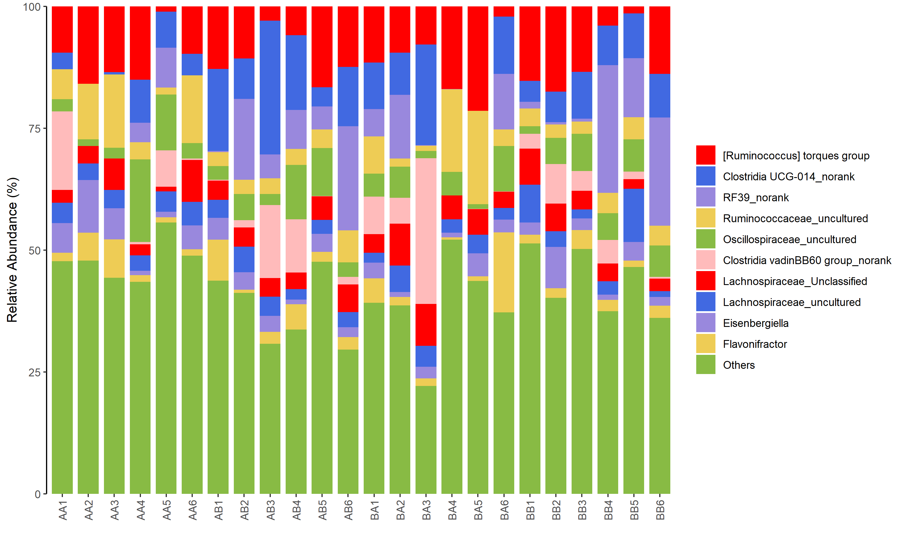
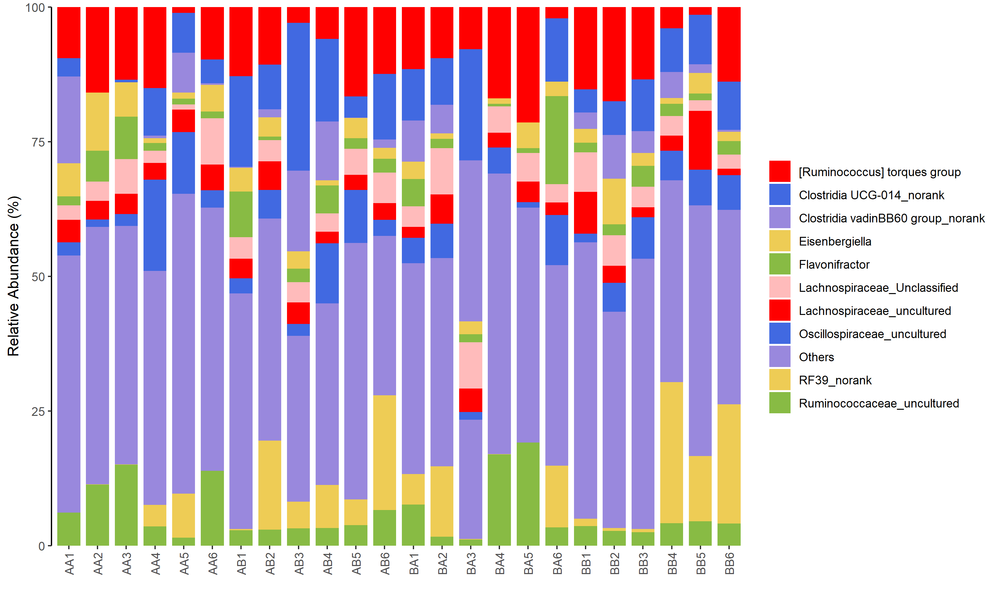
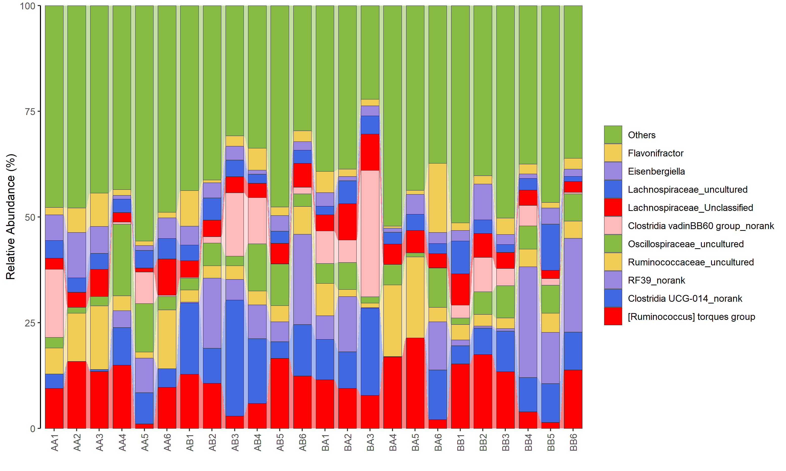

<style>
img{
    width: 30%;
}
</style>


* Scripts：[bar_alluvium_plot.r](Bar_Alluvium/bar_alluvium_plot.r)   


### 用法
1. 输入含index & header 的表格
2. 每行为一种Feature，表现为一根柱子中的彩色小块，颜色各不相同 （e.g. taxa）
3. 每列表现为一根柱子（e.g. 样本）
4. 柱子排序依照样本输入顺序，不能更改
5. Feature排序可选：按输入顺序、按输入反向顺序、按Feature名字。
6. 支持按组分面
7. 支持合并过小feature（可选topxx，也可设定阈值）
7. 颜色按照默认顺序，从上至下；除了reverse_order=T时为从下至上
8. 图片宽度可以随样本量自动调节
9. 输出png/pdf/..
```
Rscript bar_alluvium_plot.r

Usage: bar_alluvium_plot.r [-[-help|h]] [-[-input|f] <character>] [-[-output|o] <character>] [-[-group_dir|g] [<character>]] [-[-x_angle|A] [<integer>]] [-[-bar_width|b] [<double>]] [-[-legend_title|l] [<character>]] [-[-legend_face|p] [<character>]] [-[-fig_width|x] [<integer>]] [-[-fig_height|y] [<integer>]] [-[-allu|a] [<logical>]] [-[-reverse_order|r] [<logical>]] [-[-order_by_name|n] [<logical>]]
    -h|--help             help
    -f|--input            input table file; each col as a bar
    -o|--output           output img/pdf file
    -g|--group_dir        group_dir file
    -A|--x_angle          default 90, angle of the x-axis labels
    -b|--bar_width        default 0.8, the width of the bar (out of 1 maybe?)
    -l|--legend_title     default empty, title of the legend
    -p|--legend_face      default plain, face of the legend (plain, italic, bold, bold.italic)
    -x|--fig_width        default auto, width of fig
    -y|--fig_height       default auto, height of fig
    -a|--allu             T/F, default F, means not plotting alluvium; BUG:alluvium is extremely slow for very large amount of samples
    -r|--reverse_order    T/F, default T, plot by reversed input order
    -n|--order_by_name    T/F, default F, plot by naming's order
```


### 注意
1. 超过默认颜色数量后会有颜色重复（修改脚本开头mycolor赋值）
2. 某些简写和其它参数的非简写一样，若非简写漏加‘--’可能会得到意想不到的赋值
3. 图片太大的话，png画不出（limitsize失效）；pdf可以
4. alluvium选项耗时太长，且样本量太大时会卡死
5. 如果想要legend只有一列，建议选top15（一列最多20条、包括Others）
6. Bug: --legend_face italic 没反应


### 示例
```
Rscript bar_alluvium_plot.r -f example.xls -o 1.png                     ## Default(Reverse) order
Rscript bar_alluvium_plot.r -f example.xls -o 2.png --reverse_order F   ## notReverse
Rscript bar_alluvium_plot.r -f example.xls -o 3.png --order_by_name T   ## byName
Rscript bar_alluvium_plot.r -f example.xls -o 4.png --allu T  
Rscript bar_alluvium_plot.r -f example.xls -o 5.png -g group.txt  --allu T      ## allu + group
Rscript bar_alluvium_plot.r -f example.xls -o 6.png -g group.txt  --allu T --legend_title "Example" --legend_face italic
```






