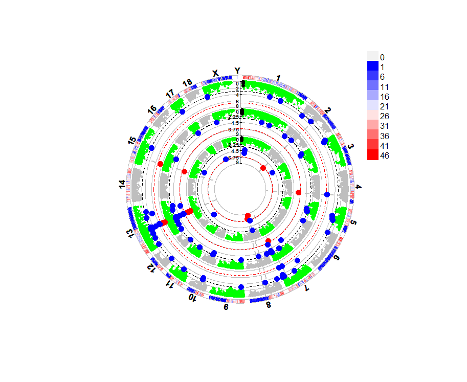

<style>
img{
    width: 60%;
}
</style>


### Data
```
library(CMplot)
data(pig60K)  

sig_points = pig60K$SNP[1:10]
adj_treashhold = 0.01/nrow(pig60K)             ## Bonfferoni

> head(pig60K)
          SNP Chromosome Position    trait1     trait2     trait3
1 ALGA0000009          1    52297 0.7738187 0.51194318 0.51194318
2 ALGA0000014          1    79763 0.7738187 0.51194318 0.51194318
3 ALGA0000021          1   209568 0.7583016 0.98405289 0.98405289
4 ALGA0000022          1   292758 0.7200305 0.48887140 0.48887140
5 ALGA0000046          1   747831 0.9736840 0.22096836 0.22096836
6 ALGA0000047          1   761957 0.9174565 0.05753712 0.05753712
```


### Usage


```


CMplot(
    pig60K,
    plot.type = c('d'),             ## "d"-SNP_density
    bin.size=5e6,
    bin.range = c(20,100),          ## NULL/c(min, max) of SNP_num per bin (colored as >= or <=)
    bin.legend.num = 8,             ## breaks of color legend (not includ >= or <=)
    file.output=F
    )


CMplot(
    pig60K, 
    plot.type = c('m'),                        ## "m"-Manhattan for each traits
    col=c('green','gray'), 
    pch = 'o',                                 ## default 19(point)    

    LOG10=TRUE,                                ## y: log10(p-value)
    ylab=paste(expression(-log[10](italic(p))),'y_lable'),  
    
    threshold=c( 0.001, adj_treashhold),       ## significant line
    threshold.col = c('black','red'),          ## threshold.lwd, threshold.lty
    highlight = sig_points,                    ## points for SNPs to be highlighted
    highlight.text = sig_points,               ## text around highlighted SNPs
    highlight.col = 'black',                   ## col,cex,pch,type
    highlight.text.col = 'purple',             ## col,cex,xadj,yadj,font
    amplify = T,                               ## zoom/coloring sig points
    signal.col = c("red","blue"),              ## available when amplify=T; signal.cex/pch/col/line for sig points

    chr.den.col=c("blue", "white", "red"),     ## Add a snp density line below

    box = F,                                   ## picture boundary box
    chr.labels.angle = 30,                     ## angle of tick labels [-90,90]
    band = 1,                                  ## gaps between chr

    multracks=F,                               ## Plot traits as multracks; very slow
    file.output=F
    )


CMplot(
    pig60K,
    plot.type = c('c'),     ## "c"-circle_Manhattan
    r = 2,                  ## inner circle radius (a number)
    H = 2,                  ## height for each circle (a number)
    col=c('green','gray'), 
    LOG10=TRUE,          
    file.output=F,

    ########## threshold/highlight & chr: similar to  Manhattan ##########   

    )


CMplot(
    pig60K,
    plot.type = c('q'),                     ## "q"-Q-Q plots for each traits
    threshold = adj_treashhold,             ## 1 threshold for each trait, e.g. c(pval_trait1,pval_trait2,pval_trait3)
    threshold.col = "orange",
    signal.col = "red",
    conf.int = T,                           ## plot confidence interval 
    conf.int.col = "gray",
    file.output=F
    )

```



### Save Plots
Opt-1 存到一个文件中。注意：有多张图作为输出时候，只适合pdf保存（png会覆盖为一张图）。
```
pdf("xx.pdf")       ## png

CMplot(...)

dev.off()
```

Opt-2
```
setwd('.....')

CMplot(
    .......
    dpi = 300,
    mar = c(3,6,3,3),
    height = NULL,    
    width = NULL,    
    file.output = F, 
    file.name = c("t1","t2","t3"),  ## qqplots for 3 traits, in this example
    file='jpg'                      ## "jpg","pdf","tiff"
    )

## Auto prefix will be added:  
## Cir_Manhtn, Marker_Density, QQplot,Rect_Manhtn
## e.g. QQplot.t1.jpg
```


### 参考
https://zhuanlan.zhihu.com/p/560722007   
https://www.jianshu.com/p/50b3cf231b34   

