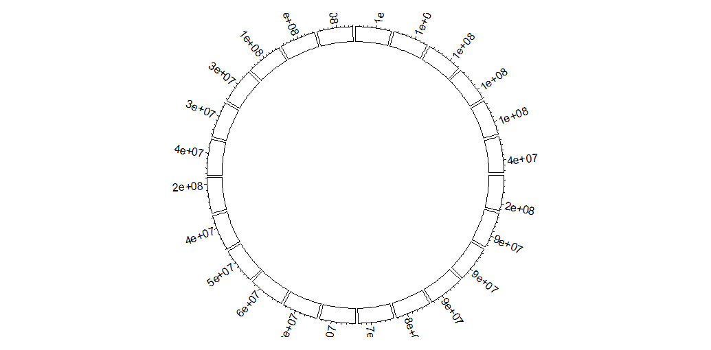
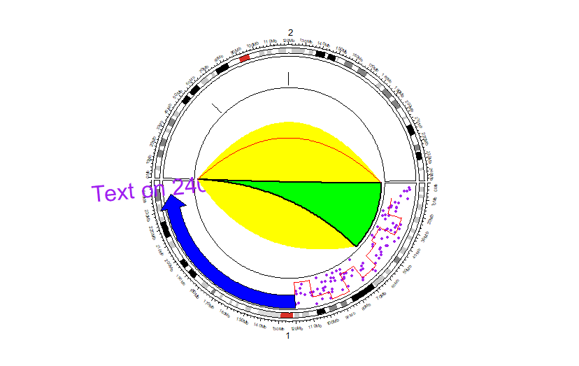

<style>
img{
    width: 60%;
}
</style>

## circlize
### Data：bed/Cytoband
bed-format-like / Cytoband
```
library(circlize)

df = read.cytoband()$df                             
colnames(df) = c('chr','start','end','name','stain')

sector_data = as.factor(df$chr)
sector_lvls = as.factor(levels(sector_data))

x_data = runif(nrow(df))
y_data = runif(nrow(df))
xlim = c(0,1)
ylim = c(0,1)

df$GC = runif(nrow(df))

```

### Initialize

circular_layout,依次设定 sector - xlim - ylim

#### Opt-1 Basic

可以直接输入vector，会自己计算 sectors xlim ylim；也可以输入sector_lvls xlim ylim
```
circos.initialize(
  sectors = sector_data,                            # factor vector, categories
  xlim = xlim,
  sector.width = rep(c(0.10),length(sector_lvls))   # Width for each sector
)
```

Track Region显示axis (传入circos.trackPlotRegion)
```
circos.track(
  ylim = ylim, 
  panel.fun = function(region, value){
    circos.axis(labels.facing='reverse.clockwise')
    }
)

```

只使用部分sectors（但还是显示了sector方框）
```
circos.trackPlotRegion(sectors = c('chr1','chr10'), 
  ylim = ylim,      
  panel.fun = function(region, value){
    circos.axis(labels.facing='reverse.clockwise')
    }
)
```





#### Opt-2 Genome
必须带有Cytoband信息
```
circos.genomicInitialize(
  data = df,
  major.by = 10000000,
  plotType = c('axis','labels','ideogram'),
  tickLabelsStartFromZero =T,
  axis.labels.cex = 0.5,
  labels.cex = 1,
  track.height = 0.10,
)
```


#### Opt-3 Genome + Ideogram
```
circos.initializeWithIdeogram(
  cytoband = df,                       ## or: cytoband_file_dir
  chromosome.index = c('chr1','chr2'), ## conflict with sort.chr
  major.by = 10000000,
  plotType = c('axis','labels','ideogram'),
  track.height = 0.10,
  ideogram.height = 0.08
)

## 注：可以 circos.genomicIdeogram() 多次多层
## 注：plotType可以控制是否在init时候画Ideogram
```


### Functions
所有方程、使用方法见[官方文档](https://jokergoo.github.io/circlize/)，或通过help(),或??circlize
#### Opt-1 单独使用
（指定sector.index与track.index）
```
circos.initializeWithIdeogram(cytoband = df,chromosome.index = c('chr1','chr2'))
circos.track(ylim = ylim)


circos.points(runif(100)*120000000, runif(100),       ## X_lst  y_lst
              sector.index = 'chr1', 
              pch = 16, 
              cex = 0.5,
              col = "purple")


circos.text(240000000, 1,                            ## X_lst  y_lst
            sector.index = 'chr1', 
            labels = "Text on 240Mb", 
            facing = "reverse.clockwise", 
            adj = c(0.5, 0),
            cex = 2, 
            col = "purple")

circos.arrow(120000000,240000000,0.8,                       ##  x_start  x_end   y_middle
             sector.index = 'chr1',
             col = "blue")


circos.lines((1:10)*12000000, runif(10), 
             sector.index = 'chr1', 
             type = "s",
             col = "red")


            ## value(y_lst)                 pos(x_lst)
circos.boxplot(runif(100)/2, c(rep(60000000,50),rep(120000000,50)),          
               sector.index = 'chr2',
               col = "red")               


circos.link('chr1', c(10000, 60000000),                  ## From   x
            'chr2', c(10000, 20000),                     ## To     x
            col = 'yellow', 
            h = 0.2,
            border = NA)                                 # interval to interval

circos.link('chr1', c(10000, 60000000), 
            'chr2', 0, 
            col = "green", 
            border = "black", 
            lwd = 2)                                     # point to interval


circos.link('chr1', 0, 'chr2', 0, h = 0.3 , col = 'red') # point to point

```


#### Opt-2 panel.fun + genomicTrack 
查看一下传入的参数
```
circos.initializeWithIdeogram(cytoband = df,chromosome.index = c('chr1','chr2'))

circos.genomicTrack(df,
                    ylim = ylim,
                    panel.fun = function(region, value,...){
                      print('--------region--------------')
                      print(head(region,n=2))
                      print('--------value--------------')
                      print(head(value,n=2))
                      print('--------df--------------')
                      print(head(df,n=2))
                    }
                    )


## (region , value, ...)
## region: two-col df with start_pos and end_pos in current genomic category (e.g. chromosome)
## value : df which is derived from data but excluding the first three columns. 
##         Rows in value correspond to rows in region
## ...   : mandatory and is used to pass internal parameters to other functions                    
```
结果
```
[1] "--------region--------------"           ## chr1
    start     end
1       0 2300000
2 2300000 5400000
[1] "--------value--------------"
    name  stain
1 p36.33   gneg
2 p36.32 gpos25
[1] "--------df--------------"
   chr   start     end   name  stain
1 chr1       0 2300000 p36.33   gneg
2 chr1 2300000 5400000 p36.32 gpos25


[1] "--------region--------------"           ## chr2
      start     end
371       0 4400000
372 4400000 7100000
[1] "--------value--------------"
     name  stain
371 p25.3   gneg
372 p25.2 gpos50
[1] "--------df--------------"
   chr   start     end   name  stain
1 chr1       0 2300000 p36.33   gneg
2 chr1 2300000 5400000 p36.32 gpos25
```


使用示例：
```
circos.initializeWithIdeogram(cytoband = df,chromosome.index = c('chr1','chr2'))

circos.genomicTrack(
  df[c(colnames(df)[1:3],"GC")],
  ylim = ylim,
  panel.fun = function(region, value,...){
    circos.genomicRect(region, value, col = 'green', border = NA, ...)
    circos.genomicLines(region, value, col = 'red', lwd = 0.35, ...)
    circos.genomicPoints(region, value, numeric.column = "GC", col = 'yellow')
  }
)


circos.genomicTrack(
  df[c(colnames(df)[1:3],"GC")],
  ylim = ylim,
  panel.fun = function(region, value,...){
    circos.genomicRect(region, value, ytop.column = "GC" ,col= 'red')
    circos.genomicRect(region, value, ybottom.column = "GC",col= 'blue')
   }
)


bed1 = head(df %>% filter(chr == 'chr1'))
bed2 = tail(df %>% filter(chr == 'chr1'))
circos.genomicLink(bed1, bed2, col='red', border = NA)
circos.genomicLink(head(bed1,1), head(bed2,1), col='blue', border = NA)

```


### Others
画完后不要忘记关闭
```
circos.clear()
```

还可以设置par
```
circos.par()
```

随机生成bed数据
```
generateRandomBed(10)
```


## chordDiagram
包含在circlize中
### Data : Adjacency Matrix
```
mat <- matrix(sample(18, 18), 3, 6) 
rownames(mat) <- paste0("S", 1:3)
colnames(mat) <- paste0("E", 1:6)

> mat 
   E1 E2 E3 E4 E5 E6
S1  9  2  8 14 16 17
S2  3  1 15 18 10 13
S3  6  7  5 11  4 12
```

### Use
```
chordDiagram(mat)
```


## 参考
circlize Doc: https://jokergoo.github.io/circlize/   
circlize：https://www.jianshu.com/p/a87bcc1cb67b   
circlize：https://mp.weixin.qq.com/s?__biz=MzIxNzc1Mzk3NQ==&mid=2247484280&idx=1&sn=fe5e0c82c123f8947b3240229ceef088&   
circlize：https://zhuanlan.zhihu.com/p/376017987   
chordDiagram： https://zhuanlan.zhihu.com/p/378190330        


Cytoband  -- Cytogenetic Bands:  
https://www.ncbi.nlm.nih.gov/Class/MLACourse/Modules/Genomes/map_cytogenetic_bands.html    
https://www.jianshu.com/p/9491901e3a9b     
https://zhuanlan.zhihu.com/p/284010321      


染色体显带及命名： https://zhuanlan.zhihu.com/p/284010321


