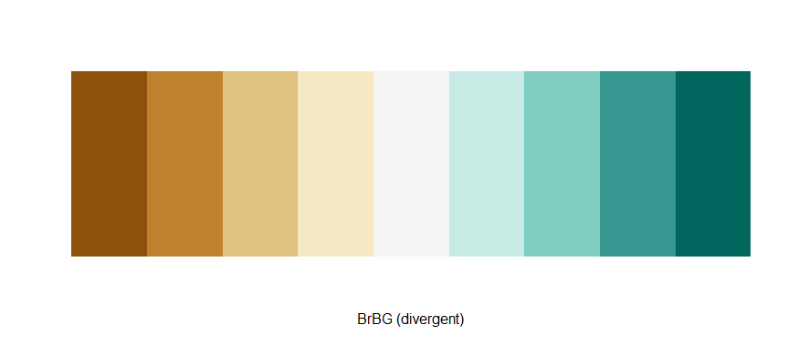
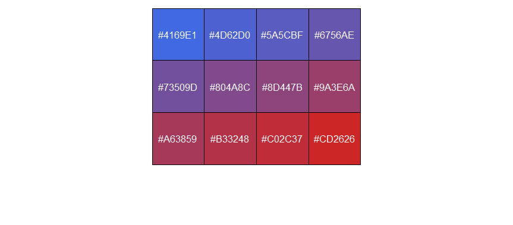

<style>
img{
    width: 60%;
}
</style>


### 小工具：给分组factor定义颜色
func:
```
group_factor_colors<- function(alist,colormap_list){
  factor_lvls = levels(as.factor(alist))
  color_lvls = colormap_list[1:length(factor_lvls)]
  names(color_lvls) = factor_lvls
  return(color_lvls)
}
```
Usage:
```
color_map = c("white","blue","red","brown","gold")
group_names = c("A","B","C","D","A","B","C","D","A","B","C","D","A","B","C","D")

> group_factor_colors(group_names,color_map)
      A       B       C       D 
"white"  "blue"   "red" "brown" 
```
pheatmat：annotation_colors中元素需要这个格式


### 小工具：将分组转换为颜色序列
func:
```
group_colors<- function(alist,colormap_list){
  return(colormap_list[as.numeric(factor(alist))])
}
```
Usage:
```
color_map = c("white","blue","red","brown","gold")
group_names = c("A","B","C","D","A","B","C","D","A","B","C","D","A","B","C","D")

> group_colors(group_names,color_map)
 [1] "white" "blue"  "red"   "brown" "white" "blue"  "red"   "brown" "white" "blue"  "red"   "brown" "white" "blue"  "red"   "brown"
```


### R 自带调色板中选颜色
```
rainbow(n)
heat.colors(n)
terrain.colors(n)
topo.colors(n)
cm.colors(n)

> cm.colors(10)
 [1] "#80FFFF" "#99FFFF" "#B3FFFF" "#CCFFFF" "#E6FFFF" "#FFE6FF" "#FFCCFF" "#FFB3FF" "#FF99FF" "#FF80FF"
```


### RColorBrewer 选取调色板
```
library(RColorBrewer)
display.brewer.all()
```


```
> brewer.pal.info
         maxcolors category colorblind
BrBG            11      div       TRUE
PiYG            11      div       TRUE
PRGn            11      div       TRUE
PuOr            11      div       TRUE
RdBu            11      div       TRUE
RdGy            11      div      FALSE
RdYlBu          11      div       TRUE
RdYlGn          11      div      FALSE
Spectral        11      div      FALSE
Accent           8     qual      FALSE
Dark2            8     qual       TRUE
Paired          12     qual       TRUE
Pastel1          9     qual      FALSE
Pastel2          8     qual      FALSE
Set1             9     qual      FALSE
Set2             8     qual       TRUE
Set3            12     qual      FALSE
Blues            9      seq       TRUE
BuGn             9      seq       TRUE
BuPu             9      seq       TRUE
GnBu             9      seq       TRUE
Greens           9      seq       TRUE
Greys            9      seq       TRUE
Oranges          9      seq       TRUE
OrRd             9      seq       TRUE
PuBu             9      seq       TRUE
PuBuGn           9      seq       TRUE
PuRd             9      seq       TRUE
Purples          9      seq       TRUE
RdPu             9      seq       TRUE
Reds             9      seq       TRUE
YlGn             9      seq       TRUE
YlGnBu           9      seq       TRUE
YlOrBr           9      seq       TRUE
YlOrRd           9      seq       TRUE
```


### brewer.pal 提取调色板颜色
```
> brewer.pal(9,"BrBG")
[1] "#8C510A" "#BF812D" "#DFC27D" "#F6E8C3" "#F5F5F5" "#C7EAE5" "#80CDC1" "#35978F" "#01665E"

> display.brewer.pal(9,"BrBG")
```



### colorRampPalette 生成颜色序列

Example 1:
```
> colorRampPalette(brewer.pal(9,"Set1"))(50)
 [1] "#E41A1C" "#C72A35" "#AB3A4E" "#8F4A68" "#735B81" "#566B9B" "#3A7BB4" "#3A85A8" "#3D8D96" "#419584" "#449D72"
[12] "#48A460" "#4CAD4E" "#56A354" "#629363" "#6E8371" "#7A7380" "#87638F" "#93539D" "#A25392" "#B35A77" "#C4625D"
[23] "#D46A42" "#E57227" "#F67A0D" "#FF8904" "#FF9E0C" "#FFB314" "#FFC81D" "#FFDD25" "#FFF12D" "#F9F432" "#EBD930"
[34] "#DCBD2E" "#CDA12C" "#BF862B" "#B06A29" "#A9572E" "#B65E46" "#C3655F" "#D06C78" "#DE7390" "#EB7AA9" "#F581BE"
[45] "#E585B8" "#D689B1" "#C78DAB" "#B791A5" "#A8959F" "#999999"
```


Example 2:
```
> colorRampPalette(c("royalblue","firebrick3"))(12)
 [1] "#4169E1" "#4D62D0" "#5A5CBF" "#6756AE" "#73509D" "#804A8C" "#8D447B" "#9A3E6A" "#A63859" "#B33248" "#C02C37"
[12] "#CD2626"
```


### 查看颜色序列

```
mycol <- colorRampPalette(c("royalblue","firebrick3"))(12)
scales::show_col(mycol)
```



### R中颜色名称
```
> colors()
  [1] "white"                "aliceblue"            "antiquewhite"         "antiquewhite1"        "antiquewhite2"       
  [6] "antiquewhite3"        "antiquewhite4"        "aquamarine"           "aquamarine1"          "aquamarine2"         
 [11] "aquamarine3"          "aquamarine4"          "azure"                "azure1"               "azure2"              
 [16] "azure3"               "azure4"               "beige"                "bisque"               "bisque1"             
 [21] "bisque2"              "bisque3"              "bisque4"              "black"                "blanchedalmond"      
 [26] "blue"                 "blue1"                "blue2"                "blue3"                "blue4"               
 [31] "blueviolet"           "brown"                "brown1"               "brown2"               "brown3"              
 [36] "brown4"               "burlywood"            "burlywood1"           "burlywood2"           "burlywood3"          
 [41] "burlywood4"           "cadetblue"            "cadetblue1"           "cadetblue2"           "cadetblue3"          
 [46] "cadetblue4"           "chartreuse"           "chartreuse1"          "chartreuse2"          "chartreuse3"         
 [51] "chartreuse4"          "chocolate"            "chocolate1"           "chocolate2"           "chocolate3"          
 [56] "chocolate4"           "coral"                "coral1"               "coral2"               "coral3"              
 [61] "coral4"               "cornflowerblue"       "cornsilk"             "cornsilk1"            "cornsilk2"           
 [66] "cornsilk3"            "cornsilk4"            "cyan"                 "cyan1"                "cyan2"               
 [71] "cyan3"                "cyan4"                "darkblue"             "darkcyan"             "darkgoldenrod"       
 [76] "darkgoldenrod1"       "darkgoldenrod2"       "darkgoldenrod3"       "darkgoldenrod4"       "darkgray"            
 [81] "darkgreen"            "darkgrey"             "darkkhaki"            "darkmagenta"          "darkolivegreen"      
 [86] "darkolivegreen1"      "darkolivegreen2"      "darkolivegreen3"      "darkolivegreen4"      "darkorange"          
 [91] "darkorange1"          "darkorange2"          "darkorange3"          "darkorange4"          "darkorchid"          
 [96] "darkorchid1"          "darkorchid2"          "darkorchid3"          "darkorchid4"          "darkred"             
[101] "darksalmon"           "darkseagreen"         "darkseagreen1"        "darkseagreen2"        "darkseagreen3"       
[106] "darkseagreen4"        "darkslateblue"        "darkslategray"        "darkslategray1"       "darkslategray2"      
[111] "darkslategray3"       "darkslategray4"       "darkslategrey"        "darkturquoise"        "darkviolet"          
[116] "deeppink"             "deeppink1"            "deeppink2"            "deeppink3"            "deeppink4"           
[121] "deepskyblue"          "deepskyblue1"         "deepskyblue2"         "deepskyblue3"         "deepskyblue4"        
[126] "dimgray"              "dimgrey"              "dodgerblue"           "dodgerblue1"          "dodgerblue2"         
[131] "dodgerblue3"          "dodgerblue4"          "firebrick"            "firebrick1"           "firebrick2"          
[136] "firebrick3"           "firebrick4"           "floralwhite"          "forestgreen"          "gainsboro"           
[141] "ghostwhite"           "gold"                 "gold1"                "gold2"                "gold3"               
[146] "gold4"                "goldenrod"            "goldenrod1"           "goldenrod2"           "goldenrod3"          
[151] "goldenrod4"           "gray"                 "gray0"                "gray1"                "gray2"               
[156] "gray3"                "gray4"                "gray5"                "gray6"                "gray7"               
[161] "gray8"                "gray9"                "gray10"               "gray11"               "gray12"              
[166] "gray13"               "gray14"               "gray15"               "gray16"               "gray17"              
[171] "gray18"               "gray19"               "gray20"               "gray21"               "gray22"              
[176] "gray23"               "gray24"               "gray25"               "gray26"               "gray27"              
[181] "gray28"               "gray29"               "gray30"               "gray31"               "gray32"              
[186] "gray33"               "gray34"               "gray35"               "gray36"               "gray37"              
[191] "gray38"               "gray39"               "gray40"               "gray41"               "gray42"              
[196] "gray43"               "gray44"               "gray45"               "gray46"               "gray47"              
[201] "gray48"               "gray49"               "gray50"               "gray51"               "gray52"              
[206] "gray53"               "gray54"               "gray55"               "gray56"               "gray57"              
[211] "gray58"               "gray59"               "gray60"               "gray61"               "gray62"              
[216] "gray63"               "gray64"               "gray65"               "gray66"               "gray67"              
[221] "gray68"               "gray69"               "gray70"               "gray71"               "gray72"              
[226] "gray73"               "gray74"               "gray75"               "gray76"               "gray77"              
[231] "gray78"               "gray79"               "gray80"               "gray81"               "gray82"              
[236] "gray83"               "gray84"               "gray85"               "gray86"               "gray87"              
[241] "gray88"               "gray89"               "gray90"               "gray91"               "gray92"              
[246] "gray93"               "gray94"               "gray95"               "gray96"               "gray97"              
[251] "gray98"               "gray99"               "gray100"              "green"                "green1"              
[256] "green2"               "green3"               "green4"               "greenyellow"          "grey"                
[261] "grey0"                "grey1"                "grey2"                "grey3"                "grey4"               
[266] "grey5"                "grey6"                "grey7"                "grey8"                "grey9"               
[271] "grey10"               "grey11"               "grey12"               "grey13"               "grey14"              
[276] "grey15"               "grey16"               "grey17"               "grey18"               "grey19"              
[281] "grey20"               "grey21"               "grey22"               "grey23"               "grey24"              
[286] "grey25"               "grey26"               "grey27"               "grey28"               "grey29"              
[291] "grey30"               "grey31"               "grey32"               "grey33"               "grey34"              
[296] "grey35"               "grey36"               "grey37"               "grey38"               "grey39"              
[301] "grey40"               "grey41"               "grey42"               "grey43"               "grey44"              
[306] "grey45"               "grey46"               "grey47"               "grey48"               "grey49"              
[311] "grey50"               "grey51"               "grey52"               "grey53"               "grey54"              
[316] "grey55"               "grey56"               "grey57"               "grey58"               "grey59"              
[321] "grey60"               "grey61"               "grey62"               "grey63"               "grey64"              
[326] "grey65"               "grey66"               "grey67"               "grey68"               "grey69"              
[331] "grey70"               "grey71"               "grey72"               "grey73"               "grey74"              
[336] "grey75"               "grey76"               "grey77"               "grey78"               "grey79"              
[341] "grey80"               "grey81"               "grey82"               "grey83"               "grey84"              
[346] "grey85"               "grey86"               "grey87"               "grey88"               "grey89"              
[351] "grey90"               "grey91"               "grey92"               "grey93"               "grey94"              
[356] "grey95"               "grey96"               "grey97"               "grey98"               "grey99"              
[361] "grey100"              "honeydew"             "honeydew1"            "honeydew2"            "honeydew3"           
[366] "honeydew4"            "hotpink"              "hotpink1"             "hotpink2"             "hotpink3"            
[371] "hotpink4"             "indianred"            "indianred1"           "indianred2"           "indianred3"          
[376] "indianred4"           "ivory"                "ivory1"               "ivory2"               "ivory3"              
[381] "ivory4"               "khaki"                "khaki1"               "khaki2"               "khaki3"              
[386] "khaki4"               "lavender"             "lavenderblush"        "lavenderblush1"       "lavenderblush2"      
[391] "lavenderblush3"       "lavenderblush4"       "lawngreen"            "lemonchiffon"         "lemonchiffon1"       
[396] "lemonchiffon2"        "lemonchiffon3"        "lemonchiffon4"        "lightblue"            "lightblue1"          
[401] "lightblue2"           "lightblue3"           "lightblue4"           "lightcoral"           "lightcyan"           
[406] "lightcyan1"           "lightcyan2"           "lightcyan3"           "lightcyan4"           "lightgoldenrod"      
[411] "lightgoldenrod1"      "lightgoldenrod2"      "lightgoldenrod3"      "lightgoldenrod4"      "lightgoldenrodyellow"
[416] "lightgray"            "lightgreen"           "lightgrey"            "lightpink"            "lightpink1"          
[421] "lightpink2"           "lightpink3"           "lightpink4"           "lightsalmon"          "lightsalmon1"        
[426] "lightsalmon2"         "lightsalmon3"         "lightsalmon4"         "lightseagreen"        "lightskyblue"        
[431] "lightskyblue1"        "lightskyblue2"        "lightskyblue3"        "lightskyblue4"        "lightslateblue"      
[436] "lightslategray"       "lightslategrey"       "lightsteelblue"       "lightsteelblue1"      "lightsteelblue2"     
[441] "lightsteelblue3"      "lightsteelblue4"      "lightyellow"          "lightyellow1"         "lightyellow2"        
[446] "lightyellow3"         "lightyellow4"         "limegreen"            "linen"                "magenta"             
[451] "magenta1"             "magenta2"             "magenta3"             "magenta4"             "maroon"              
[456] "maroon1"              "maroon2"              "maroon3"              "maroon4"              "mediumaquamarine"    
[461] "mediumblue"           "mediumorchid"         "mediumorchid1"        "mediumorchid2"        "mediumorchid3"       
[466] "mediumorchid4"        "mediumpurple"         "mediumpurple1"        "mediumpurple2"        "mediumpurple3"       
[471] "mediumpurple4"        "mediumseagreen"       "mediumslateblue"      "mediumspringgreen"    "mediumturquoise"     
[476] "mediumvioletred"      "midnightblue"         "mintcream"            "mistyrose"            "mistyrose1"          
[481] "mistyrose2"           "mistyrose3"           "mistyrose4"           "moccasin"             "navajowhite"         
[486] "navajowhite1"         "navajowhite2"         "navajowhite3"         "navajowhite4"         "navy"                
[491] "navyblue"             "oldlace"              "olivedrab"            "olivedrab1"           "olivedrab2"          
[496] "olivedrab3"           "olivedrab4"           "orange"               "orange1"              "orange2"             
[501] "orange3"              "orange4"              "orangered"            "orangered1"           "orangered2"          
[506] "orangered3"           "orangered4"           "orchid"               "orchid1"              "orchid2"             
[511] "orchid3"              "orchid4"              "palegoldenrod"        "palegreen"            "palegreen1"          
[516] "palegreen2"           "palegreen3"           "palegreen4"           "paleturquoise"        "paleturquoise1"      
[521] "paleturquoise2"       "paleturquoise3"       "paleturquoise4"       "palevioletred"        "palevioletred1"      
[526] "palevioletred2"       "palevioletred3"       "palevioletred4"       "papayawhip"           "peachpuff"           
[531] "peachpuff1"           "peachpuff2"           "peachpuff3"           "peachpuff4"           "peru"                
[536] "pink"                 "pink1"                "pink2"                "pink3"                "pink4"               
[541] "plum"                 "plum1"                "plum2"                "plum3"                "plum4"               
[546] "powderblue"           "purple"               "purple1"              "purple2"              "purple3"             
[551] "purple4"              "red"                  "red1"                 "red2"                 "red3"                
[556] "red4"                 "rosybrown"            "rosybrown1"           "rosybrown2"           "rosybrown3"          
[561] "rosybrown4"           "royalblue"            "royalblue1"           "royalblue2"           "royalblue3"          
[566] "royalblue4"           "saddlebrown"          "salmon"               "salmon1"              "salmon2"             
[571] "salmon3"              "salmon4"              "sandybrown"           "seagreen"             "seagreen1"           
[576] "seagreen2"            "seagreen3"            "seagreen4"            "seashell"             "seashell1"           
[581] "seashell2"            "seashell3"            "seashell4"            "sienna"               "sienna1"             
[586] "sienna2"              "sienna3"              "sienna4"              "skyblue"              "skyblue1"            
[591] "skyblue2"             "skyblue3"             "skyblue4"             "slateblue"            "slateblue1"          
[596] "slateblue2"           "slateblue3"           "slateblue4"           "slategray"            "slategray1"          
[601] "slategray2"           "slategray3"           "slategray4"           "slategrey"            "snow"                
[606] "snow1"                "snow2"                "snow3"                "snow4"                "springgreen"         
[611] "springgreen1"         "springgreen2"         "springgreen3"         "springgreen4"         "steelblue"           
[616] "steelblue1"           "steelblue2"           "steelblue3"           "steelblue4"           "tan"                 
[621] "tan1"                 "tan2"                 "tan3"                 "tan4"                 "thistle"             
[626] "thistle1"             "thistle2"             "thistle3"             "thistle4"             "tomato"              
[631] "tomato1"              "tomato2"              "tomato3"              "tomato4"              "turquoise"           
[636] "turquoise1"           "turquoise2"           "turquoise3"           "turquoise4"           "violet"              
[641] "violetred"            "violetred1"           "violetred2"           "violetred3"           "violetred4"          
[646] "wheat"                "wheat1"               "wheat2"               "wheat3"               "wheat4"              
[651] "whitesmoke"           "yellow"               "yellow1"              "yellow2"              "yellow3"             
[656] "yellow4"              "yellowgreen"
```
