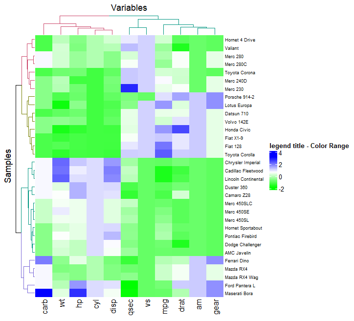

<style>
img{
    width: 49%;
}
</style>

### Example Data & Color Lists

```
library("RColorBrewer")
col =  colorRampPalette(c("red", "white", "blue"))(256)


df = scale(mtcars)                   # must be as.matrix(df) 

anno_col = data.frame(               # group info for each col
  col_A = factor(rep(c("A", "B"), 100))[1:length(colnames(df))],
  col_B = 1:length(colnames(df))
)
rownames(anno_col) = colnames(df)


anno_row = data.frame(               # group info for each row
  row_A = factor(rep(c("aa", "bb"), 100))[1:length(rownames(df))],
  roe_B = 1:length(rownames(df)) * 9
)
rownames(anno_row) = rownames(df)

```


### 1 - R自带Heatmap
1. 用分组信息设定侧边颜色
```
anno_col_map = rep(c('blue','red','yellow','black'), 20)
col_lst = anno_col_map[as.numeric(factor(anno_col$col_A))]
```
2. 绘图
```
heatmap(as.matrix(df), 
        scale = "row", 
        col =  col, 
        ColSideColors = col_lst ,      ## RowSideColors
        distfun = function(c) dist(c , method = "euclidean"), 
        xlab = 'X'
        )
## dist: "euclidean", "maximum", "manhattan", "canberra", "binary" or "minkowski"
```


### 2 - pheatmap
1. 设定分组颜色
Note : group_factor_colors func in [ColorMap](ColorMap.md)
```
g_colormap = c('red','blue','yellow','black','pink','green')
anno_color = list(                                  
  col_A = c(A = 'red',B = 'green'),    ## group_factor_colors
  col_B = c('white', 'red'),           ## col_B is c(1:12), numeric??
  row_A = group_factor_colors(anno_row$row_A,g_colormap)
)       

## Note： roe_B not assigned here -> auto color
```
2. 作图
```
library(pheatmap)

pheatmap(df, 
         color = col,
         annotation_col = anno_col, 
         annotation_row = anno_row, 
         annotation_legend = T,
         annotation_colors = anno_color,
         cutree_rows = 4,
         cluster_rows = T,
         distfun = function(c) dist(c , method = "euclidean"),  
         display_numbers = matrix(ifelse(df > 1.5, "*", ""), nrow(df))
         )

## dist: "euclidean", "maximum", "manhattan", "canberra", "binary" or "minkowski"
```


### 3 - ComplexHeatmap + dendextend
Example 1：
```
library(ComplexHeatmap)
library(dendextend)

row_dend = hclust(dist(df,method = "euclidean"))      ## row clustering
col_dend = hclust(dist(t(df),method = "euclidean"))   ## column clustering

Heatmap(df,
        name = "legend title - Color Range",                
        column_title = "Variables", 
        row_title = "Samples",
        row_names_gp = gpar(fontsize = 7),            ## Text size
        col = col,
        cluster_rows = color_branches(row_dend, k = 4),  ## Colored dendTree
        cluster_columns = color_branches(col_dend, k = 2),
        )

plot(color_branches(row_dend, k = 4))        
```



Example 2： K-means clustering --- conflict with cluster_rows/cluster_columns
```
Heatmap(df, name = "legend title - Color Range", row_km = 4)  ## column_km
```


Example 3： Split column/row given group list
```
Heatmap(df,
        name = "legend title - Color Range",  
        split =  rep(c("A","B","C"),100)[1:nrow(df)],   ## split rows 
        column_split = rep(c(1,2),100)[1:ncol(df)],     ## split columns 
        row_names_gp = gpar(fontsize = 7))
```


Example 4： Annotated & Combined Heatmap
```

top_anno = HeatmapAnnotation(
  hist = anno_histogram(df, gp = gpar(fill = "lightblue")),
  density = anno_density(df, type = "line", gp = gpar(col = "blue"))
  )

right_anno = HeatmapAnnotation(
  violin = anno_density(df, type = "violin",which = "row"),
  bxplt = anno_boxplot(df, which = "row"),
  which = "row", 
  width = unit(4, "cm")
  )

Heatmap(df, top_annotation = top_anno) + right_anno
```


Example 5： fix layout of Combined Heatmap
```
h1 = Heatmap(df, top_annotation = top_anno)
h2 = right_anno

draw(h1 + h1 + h2,
    row_title = "Row title",
    row_title_gp = gpar(col = "red"),
    column_title = "Column title",
    column_title_side = "bottom",
    gap = unit(1, "cm")            ## Gap between heatmaps
    )

```


### 4-ClusterGVis

```

library(ClusterGVis)


exps = scale(mtcars,center=F)
markGenes = rownames(exps)[sample(1:nrow(exps),30,replace = F)]
termanno = data.frame(
  'id' = rep(c('C1','C2','C3','C4'),each = 2),         
  'term' = rep(c('C1 anno','C2 anno','C3 anno','C4 anno'),each = 2),
  'pval' = runif(8)
)
## Note: optimal cluster numbers decided by getClusters()
##       in this case k = 4


getClusters(exp = exps)         ## plot SS within groups of various group number

ck <- clusterData(
  exp = exps,
  cluster.method = "kmeans",    ## mfuzz(not working)
  cluster.num = 4)


visCluster(
  object = ck,
  plot.type = "both",           ## line, heatmap, both
  markGenes = markGenes,
  annoTerm.data = termanno,
  column_names_rot = 45
  )

```


### 参考
ComplexHeatmap：https://mp.weixin.qq.com/s/idbsiOPtdsQ0p7xD6HxGKg
pheatmap：https://www.jianshu.com/p/86ae39a227f4
ClusterGVis：https://github.com/junjunlab/ClusterGVis


