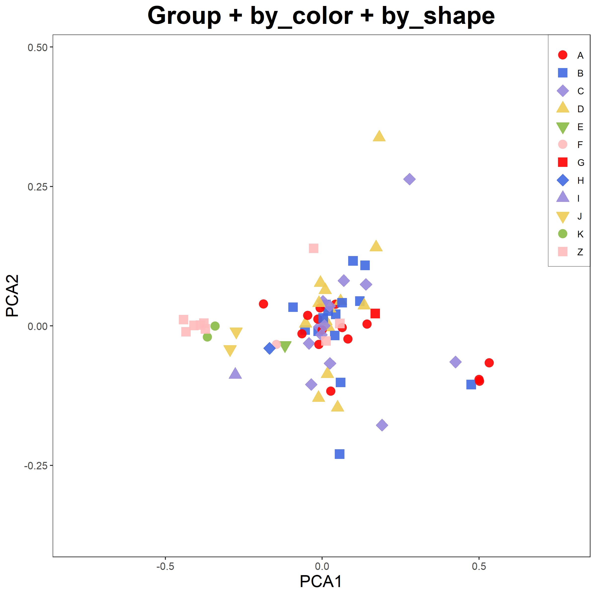
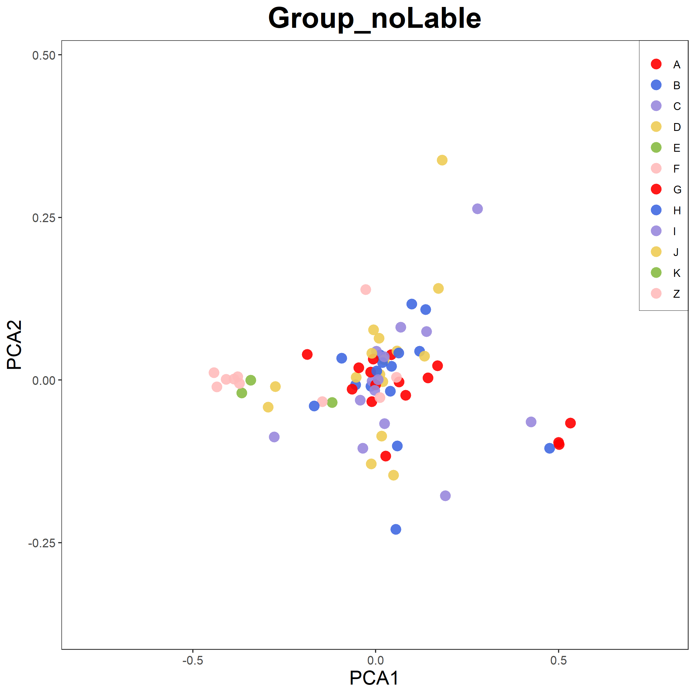
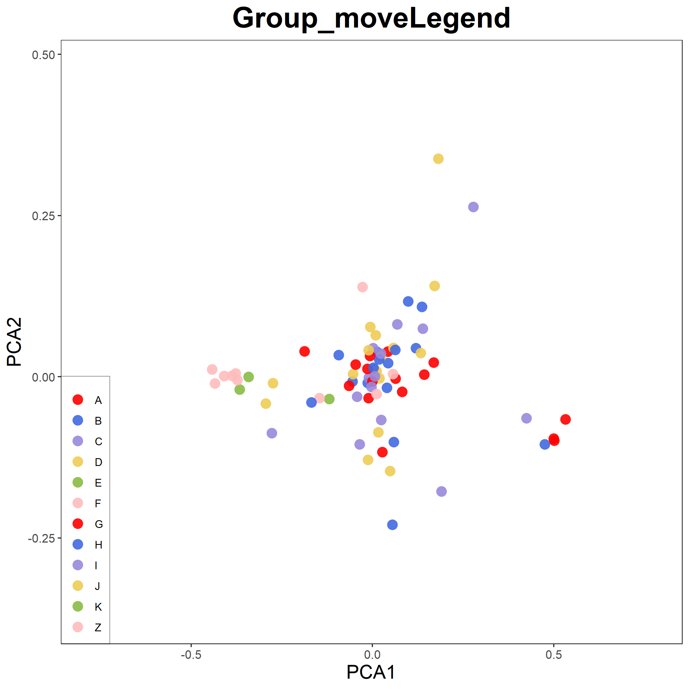
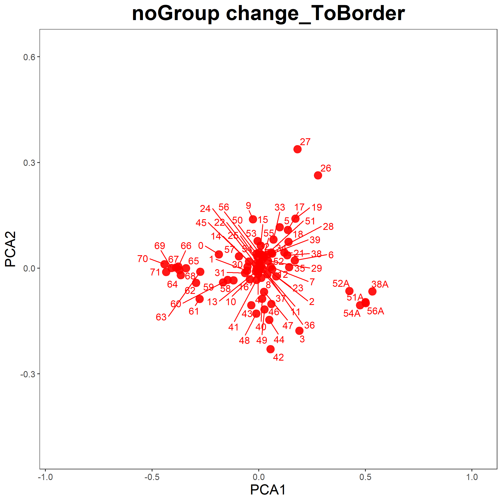
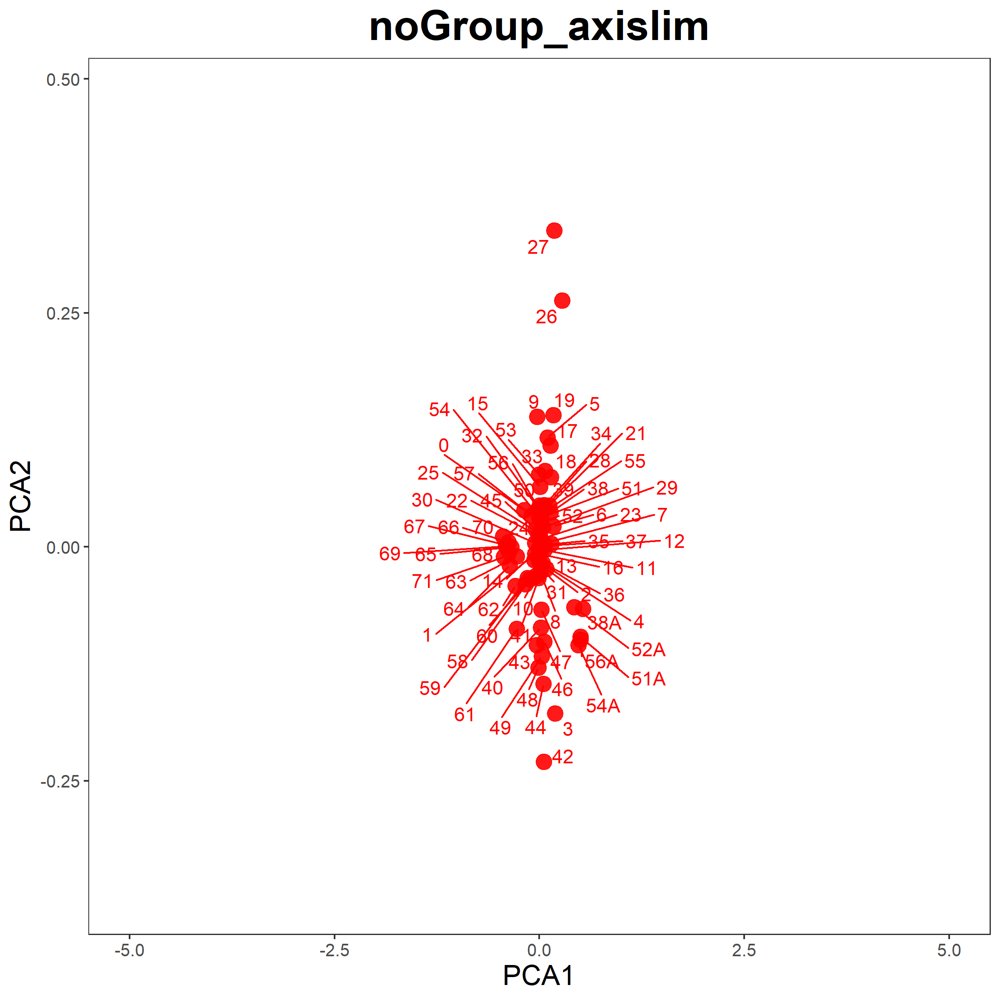

<style>
img{
    width: 30%;
}
</style>


* Scripts：[point_plot.r](Point/point_plot.r)   


### 用法

1. 输入含index & header 的表格，每行为一个样本（点），每列为一个维度（轴）
2. 无分组默认包含标签；分组默认颜色变化、不含标签。（图片、形状等暂不支持无分组的设定。建议使用一组一个样本的分组文件）
3. 暂不支持调节图例，图注，label大小，字体；若有需要建议直接修改脚本（ggplot都在脚本下方）
```
Rscript point_plot.r
    -h|--help                  help
    -f|--file_dir              input points file
    -o|--output_dir            output pdf file
    -a|--text_dir              text file to be added to the plot
    -g|--group_dir             group file
    -t|--title                 title
    -x|--dim1                  default 1, which column to be dim1
    -y|--dim2                  default 1=2, which column to be dim2
    -b|--to_border             default 0.25 [0-1], distance to ploting border
    -q|--xmax                  set axis xmax
    -j|--xmin                  set axis xmin
    -e|--ymax                  set axis ymax
    -r|--ymin                  set axis ymin
    -H|--outside_legend        top/bottom/left/right, show legend out of plottig region
    -Q|--legend_x              default 1 [0-1], legend position
    -W|--legend_y              default 1 [0-1], legend position
    -E|--text_x                default 0 [0-1], text position
    -R|--text_y                default 0 [0-1], text position
    -Z|--plot_hight            default 8, plot size
    -C|--plot_width            default 8, plot size
    -V|--point_size            default 8, point size
    -P|--ellipse_treashhold    default 1(emit lines)[0-1], below which treshhold cannot plot ellipse (neglect this parameter, its useless)
    -U|--ellipse_level         default 0.95[0-1], ellipse confidance level
    -O|--if_label              T/F, if show point label
    -L|--if_legend             T/F, if show legend
    -K|--if_ellipse            T/F, if show ellipse
    -J|--by_shape              T/F, if show group with different shape
    -M|--by_colour             T/F, if show group with different color
```


### 脚本说明
1. 颜色及形状设定见开头；由于使用了fill参数，不支持空心形状（且循环重复5种形状）
2. 对于ellipse，如果有的分组cor(x,y)为NA，那么这个分组不会有ellipse，其余分组不受影响。注：cor(x,y)在sd(x)或sd(y)中有一个为0（即：平行/垂直直线）时就为NA。
3. 对于ellipse，有一个参数设定如果cor(x,y)在(-ellipse_treashhold,ellipse_treashhold)区间外,就不画椭圆。**但是这个参数没有意义,忽略即可** 目前设定此参数为1（即：垂线）时不画椭圆，对应上文5中不画椭圆的情景。
4. 对于ellipse，ellipse_level参数设置ellipse方程的level，似乎是置信区间，默认0.95
5. 设定left/right时候plot_width为12，有时候还是要调整图片宽、高（如果legend非常长）


### 示例

```
Rscript point_plot.r -f example.txt -o 1.png -t "noGroup + addINFO" -a info.txt
Rscript point_plot.r -f example.txt -o 2.png -t "Group" -g group.txt
Rscript point_plot.r -f example.txt -o 3.png -t "Group + by_color + by_shape" -g group.txt  --by_shape T 
Rscript point_plot.r -f example.txt -o 4.png -t "Group + by_shape" -g group.txt  --by_shape T  --by_colour F  ## maxium 5 !!
Rscript point_plot.r -f example.txt -o 5.png -t "Group_noLable" -g group.txt --if_label F
Rscript point_plot.r -f example.txt -o 6.png -t "Group_moveLegend" -g group.txt --legend_x 0 --legend_y 0
Rscript point_plot.r -f example.txt -o 7.png -t "noGroup change_ToBorder" --to_border 0.5
Rscript point_plot.r -f example.txt -o 8.png -t "noGroup_axislim" --xmax 5 --xmin -5
Rscript point_plot.r -f example.txt -o 9.png -t "Ellipse" -g group.txt --if_ellipse T
Rscript point_plot.r -f example.txt -o 10.png -t "ellipse_level 0.90" -g group.txt --if_ellipse T --ellipse_level 0.9
Rscript point_plot.r -f example.txt -o 11.png -t "ellipse_level 0.99" -g group.txt --if_ellipse T --ellipse_level 0.99
```










