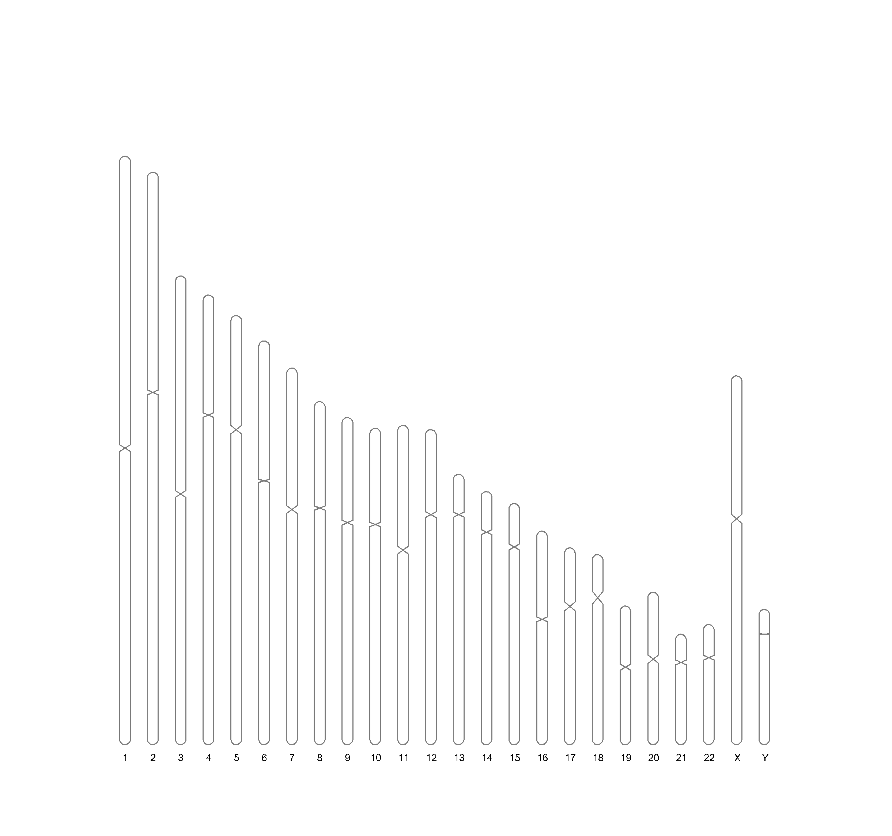
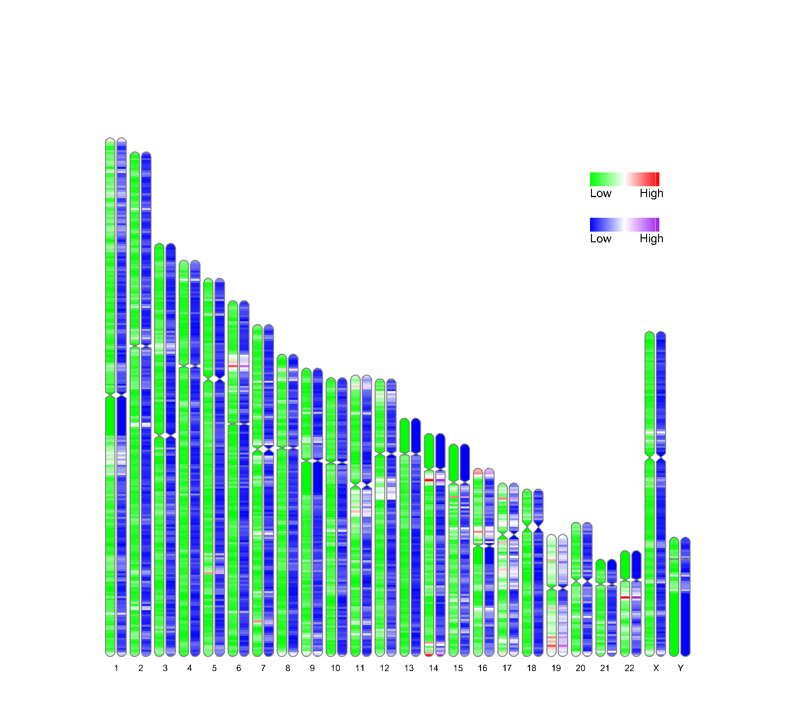
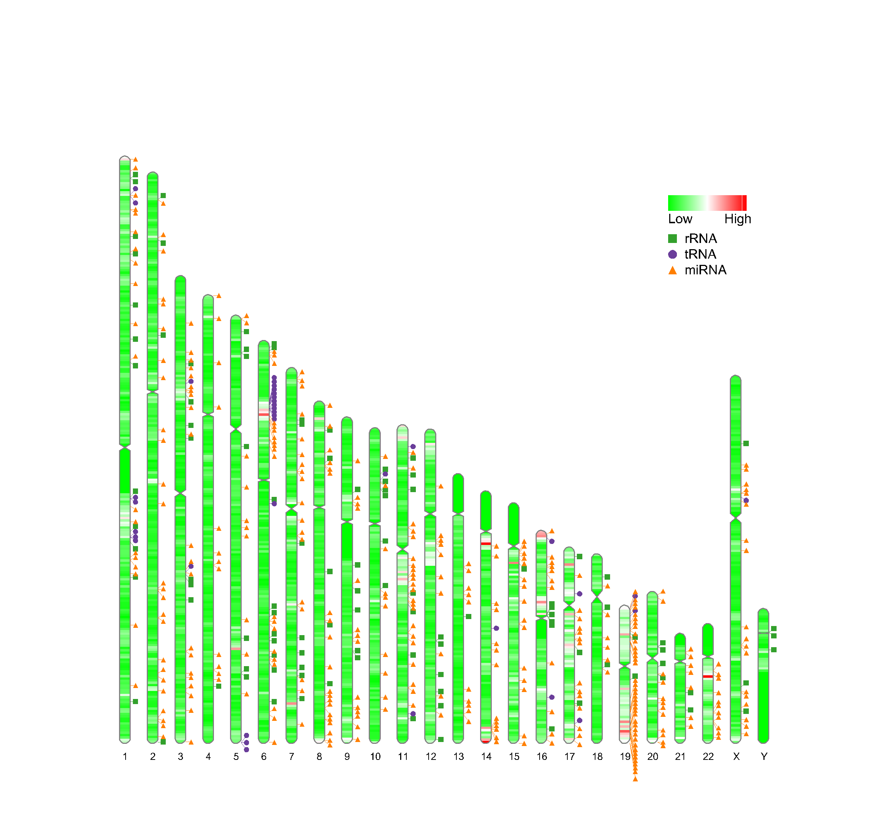
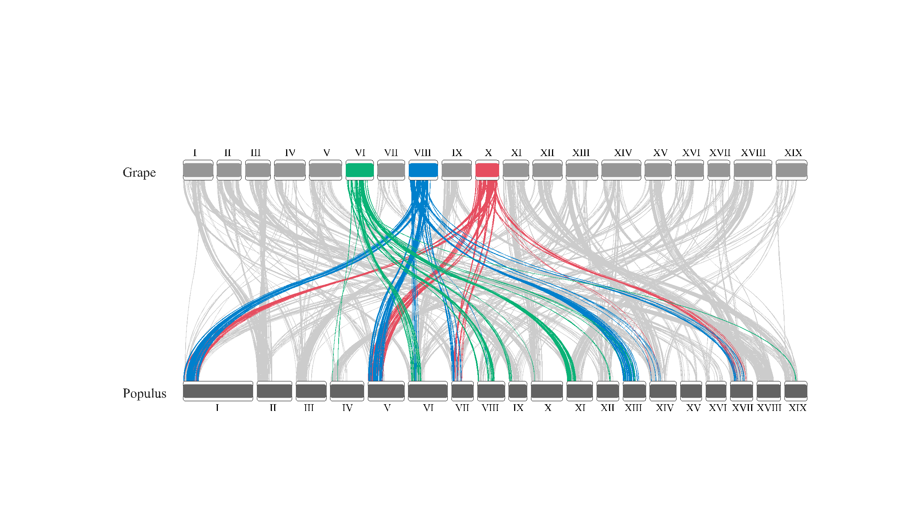
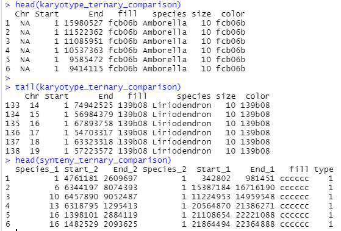

<style>
img{
    width: 49%;
}
</style>

## karyotype

### Data
```
library(RIdeogram)


karyo_df  = human_karyotype
dens_df = gene_density
rna_df = Random_RNAs_500

colA = c('green','white','red')
colB = c('blue','white','purple')
```

```
> head(karyo_df)    ## CE: centriole
  Chr Start       End  CE_start    CE_end
1   1     0 248956422 122026459 124932724
2   2     0 242193529  92188145  94090557
3   3     0 198295559  90772458  93655574
4   4     0 190214555  49712061  51743951
5   5     0 181538259  46485900  50059807
6   6     0 170805979  58553888  59829934


> head(dens_df)     ## Value: e.g. SNP density in that window
  Chr   Start     End Value
1   1       1 1000000    65
2   1 1000001 2000000    76
3   1 2000001 3000000    35
4   1 3000001 4000000    30
5   1 4000001 5000000    10
6   1 5000001 6000000    10


> head(rna_df)
   Type    Shape Chr    Start      End  color
1  tRNA   circle   6 69204486 69204568 6a3d9a
2  rRNA      box   3 68882967 68883091 33a02c
3  rRNA      box   5 55777469 55777587 33a02c
4  rRNA      box  21 25202207 25202315 33a02c
5 miRNA triangle   1 86357632 86357687 ff7f00
6 miRNA triangle  11 74399237 74399333 ff7f00

```


### Usage
```
ideogram(karyotype = karyo_df, output = "ideogram_out.svg")
svg2png("ideogram_out.svg",file = "1.png")


## anno type's input type:
## except heatmap, must have df$color in 'ff7f00' format
# marker - categorical 
# heatmap - numeric
# line - numeric 
# polygon - numeric 


ideogram(
    karyotype = karyo_df,
    overlaid = dens_df,                                # numeric -> heatmap  
    label = dens_df,                    #              # anno beside chromosomes
    label_type = "heatmap",             ##             # anno type: marker, heatmap, line, polygon
    colorset1 = colA,                                  # overlaid color
    colorset2 = colB,                   #              # marker color: only for label_type = "heatmap"
    width = 170,
    Lx = 160,                                          # position of legend x
    Ly = 35, 
    output = "ideogram_out.svg"
    )

svg2png("ideogram_out.svg",file = "2.png")


ideogram(
    karyotype = karyo_df,
    overlaid = dens_df,                              
    label = rna_df,                     #            
    label_type = "marker",              ##           
    colorset1 = colA,                                
    colorset2 = NULL,                   #            
    width = 170,
    Lx = 160,                                        
    Ly = 35, 
    output = "ideogram_out.svg"
    )

svg2png("ideogram_out.svg",file = "3.png")


dens_df$color = 'ff7f00'
ideogram(
    karyotype = karyo_df,
    overlaid = dens_df,                              
    label = dens_df,                    #            
    label_type = "polygon",             ##           
    colorset1 = colA,                                
    colorset2 = NULL,                   #          
    width = 170,
    Lx = 160,                                        
    Ly = 35, 
    output = "ideogram_out.svg"
    )

svg2png("ideogram_out.svg",file = "4.png")

```





### tips
如果想画多个line或者polygon，可以修改overlaid的df
```
## single polygon
  Chr   Start     End      Value  Color
1   1       1 2000000 0.00273566 fc8d62
2   1 1000001 3000000 0.00239580 fc8d62
3   1 2000001 4000000 0.00319407 fc8d62
4   1 3000001 5000000 0.00286900 fc8d62
5   1 4000001 6000000 0.00186596 fc8d62
6   1 5000001 7000000 0.00186182 fc8d62


## multi polygon
  Chr   Start     End    Value_1 Color_1    Value_2 Color_2
1   1       1 2000000 0.00273566  fc8d62 0.00385702  8da0cb
2   1 1000001 3000000 0.00239580  fc8d62 0.00331109  8da0cb
3   1 2000001 4000000 0.00319407  fc8d62 0.00374530  8da0cb
4   1 3000001 5000000 0.00286900  fc8d62 0.00339141  8da0cb
5   1 4000001 6000000 0.00186596  fc8d62 0.00305246  8da0cb
6   1 5000001 7000000 0.00186182  fc8d62 0.00323655  8da0cb

```


## synteny
### Dual
```
> levels(as.factor(karyotype_dual_comparison$species))
[1] "Grape"   "Populus"
```


```
ideogram(
    karyotype = karyotype_dual_comparison, 
    synteny = synteny_dual_comparison,
    output = "ideogram_out.svg"
    )
svg2png("ideogram_out.svg",file = "5.png")
```



### Ternary 
**文件准备太复杂，且不确定species按照什么顺序排列；建议用circus**   
已知此例中有3个species按照如下顺序排列：A (Amborella), B (Grape) and C (Liriodendron)，type列：1=A_vs_B，2=A_vs_C，3=B_vs_C 
```
> levels(as.factor(karyotype_ternary_comparison$species))
[1] "Amborella"    "Grape"        "Liriodendron"

> table(synteny_ternary_comparison$type)
  1   2   3 
192 210 188 
```



```
ideogram(
    karyotype = karyotype_ternary_comparison, 
    synteny = synteny_ternary_comparison,
    output = "ideogram_out.svg"
    )
svg2png("ideogram_out.svg",file = "6.png")
```


## SVG to Img
ideogram输出强制保存为svg文件，需要手动转换
```
convertSVG(
    svg = "ideogram_out.svg", 
    file = "ideogram_out.png",   ## width  height  dpi 
    device = "png")


svg2tiff(...)
svg2pdf(...)
svg2jpg(...)
svg2png(...)

library("rsvg")
rsvg_pdf("ideogram_out.svg", "ideogram_out.pdf")
```


### 参考
RIdeogram: https://www.jianshu.com/p/07ae1fe18071
RIdeogram: https://cran.r-project.org/web/packages/RIdeogram/vignettes/RIdeogram.html

染色体显带及命名: https://zhuanlan.zhihu.com/p/284010321


