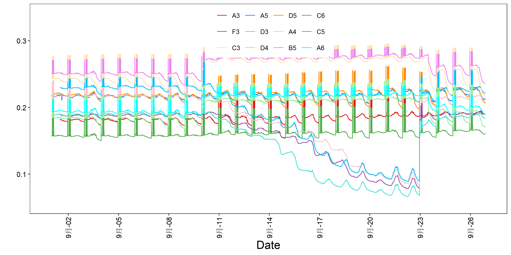
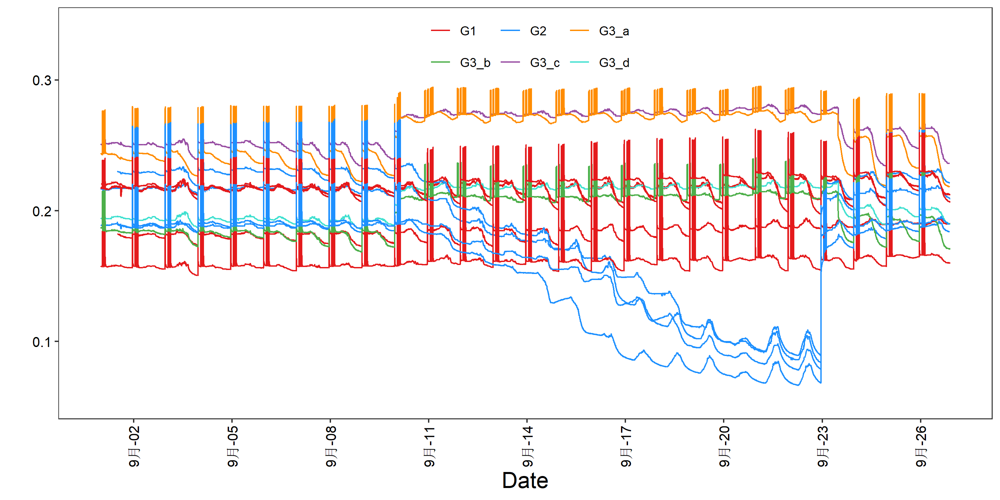

<style>
img{
    width: 30%;
}
</style>


* Scripts：[time_series_plot.r](TimeSeries/time_series_plot.r)   


### 用法
1. 输入含index & header 的表格，index列为时间记录，第二列开始为样本
2. 假设输入的时间是等间隔的、且中间没有缺失的日期;对输入不做检查
3. 假设输入的时间格式为dmy_hm(默认)或ymd;若不是，先转换，或更改脚本中:
```
if(day_format){df$time= as_datetime(ymd(df$time))}else{df$time= dmy_hm(df$time)}
```


### 脚本说明
1. 对于sd se ci，画出来的是x +- 0.5*sd
2. legend的排列目前还不太自由。如果无法fit进图中，建议使用--legend_position right --horizontal_legend F 放到图外； 或者，更改脚本：guide_legend(byrow = T,direction='horizontal',nrow = 5, ncol = 5)
3. 因含特殊符号，不能将exptime_series_plotsion与普通语句结合，于是用y_axis_lable_parse替代y_axis_lable。二者区别就是y_axis_lable_parse会表达exptime_series_plotsion。
<font color='red'> 但是，y_axis_lable_parse 将全句视为exptime_series_plotsion，单词间空格必须由'~'替代, 同时还要遵循其他exptime_series_plotsion的表达格式</font> 

4. 有时会有如下Warning, 是因为计算ribbon时，某组有一段时间不能计算（非NAN样本数不满足计算要求）。  
    <font color='red'> 计算ribbon后我将ci sd se 中nan都替换为0  </font>  
    理论上，其ci应该被inf替换，但这样无法绘图。  
    <font color='red'> ci的计算样本数量比较敏感，非nan太少的话就会出现下文前端不正常宽度的区间！ </font> 
```
Warning message:
In qt(conf.interval/2 + 0.5, datac$N - 1) : NaNs produced
```


### 示例
```
Rscript time_series_plot.r -f example.xls -o 1.png
Rscript time_series_plot.r -f example.xls -o 2.png --y_axis_lable 'Test Lable */%()[]{}^3/m^4'
Rscript time_series_plot.r -f example.xls -o 3.png --date_labels '%m-%d' --date_breaks '1 day' # change_axis_date_style
Rscript time_series_plot.r -f example.xls -o 4.png -g group.xls   #default_group
Rscript time_series_plot.r -f example.xls -o 5.png -g group.xls --plot_avg T  # avg_group
Rscript time_series_plot.r -f example.xls -o 6.png -g group.xls --ribbon sd  # sd_ribbon_group
Rscript time_series_plot.r -f example.xls -o 7.png -g group.xls --ribbon ci  # ci_ribbon_group
Rscript time_series_plot.r -f example.xls -o 8.png -g group.xls --ribbon ci --conf_interval 0.99  # ci2_ribbon_group
Rscript time_series_plot.r -f example.xls -o 9.png --legend_x 0.2 --legend_y 0  # test_legend1
Rscript time_series_plot.r -f example.xls -o 10.png --legend_position right --horizontal_legend F  # test_legend2
Rscript time_series_plot.r -f example.xls -o 11.png --if_legend F  # no_legend

Rscript time_series_plot.r -f example2.xls -o 12.png -g group.xls --day_format T  # Another input datatype
```






