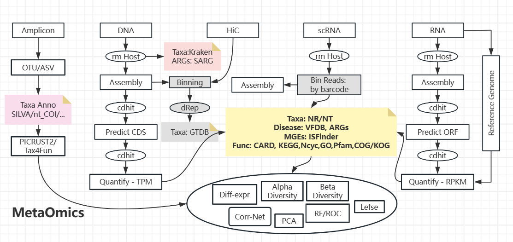

注意：微生物可能是处于动态平衡中，一次采样只是得到一个瞬时snapshot；再者MAGs本质上也是一堆相似基因组的cluster，高质量MAGs之外还有些没被归类的序列可能有功能

## 基于相对丰度

宏基因组的数据处理参考一篇[流程/工具总结](https://www.sciencedirect.com/science/article/pii/S2001037024001430)。病毒由于含量少，另有工具（VirSorter/VirFinder/geNomad/...checkv）





### Life history strategy


代谢潜力(KEGG) -> **生活史策略(KEGG)** -> 表观状态（生长速率）


* 富营养/寡营养比 (Copiotrophic/Oligotrophic Ratio)：群落中富营养型细菌（快速生长）与寡营养型细菌（节约缓慢）的相对丰度比例。基于**微生物的生长速率**判断：
    - 当前生长速度：基于覆盖度的 Peak-to-Valley Ratio（复制起点/复制终点），推荐工具 CoPTR
    - 理论生长潜力：基于 ORF Coden Usage，推荐工具 gRodon `--- 虽然16S数据也可以计算密码子偏好，但这类序列只覆盖基因组不到1%的区域，信息量远不如 WGS；况且16S的进化模式似乎和普通基因不一样`
    - 理论生长潜力：基于 rrn 拷贝数（rRNA的基因） `--- 16S数据如何估算？用物种丰度乘上rrnDB中该物种平均的拷贝数，我觉得应该不会准。`


此外，还能基于群落Flux模拟推算个体生长速率，见 [FBA笔记-MICOM](../../_Blocks/FBA.md#micom)


## 基于绝对丰度

基于相对丰度的研究不能体现真实的变化。比如，单纯基于比例的变化时，看起来A减少了、B/C/D增加了，它们负相关？但其实它们都减少了

```bash
AAAA BB  CC  DD  ==>  A   B   C   D
 40% 20% 20% 20%      25% 25% 25% 25% 
```

对于这个问题，当前的测序技术提供微生物loading的测量，也有一些统计推断方法上的优化。


### [Scale-Reliant Inference](https://link.springer.com/article/10.1186/s13059-025-03609-3)

如果只有相对丰度，在下游分析时应当考虑“微生物总量一致”这个假设上可能存在的误差。可以量化这种误差作为先验信息（e.g. 有95%的把握认为，两个样本loading的比值在某个Scale之间: [0.26,3.89]），然后从这个分布中采样、模拟计算某个参数的后验分布（e.g. `Posterior(Fold_change) ∝ ∫ [ Likelihood(Data|Fold_change,Scale)× Prior(Scale) ] d(Scale)`）。 --- [PIM](https://arxiv.org/pdf/2512.12040)就是这种不确定性建模，它额外量化了数据中稀疏性的不确定性

整体上的策略是：从分布中多次采样、得到效应大小的不确定性度量（替代传统的P值置信空间）。因此，在统计推断任务时，它可以消除一些FDR。

但由于它输出的是一个宽泛的分布，可能不适合进行模拟（模拟过程中添加更多的随机性 & 数值经过非线性传递后成倍放大不确定性度量）

---------------------------------

一些使用示例。

* 菌A的`Fold_change(健康样本中,疾病样本中)`的后验分布的是 `均值=1.5，95%置信区间 [-0.5,3.5]`。从丰度表上计算的 Fold_change 是 2.25，但我们无法认为菌A在健康样本中含量明显更高、因为传导自‘绝对丰度的未知差异’的这个不确定区间实在太宽了


* 从丰度矩阵的后验分布中抽样，可以得到每对样本间距离的分布（聚类分析）、Alpha多样性的分布、多次建立共现网络（评估边的稳健与否）、多次进行Source Tracing（评估来源推断的稳定程度）


### Spike-in for Metagenomics


### qPCR for 16S rRNA


### FCM for living cells


