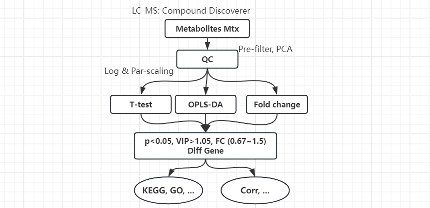

质谱原始数据经过 [Compound Discoverer](https://www.thermofisher.cn/order/catalog/product/cn/zh/OPTON-31055) 进行峰提取、峰对齐、峰校正、标准化后可以得到正/负compounds 的定性/定量数据矩阵 共4个文件


## 广泛靶向代谢组


* 化合物预筛选
    - QC 样本由每个待测样本贡献相同体积液体混合而成，被多次检测；计算多次QC中每个 Compound 的 RSD (Relative Standard Deviation) 值，选取 RSD < 0.3 的化合物；如果一个样本中有超过70%的化合物 RSD < 0.3，说明 QC 稳定，代谢物峰面积可直接除以QC中均值进行标准化
    - 缺失值不能太多，最好选取>50%样本含有的化合物

* 分别对正/负compounds进行PCA，展示研究采用的仪器和方法是否具有良好的稳定性和重复性
* 对数据进行log转换与Par-scaling
* 分别对正/负compounds的不同组间进行两两比较(e.g. A vs B)，筛选差异基因：t-test's p<0.05, OPLS-DA's VIP>1.05, Fold change  (0.67~1.5)
* 对差异基因进行通路分析：KEGG
* 使用差异基因进行相关性分析...


## 研究分类

### [A lipidomics roadmap](https://www.nature.com/articles/s41467-026-73797-4)：脂质组学综述

* 静态（LC-MS）or 时间动态（代谢追踪、通量分析：生物正交反应，同位素标记）or 空间定位（MS imaging or 荧光标记） --- ```实验进展超过信息学进展？```

* MS数据有数据库（LMSD/SwissLipids/LipidBank）以及脂质研究的原始数据（Metabolomics Workbench）。**靶向的MS数据**只关心预设的特定代谢物（通常几十到几百个，通常可精准定量）；而**非靶向的MS数据**意在探索，其中有一部分质谱峰无法被注释（电离加合物/源内裂解/高分子聚集态/不在公共数据库内），针对这个“暗物质”问题：

```bash
1. Reverse metabolomics
通常：比对样本，得到与疾病相关的“差异分子”后再利用数据库鉴定其结构
反向：自定义/推断一些潜在代谢物（有机合成/pathway/...） → 合成、混合这些小分子化合物，测量混合物的质谱 → 比对公共数据库（e.g.是否频繁出现在“IBD”病例的数据集中？）

2. 分子网络（Molecular Networking）
GNPS平台的核心方法：每个分子都会产生一张独特的MS²碎裂“指纹图谱”，计算这些“指纹”之间的相似度、将结构相似（因此碎裂图谱也相似）的分子聚集成一个个“分子家族”，并以网络图的形式直观地展示出来 --- “soft matching”：匹配则基于这个分子与多个分子之间的相似度
NetID算法：以离子峰为节点，如果两个峰之间的质量差可以对应到一种合理的代谢事件（reaction：e.g.相差一个H₂O，对应脱水反应），则在它们之间连一条边 --- “GNN + 化学反应_prior + 已被数据库注释的化合物”

3. MassQL：以质谱数据中的各种特征作为搜索条件 ---  “soft matching”：满足所选的特征即可
MS1模式：如特定的同位素特征（例如，含溴或氯的化合物）、加合物质量偏移
MS/MS模式：如诊断性的碎片离子、特定的中性丢失（例如，丢失糖基或特定官能团）

4. AI模型
学习代谢物的结构规律：化学语言模型（如 DeepMet）
学习碎裂规则：CFM-ID

5. 同位素示踪技术（如 IsoNet）：通过追踪原子在代谢物中的去向，推断并验证未知的代谢反应，不依赖先验知识
```

* 研究角度
    - 癌症/心血管/代谢疾病，衰老时钟：易感性（GWAS/纳入风险评分）、诊断（但临床批准很少，只有几种营养不良症的筛查）、预后和药效学监测以及治疗靶
    - 评估食品质量（脂质谱加入FoodDB/FoodData Central）、优质脂质的获取（微藻/新作物/昆虫/微生物），以及**饮食干预调节疾病风险**的研究，e.g.疾病标志物对膳食干预的反应 --- 指饱和脂肪酸（SFA）和多元不饱和脂肪酸（PUFA）的含量变化
    - 监测环境化学物质暴露（exposures）：紫外线损伤（氧化脂质 epilipids），PFAS 暴露（肝脏损伤 --> 产前/早期暴露导致脂质变化），微塑料和重金属毒性
    - 物种分化、生物多样性：尽管细胞结构和核心膜功能保守，脂质组成在不同taxa间差异很大。进化猜想，普遍共同祖先的异质膜包含两种脂质类型，由于其化学不稳定性，这些膜分裂为单层的古菌膜（G1P）与双层的细菌/真核细胞膜（G3P）。
    - 生态研究中，脂肪酸（FAs）作为营养级生物标志物，在各类群中各有特点（e.g.植物中富集油酸，真菌中富集亚油酸），可用于追踪营养路径以绘制食物网（QFASA：估算消费者饮食中猎物的组成），也反应食物网对环境的适应（海洋浮游生物脂质组全球调查发现，脂质不饱和指数与海洋温度之间存在强烈相关性）

* 未来：多组学，更高空间分辨率，为不同组织和器官生成脂质图谱，临床转化的挑战、性别二态性


## 参考
LCMS文件示例：https://www.bilibili.com/video/BV1rh411h7To/   
代谢组学数据标准化：https://zhuanlan.zhihu.com/p/79373522   
mzCloud 质谱库      
液相色谱质谱分析 (LC-MS)     
脂质组数据：UK Biobank, FINNGEN, and NAKO   
