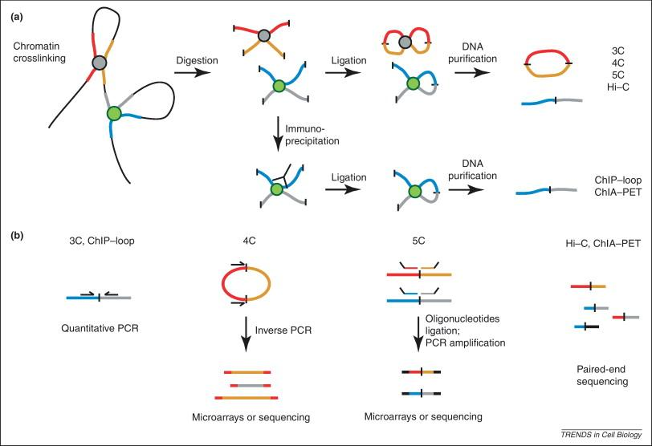

## 示意图

HiC相比3/4/5C可以做到全基因组范围的互作。将DNA用蛋白交联固定后，水解得到蛋白周边的DNA片段，链接DNA片段的末尾。如此，一个测序片段中，前半段与后半段将会被map到基因组中两个不同的位置，提示这两个位置在三维空间中接近。

## Basic Pipeline

### 组装
### 比对
### A/B compartment
### TAD

## Meta Pipeline

## 参考
A/B compartment 染色质区室： https://cloud.tencent.com/developer/article/1556901   
Unraveling the 3D genome: genomics tools for multi-scale exploration：https://www.ncbi.nlm.nih.gov/pmc/articles/PMC4490074/

