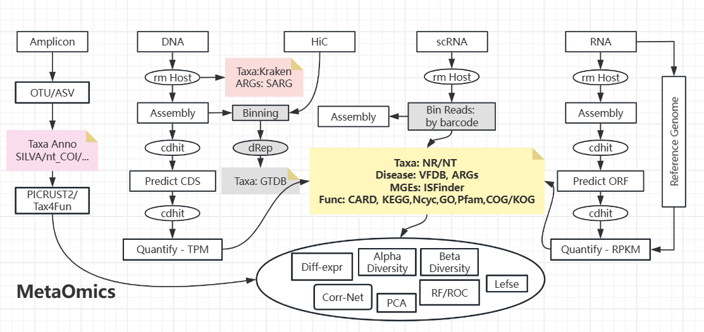

<style>
img{
    width: 80%;
}
</style>


* 在需要准确定量的项目如ATAC、转录组中，可以加入去除PCR重复的步骤。例如scRNA使用的UMI技术，或者通过samtools/picard去除duplicate
* RNA项目可以使用RSeQC进行测序饱和度分析，以确保有效检测
* **简化xxx**：缩小测序范围，e.g. WES,RRBS
* 当部分样本直接具有关联性时，就不能简单的考虑 Sample Size。假设有一部分样本(N=2)的Correlation可以计算，则着部分样本的 Effective_Sample_Size = N/[1+corr*(N-1)]

## Bulk

### Basic Pipelines
| Basic Pipelines | 说明 | -- |
| -- | -- | -- |
| [Genome](Bulk/Genome.md) | 组装基因组，并且预测基因；准备上传NCBI的格式 | 其它：Haplotype-based组装；结合HiC数据的组装 |
| Transcriptomics | [RNA-seq](Bulk/RNA.md) | 基因的转录水平，可变剪接 |
| [Proteomics](Bulk/Proteomics.md) | 蛋白组 | -- |
| [Metabolomics](Bulk/Metabolomics.md) | 代谢组 | -- |
| [Re-seq](Bulk/Re-seq.md) | 对已知基因组序列信息的个体进行测序，获取SNP、InDel、SV等信息 | 群体遗传，下游：GWAS |

### Metagenomics
关注环境中物种组成，或者功能基因的比例，或者物种/功能的Network

这里有一篇[流程/工具总结](https://www.sciencedirect.com/science/article/pii/S2001037024001430)

[]()


病毒由于含量少，另有工具（VirSorter/VirFinder/...）

对于Binning质量，一般使用checkm/busco进行检测

cd-hit 去除冗余序列，dRep去除冗余细胞

### Epi & Regulome

[表观遗传修饰](https://zhuanlan.zhihu.com/p/616493908)表观修饰可能是影响基因表达的潜在因素，常见包括：DNA甲基化、组蛋白修饰（影响染色质的暴露）、RNA甲基化...  研究话题可能与 发育、疾病、衰老 相关，例如：什么机制调控了疾病相关xx基因的过表达？

可以用实验手段直接评估调控元件的活性，例如：[MPRA（大规模、并行、基因编辑）](https://academic.oup.com/bioinformatics/article/41/6/btaf315/8139935)

DNA水平上的表观修饰主要是甲基化，可通过 [BS-seq](Bulk/BS-seq.md) 获取甲基化位点信息 / 免疫沉淀富集6mA的片段(MeDIP-seq) / 测序平台直接获取。

转录调控（```DNA -> RNA``` Transcription）一般也需要考虑细胞内**DNA的3D空间距离信息（[HiC](Bulk/HiC.md)）**。**[ATAC-seq](Bulk/ATAC-seq.md)** (Tn5) 标注**所有开放染色质**（Peaks 信号强度 = 开放程度），这些开放染色质可能是潜在的 TF-binding site (TFBS)，双峰/下凹Peak可能意味着位点被核小体/TF占据（也有可能是信号失真）。[Chip-seq](Bulk/Chip-seq.md) (超声随机断裂) 的原理是通过免疫共沉淀捕获目标蛋白、从而获得目标蛋白与DNA的互作位点，对象一般是修饰后的组蛋白/特定TF（e.g.CTCF）。**CUT&Tag** (Tn5 优先切割开放染色质) / CUT&RUN (MNase 对某些蛋白不敏感) 同样用于获得**目标蛋白与DNA的互作**，似乎更灵敏、更精细、低噪音、操作便捷，逐渐替代 Chip-seq。**PRO-seq** 用生物素标记原料、获得新生成的RNA，从这些被标记的RNA的位置，可知**正在生成中RNA的转录起始位点(TSS)**。**CAGE**（Cap Analysis of Gene Expression）精确捕获 mRNA 5' Cap 并测序其下游的短片段，即精确定位**所有静态/稳态RNA的 TSS**、CAGE tag 计数 = 启动子活性。

```bash
获知活跃的TFBS后（e.g. 与增强子活性标记 H3K27ac 共定位），如何推断其对应调控的基因？
1. 已知：增强子通常位于靶基因的±1Mb内，启动子区域（TSS ±2.5kb）的TFBS直接关联该基因
    - 方法：线性距离最近的TSS（基因）

2. 3D距离最近的TSS（基因） ---- HiC 辅助

3. 假设：TF与其靶基因可能共表达
    - 使用公共数据库（如GTEx、TCGA）或自有RNA-seq数据，构建共表达网络（如WGCNA）/ 筛选与TF表达高度相关的基因

4. 湿实验验证：TF扰动实验 + RNA-seq
```

复杂的细胞状态（信号通路、环境刺激、非编码RNA、蛋白质复合物）控制着各种酶的活性（e.g. m6A Writer/Eraser/Reader）,对RNA进行表观修饰、并通过这些修饰调控下游的剪接、翻译效率。

RNA的表观修饰（转录后修饰）有：m6A（剪接/翻译/降解），m5C（增强稳定性/影响核质转运），假尿苷（增强稳定性），A-to-I编辑。也可以通过 BS-seq / MeDIP-seq 获得甲基化修饰位点。**RNA的表观修饰会影响各种调控蛋白/miRNA(e.g.与RNA互补)的结合效率**，e.g. 加速招募mRNA降解相关蛋白/miRNA（**mRNA稳定性**），招募翻译起始因子/增强核糖体结合（**mRNA翻译效率**），于外显子-内含子交界处招募**剪接**因子，招募**转运**蛋白 ...

一般可以从 **RNA-seq 中获取可变剪接事件** (rMATS)、其突变信息（ANNOVAR）。 关于其调控机制，可通过 [SpliceAid 数据库](http://www.introni.it/splicing.html)预测剪接因子的结合位点，或使用 **CLIP-seq (蛋白-RNA互作)** 验证剪接因子（e.g. SRSF1）的结合位点（即调控剪接的顺式元件）。

翻译调控（```RNA -> Peptide``` Translation）的研究。Ribo-seq 可获得与核糖体结合的RNA片段（正在翻译），其定位(ribosome footprints)的密集程度暗示翻译的效率：Translation Efficiency = Ribo-binding Reads (Ribo-seq) / mRNA reads (RNA-seq)


关于 Ribo-seq，可以联合其它组学：
```bash
- 翻译效率是否正常？ --- （active mRNA） v.s. （蛋白组）

- mRNA稳定但翻译抑制？寻找相应的转录后修饰 --- （active mRNA） v.s. （RNA-seq / BS）
```


示例：一个研究问题
```bash
Alternative Promoter  --> TSS 变化  --> pre-mRNA 变化，如何影响翻译效率？
 - 长/短/序列不同的5'UTR --> 新增/减少 蛋白结合位点
    - 可变剪接 --> 不同的外显子 --> 蛋白结构/功能改变
    - 降解/翻译起始/.... 参考上文 ‘表观修饰’ 段
 - 在上游增加 ORF，翻译后核糖体脱离，抑制主ORF的翻译
```

* 一些可行的ML工具
    - 基于序列结构预测mRNA稳定性
    - 预测甲基化信息 --- [DeepCpG](https://zhuanlan.zhihu.com/p/93149457)基于单细胞类型可预测此信息
    - [MethNet](https://www.nature.com/articles/s41467-024-50380-3) 整合多组学，对启动子周围 1Mb 内的顺式调控元件（CREs）生成调控网络，关注重要的 Hub Node


## Single-Cell & Spatial

| -- | 说明 | -- |
| -- | -- | -- |
| [SingleCell](SingleCell.md) | Reads 带有 Cell Barcode 和 UMI | -- |
| [Spatial](Spatial.md) | Reads 带有空间信息 | -- |


