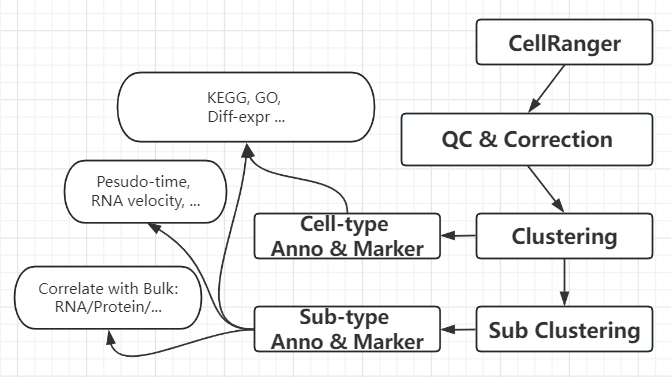
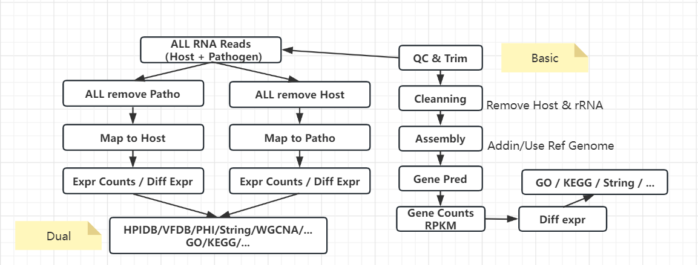

注：
* 在需要准确定量的项目如ATAC、转录组中，可以加入去除PCR重复的步骤。例如scRNA使用的UMI技术，或者通过samtools/picard去除duplicate
* RNA项目可以使用RSeQC进行测序饱和度分析，以确保有效检测
* 定量单位可以有TPM、FPKM... （TBA）

## Meta

## scRNA

## Spatial 
Space Ranger(10x Visium; each spot contains several cells) + Seurat.   
Seurat provides methods for clustering, gene expr viewing, marker detection and ‘anchor’ between scRNA datasets (e.g., scRNA data & deconvoluted Visium data).

## HiC
TBA

## ATAC-seq 
TBA

## Chip-seq 
TBA

## RNA

