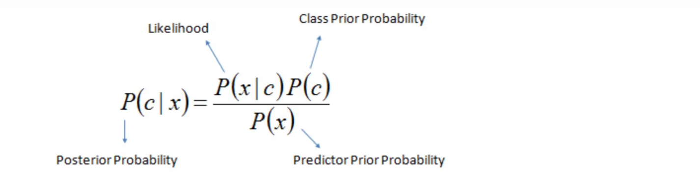

 

## 描述性统计

| -- | 样本 | 总体 |
| -- | -- | -- |
| 列说明 | 从总体N中取n测量值 | 有n个测量值的有限总体 |
| 均值 | $$\overline{y}=\frac{\sum\limits_{i=1}^{n}y_i}{n}$$ | $\mu$ |
| 方差 | $$s^2=\frac{\sum\limits_{i=1}^{n}(y_i-\overline{y})^2}{n-1}$$ | $$\sigma^2=\frac{\sum\limits_{i=1}^{n}(y_i-\mu)^2}{n}$$ |
| 标准差 | $$s=\sqrt{s^2}$$ | $$\sigma=\sqrt{\sigma^2}$$ |
| z score | $$z=\frac{y-\overline{y}}{s}$$ | $$z=\frac{y-\mu}{\sigma}$$ |

* 经验法则：68% 观测值位于 $\overline{y}\pm s$，95% 位于 $\overline{y}\pm 2s$，几乎所有位于 $\overline{y}\pm 3s$
* 切比雪夫法则：$(1-\frac{1}{k^2})$观测值位于k个标准差范围内($\overline{y}\pm ks$)
* z score：以标准差为单位，观测值y相对于均值的位置
* IQR=上四分位-下四分位，box plot 内篱笆为 1.5 IQR 范围内，外篱笆为 3 IQR；超出外篱笆者很可能是异常值

## 概率

* **概率**：给定模型参数，结果是否合理：均匀硬币，拋20次得15次正面的概率
* **似然**：给定观测值，描述模型参数是否合理：拋20次得15次正面，硬币均匀的可能性
* **简单事件**是一个试验的基本结果，不能被分解为更简单的结果；试验的**样本空间**是所有可能的简单事件的集合; 
    - e.g. 对于 0-1-2 随机选择，0是一个简单事件，{0,1,2}是样本空间
    - 简单事件的概率在 [0,1] 之间，且样本空间中所有简单事件的概率和等于1
    - **事件A**的概率等于事件A中所包含的简单事件的概率之和；e.g. A：{观测到1或2}
* 事件A的**补**$A^c$指所有不在A中的简单事件组成的事件， $P(A)+P(A^c)= 1$    
* **复合事件**可视为两个或更多事件的组合
    - A或B $= P(A \cup B)$
    - A和B同时发生 $= P(A \cap B) = P(A,B)$，如果A与B**互斥**（不能同时发生），$P(A,B)=0$
    - $P(A \cup B) = P(A) + P(B) - P(A,B)$
* **条件概率** $P(A|B)$：Given B 时，事件A发生的概率
    - $P(A,B) = P(A|B)P(B) = P(B|A)P(A)$
* 贝叶斯法则：通过已知的概率计算未知条件概率
     
    - 先验概率：不依靠观测数据的概率分布
    - 后验概率：基于观测数据得到的条件概率

* 从N中一次取n的不同**排列**个数：$A_N^n=N(N-1)...(N-n+1)=\frac{N!}{(N-n)!}$
* 从N中一次取n的不同**组合**个数：$C_N^n=\binom{N}{n}=\frac{N!}{n!(N-n)!}$
* 从N中取k个集合大小为$n_i$的集合，不同的分割方法个数：$A=\frac{N!}{n_1!n_2!...n_k!}$

* N中每个样本都有相等的被选中概率，如是被选出的n个样本可被称为**随机样本**
* $P(A|B)=P(A)$，B不影响A的概率，则A、B相互**独立**

## 随机变量

### 矩和矩母函数

如果随机变量的各阶矩都存在，可用来**证明两个随机变量具有相同的概率分布**

* 随机变量Y的**k阶原点矩** $\mu'_k=E(Y^k)$,(k=1,2,...)
* 随机变量Y的**k阶中心矩** $\mu_k=E[(Y-\mu)^k$]
* 离散随机变量Y的矩母函数:  
$m(t)=E(e^{tY})$  
$\hspace{2.4em}=\sum{e^{ty}p(y)}$  
$\hspace{2.4em}=\sum[1+ty+\frac{(ty)^2}{2!}+\frac{(ty)^3}{3!}+...]p(y)$  
$\hspace{2.4em}=\sum[p(y)+typ(y)+\frac{(ty)^2}{2!}p(y)+\frac{(ty)^3}{3!}p(y)+...]$  
$\hspace{2.4em}=\sum p(y)+\sum typ(y)+\sum \frac{(ty)^2}{2!}p(y)+\sum \frac{(ty)^3}{3!}p(y)+...$  
$\hspace{2.4em}=\sum p(y)+t\sum yp(y)+ \frac{t^2}{2!}\sum y^2p(y)+\frac{t^3}{3!}\sum y^3p(y)+...$  
$\hspace{2.4em}=1 + t \mu'_1+ \frac{t^2}{2!} \mu'_2+\frac{t^3}{3!} \mu'_3+...$  
$\hspace{2.4em}=1 + \mu'_1 t + \frac{\mu'_2}{2!}t^2 +\frac{\mu'_3}{3!} t^3+...$    
* 如果无法轻易展开$m(t)$，则可令t=0、对$m(t)$关于t进行k阶求导，**求得k阶原点矩**
    - 一阶求导$\frac{dm(t)}{dt}=(0+\mu'_1+ \frac{2t}{2!} \mu'_2 + ...)$，t=0 时 $\frac{dm(t)}{dt}=\mu'_1$
    - 二阶求导$\frac{d^2m(t)}{dt^2}=(0+0+ \mu'_2 + ...)$，t=0 时 $\frac{d^2m(t)}{dt^2}=\mu'_2$
* 连续随机变量的矩母函数的定义方法及应用与离散随机变量一致，只是期望值牵涉到积分

### 离散
| -- | 说明 | $p(y)$ | $\mu$ | $\sigma^2$ | 矩母函数 $m(t)$ |
| -- | -- | -- | -- | -- | -- |
| 离散 | (一般) | Y 取值为 y 的概率 | $E(Y)=\sum{yp(y)}$ | $E[(Y-\mu)^2]=E(Y^2)-\mu^2$   $其中E(Y^2)=\sum{y^2p(y)}$ | $E(e^{tY})=\sum{e^{ty}p(y)}$ |
| 伯努利 | 成功概率p、失败概率q，累计成功$y$次(0/1) | $p(y)=p^yq^{1-y}$ | $p$ | $pq$ | $pe^t+q$ |
| 二项 | 一系列（n次）伯努利试验，累计成功$y$次(0-n) | $p(y)=\binom{n}{y}p^yq^{n-y}$ | $np$ | $npq$ | $(pe^t+q)^n$ |
| 多项 | $n=\sum\limits_{i=0}^{k}{y_i}$次独立试验，每次试验都有k个可能结果；$y_i$指出现结果i的试验数目 | $p(y_1,y_2,...,y_k)=$ $\frac{n!}{y_1!y_2!...y_k!}(p_1)^{y_1}(p_2)^{y_2}...(p_k)^{y_k}$ | $\mu_i=np_i$ | $\sigma_i^2=np_i(1-p_i)$ | -- |
| 负二项 | Y表示直至第r次成功时的试验次数（时间） | $p(y)=\binom{y-1}{r-1}p^rq^{y-r}$ | $\frac{r}{p}$ | $\frac{rq}{p^2}$ | $(\frac{pe^t}{1-(1-p)e^t})^r$ |
| 几何 | r=1时的负二项 |$p(y)=pq^{y-1}$ | $\frac{1}{p}$ | $\frac{q}{p^2}$ | $\frac{pe^t}{1-(1-p)e^t}$ |
| 超几何 | 集合N由r个S、(N-r)个F组成；**无放回**地随机抽取n个元素；Y表示n中S的个数 | $p(y)=\frac{\binom{r}{y}\binom{N-r}{n-y}}{\binom{N}{n}}$ | $\frac{nr}{N}$ | $\frac{r(N-r)n(N-n)}{N^2(N-1)}$ | -- |
| 泊松 | 1 unit内发生事件的次数Y(0,1,2,..)；已知 1 unit内平均会发生$\lambda$次事件；发生在每个unit内的事件数独立于其它unit中事件数 | $p(y)=\frac{\lambda^ye^{-\lambda}}{y!}$ | $\lambda$ | $\lambda$ | $e^{\lambda(e^t-1)}$ |

* 二项试验中使用了**有放回**抽样（放回集合后再开始下一次抽取），Y的概率分布近似于二项分布；超几何试验则使用了**无放回**抽样，当N很大时Y分布亦可近似于二项分布，但当N小(e.g. <20n)时希望利用更加精确的超几何分布

### 连续

## 二元概率

## 参考
先验概率、后验概率、似然概率：https://zhuanlan.zhihu.com/p/397960221  

