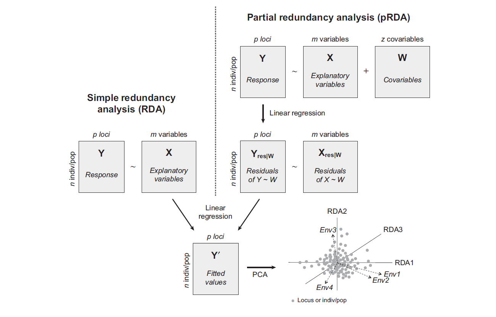

<script>
MathJax = {
  tex: {
    inlineMath: [['$', '$'], ['\\\\(', '\\\\)']]
  },
  svg: {
    fontCache:   'global'   // 'local',or 'global' or 'none'
  }
};
</script>
<script type="text/javascript" id="MathJax-script" async
  src="https://cdn.jsdelivr.net/npm/mathjax@3/es5/tex-svg.js">
</script>
<script type="text/javascript" id="MathJax-script" async
  src="http://127.0.0.1:8000/Bioinfo/Statistics/Basis/tex-svg.js">
</script>
<script type="text/javascript" id="MathJax-script" async
  src="https://github.com/Jiarong-L/notes/blob/main/docs/Bioinfo/Statistics/Basis/tex-svg.js">
</script>
<!-- src="https://cdn.jsdelivr.net/npm/mathjax@3/es5/tex-svg.js" -->
<!-- src="http://127.0.0.1:8000/Bioinfo/Statistics/Basis/tex-svg.js" -->


<style>
img{
    width: 60%;
}
</style>


生物信息中常用的数据降维方法


<details>
<summary> Vegan 是R中比较常用的生态学统计包 </summary>

参考：<a href="https://rdrr.io/rforge/vegan/man/">Man pages for vegan</a>，<a href="https://cran.r-project.org/web//packages//vegan/vignettes/FAQ-vegan.html">FAQ-vegan</a>，<a href="https://cran.r-project.org/web/packages/vegan/vignettes/decision-vegan.pdf">Scale.pdf</a>，<a href="https://zhuanlan.zhihu.com/p/99308486">数据标准化方法</a>，<a href="https://rdrr.io/cran/vegan/man/scores.html">scores()</a>，<a href=""></a>


```
library(vegan)
browseVignettes("vegan")  ##查看doc

## 随后可对原始物种分布矩阵进行预处理：（centered, standardized, transformed, normalized）

## standardized:  decostand()  scale()
## transformed:  sqrt()  log()  log10()  log1p()  
```

比起直接访问结果对象，推荐以下两种方法提取 scores of ordination axes：（顺便可以scale一下结果）
```
## scaling：options "sites", "species", "symmetric" defines the set of scores which is scaled by eigenvalues
## const：set the numeric scaling constant to non-default values
## correlation can be used to modify species scores so that they show the relative change of species abundance, or their correlation with the ordination. This is no longer a biplot scaling.

scores(res, choices = 1:2, display='both')  ## 2列，"sites" or "species" or "both"/"all" or ...
summary(crda,scaling=0,axes=2)$species  ## 2列，不scale
```

RDA对象中数据默认不Scale，但是在Summary或Plot时又会默认进行scaling="species"(i.e.对spe进行scale，其它仅乘 General scaling constant) <br>


</details>


## Recall

### QR Decomposition
[参考1](https://zhuanlan.zhihu.com/p/47251888)，[参考2](https://zhuanlan.zhihu.com/p/112327923)


将矩阵$A$分解：$A=QR$，$QQ^T=I$为正交矩阵，R 是 upper triangle 矩阵
（TBA）


### Eigen

假设对于$n$阶矩阵 $A \in R^{n \times n}$，存在非零列向量 $\vec{v} \in R^{n}$ 使得 $A\vec{v}=\lambda\vec{v}$，则 $\lambda \in R$ 为矩阵$A$的一个**特征值**，$\vec{v}$ 为为矩阵 $A$ 的一个**特征向量**

求解过程：

* $A\vec{v}-\lambda\vec{v}=0$
* $A\vec{v}-\lambda I \vec{v}=0$，$(\because \vec{v}=I\vec{v})$
* $(A-\lambda I)\vec{v}=0$
* $A-\lambda I=0 $，$(\because \vec{v}非零)$
* $
\begin{bmatrix}
a_{11}-\lambda & a_{12} & ... & a_{1n} \\\\
a_{21} & a_{22}-\lambda & ... & a_{2n} \\\\
... & ... & ... & ... \\\\
a_{n1} & a_{n2} & ... & a_{nn} 
\end{bmatrix} = 0
$ 可求得多个解 $\lambda_1,\lambda_2,...$
* 将$\lambda_i$代入原式，计算$\vec{v_i}$


[参考1](https://zhuanlan.zhihu.com/p/625791671), [参考2](https://zhuanlan.zhihu.com/p/104980382)

### SVD
（奇异值分解）[参考1](https://zhuanlan.zhihu.com/p/29846048),[参考2](https://zhuanlan.zhihu.com/p/629013736)

$$
\begin{bmatrix}
a_{11} & ... & a_{1n} \\\\
a_{21} & ... & a_{2n} \\\\
... &  ... & ... \\\\
... &  ... & ... \\\\
a_{m1}  & ... & a_{mn} 
\end{bmatrix} = 
\begin{bmatrix}
| & | & ... & ... & ... & | \\\\
| & | & ... & ... & ... & | \\\\
\vec{u_1} & \vec{u_2} & ... & ... & ... & \vec{u_m} \\\\
| & | & ... & ... & ... & | \\\\
| & | & ... & ... & ... & |
\end{bmatrix}
\begin{bmatrix}
\sigma_1 & 0 & ... \\\\
0 & \sigma_2 & ... \\\\
0 & 0 & ...  \\\\
... & ... & ...  \\\\
0 & 0 & ...  
\end{bmatrix}
\begin{bmatrix}
.- & \vec{v_1} & -. \\\\
... & ... & ... \\\\
.- & \vec{v_n} & -.
\end{bmatrix}
$$

任意实矩阵 $A \in R^{m \times n}$ 都可以分解为 $A=U \Sigma V^T$，其中

* $U \in R^{m \times m}, U^TU=I$
* $\Sigma \in  R^{m \times n}, (\Sigma)_{ii}=\sigma_i$ 依次增大，其余部分为0
* $V \in R^{n \times n}, V^TV=I$


解法：

* $(A^TA)\vec{v_i}=\lambda_i\vec{v_i}$，对$(A^TA) \in R^{n \times n}$ 求特征值得$\vec{v_i}$与$\lambda_i$

* $(AA^T)\vec{u_i}=\lambda_i\vec{u_i}$，对$(AA^T) \in R^{m \times m}$ 求特征值得$\vec{u_i}$与$\lambda_i$

* $A\vec{v_i}=\sigma_i\vec{u_i}$ 求解奇异值 $\sigma_i = \sqrt{\lambda_i}$


用法：可以用$\Sigma$中最大的k个奇异值来近似表达原矩阵：$A_{m \times n} \approx A_{m \times k} = U_k\Sigma_kV^T_k$

SVD分解后的右奇异矩阵$V$，对应着PCA所需的主成分特征矩阵


### MDS

假设 $m$ 个样本在原始空间的距离矩阵 $D \in R^{m \times m}$，其 $i$ 行 $j$ 列的元素 $dist_{ij}$ 表示样本 $x_i$ 到 $x_j$ 的距离，多维缩放(Multiple Dimensional Scaling, MDS)的目标是获得样本在 $d'<m$ 维空间的表示，并且**任意样本在低维空间中的距离等于原始空间中的距离**（欧式距离/其它）


* $dist_{i-}^2=\frac{1}{m}\sum\limits_{j=1}^{m}dist_{ij}^2$
* $dist_{-j}^2=\frac{1}{m}\sum\limits_{i=1}^{m}dist_{ij}^2$
* $dist_{--}^2=\frac{1}{m^2}\sum\limits_{i=1}^{m}\sum\limits_{j=1}^{m}dist_{ij}^2$
* 内积矩阵$B$，其元素 $b_{ij} = -\frac{1}{2}(dist_{ij}^2-dist_{i-}^2-dist_{-j}^2+dist_{--}^2)$
* 对内积矩阵$B$进行特征值分解，取 $\Lambda$ 为 $d'$ 个最大特征值构成的对角矩阵，$V$ 为相应的特征向量矩阵
* 得到新矩阵 $\Lambda V^{1/2} \in R^{m \times d'}$，每行是一个样本的低维坐标


## PCA
（主成分分析: 如果一个特征的**方差**很大，则说明这个特征上带有大量的**信息**）[参考1](https://zhuanlan.zhihu.com/p/448641448),[参考2](https://zhuanlan.zhihu.com/p/478417013),[参考3](https://www.cnblogs.com/banshaohuan/p/13308723.html)


1. 矩阵数据 $A_{m \times n}$：m_Sample，n_Feature
2. 对 $A^TA \in R^{n  \times n}$ 进行特征值分解，得到$n$组特征值与特征向量 $(\lambda_i \in R,\vec{v_i}\in R^{n})$，即：$PC_i$上保留方差的比例与最大方差的方向
3. 计算m_Sample在$PC_i$上的坐标：$A\vec{v_i} = \vec{d_i} \in R^{m}$

若计算n_Feature在$PC_i$上的坐标，则对 $AA^T \in R^{m  \times m}$ ...(略，实际操作时对$A^T$进行PCA即可)   

<details>
<summary>示例代码</summary>
<a href="https://davidzeleny.net/anadat-r/doku.php/en:pca_examples">示例1</a>

```R
A = iris[,-5]
res <- prcomp(A,center = FALSE, scale= FALSE)

pc_importance <- summary(res)$importance  ## 各PC方差占总方差百分比
res$x    ## m_Sample在PC上的坐标

## S <- scores(res, choices = 1:2, display='both')
## S$species = res$rotation = n_Feature的特征向量矩阵，也是载荷(loading)图中n_Feature箭头在PC上的坐标？？
## S$sites = res$x = m_Sample在PC上的坐标 = scaled_centered_A x $rotation = as.matrix(A) %*% as.matrix(res$rotation)
```
**Question**：载荷(loading)等于特征向量乘以特征值的平方根，一个Feature在所有PC上载荷的平方和为1（理解为各PC对该Feature方差的解释度）；但help(prcomp)中说rotation是 ‘the matrix of variable loadings (i.e., a matrix whose columns contain the eigenvectors)’、且 ``` eigen(t(as.matrix(A)) %*% as.matrix(A)) ```确实等于 ```$rotation```

</details>


## PCoA

关注距离，[示例](https://blog.csdn.net/qq_47369980/article/details/122644823)

1. 对样本集生成距离矩阵 $D$，生态学中常见使用 Jaccard, Bray-Curtis, Unifrac, ...
2. MDS：```cmdscale(D,k=nrow(D)-1,egi=TRUE)```


## NMDS

关注距离的秩次，[示例](https://zhuanlan.zhihu.com/p/559725141)


1. 对样本集生成距离矩阵 $D$，
2. ```metaMDS(D,k=nrow(D)-1)```


Stress is a proportional measure of badness of fit，一般当stress > 0.2时表明使用该方法不合适


## Canonical Analysis
[典型相关分析（Canonical Analysis）](https://www.sciencedirect.com/science/article/abs/pii/B9780444538680500113) 

* Asymmetric：RDA、CCA、LDA；  
* Symmetric：CCorA、CoIA、Proc


### RDA
（仅当y与x为**线性**关系时使用RDA，否则可以考虑逻辑回归、梯度森林、polynomial RDA...），[参考1](https://www.researchgate.net/publication/354709037_Redundancy_Analysisrda_a_Swiss_Army_knife_for_landscape_genomics)，[参考2](https://r.qcbs.ca/workshop10/book-en/redundancy-analysis.html)

 


| 输入 | -- | -- |
| -- | -- | -- |
| Response Matrix | $Y$ | n样本 $\times$ p物种/loci/... |
| Explanatory Matrix | $X$ | n样本 $\times$ m环境因子/任何变量/... |
| Conditioning variables | $W$ | n样本 $\times$ z限制因子(e.g. 群体结构参数，ancestry coefficients，PC axes，spatial eigenvectors) |


$Y$在$X$上进行多元回归 $y_{ii}=\beta_1x_{i1}+\beta_2x_{i2}+...$，得到拟合值矩阵：$\hat{Y}=XB=X(X'X)^{-1}X'Y$ 与 残差矩阵$Y_{res}=Y-\hat{Y}$

* 对$\hat{Y}$进行PCA分析，得到约束轴(constrained)$RDA_i$上展示的信息 (explained by X)
* 对$Y_{res}$进行PCA，得到非约束轴(unconstrained)$PC_i$上展示的信息 (explained by residuals)

轴的总数量为(n_sample-1)，其中约束轴数目为(explain_x_level)，余下为非约束轴；其中 explain_x_level = quantitative_x数目 + (categorical_x中类别数-1)

**Question**: X矩阵如何映射到RDA坐标？？$\hat{Y}^{n \times p}V^{p \times p}=X^{n \times m}B^{m \times p}V^{p \times p}$=n个样本在p个RDA上的坐标，求：$B^{m \times p}V^{p \times p}$=m个环境因子在p个RDA上的坐标？？

<details>
<summary>示例代码</summary>

参考：<a href="https://rdrr.io/rforge/vegan/man/cca.object.html">cca.object</a>，<a href="https://davidzeleny.net/anadat-r/doku.php/en:rda_cca">RDA_CCA</a>

<br>

```R
## 欧氏距离下的db-RDA capscale() 等效于 rda()
## rda(Y ~ X + Condition(Z)) 等于 rda(Y, X, Z); X, Z can be missing
## DataMatrix ~ ConstrainVar1 + Condition(Var)

data(dune)     ## decostand(dune, method = "hellinger")
data(dune.env)
####################################### Only Data Y = Only PCA
xrda <- rda(dune, center = FALSE, scale= FALSE)
biplot(xrda,type = c("text","points"))  


####################################### With constrains X
crda <- rda(dune ~ ., dune.env, center = FALSE, scale= FALSE) 
ordiplot(crda) 


####################################### With constrains X & condition Z
zrda <- rda(dune ~ A1 + Condition(Manure), dune.env, center = FALSE, scale= FALSE) 
ordiplot(zrda) 


#########################  结果说明  #############################

## eig占总体eig的比例
RDA_eig_prop = crda$CCA$eig / crda$tot.chi
PC_eig_prop = crda$CA$eig / crda$tot.chi


## scaled pos
### 默认scaling="species", 即 species scaled by eigenvalues
summary(crda, axes = 2) 
ordiplot(crda, type="n") |>
  points("sites", pch=16, col="grey") |>  
  text("species", pch=10, col="red") |> 
  text("biplot", arrows = TRUE, length=0.05, col="blue") 


## unscaled pos,scaling=0 改为 scaling=2 就如默认 scaled pos 一般
## 尝试但对不上！！ scale(crda$CCA$wa, scale = RDA_eig_prop,center=F)
summary(crda,scaling=0,axes=2)$sites  ## Site scores: 样本点(dune行名)在各轴上的坐标，crda$CCA$wa  ??看Doc crda$CCA$u 才是site坐标
summary(crda,scaling=0,axes=2)$species  ## Species scores: spe(dune列名)在各轴上的坐标，crda$CCA$v 
summary(crda,axes=2)$biplot ## ENV 箭头坐标 = crda$CCA$biplot 

summary(crda,scaling=0,axes=2)$constraints ## Site constraints: 样本点的fitted Site scores，crda$CCA$u
```

注：PCA过程中分解$\hat{Y}^T\hat{Y}$得到特征向量矩阵$U$:
<br>Species scores $U$：特征向量矩阵
<br>Site scores $YU$：ordination in the space of Y
<br>Site constraints $\hat{Y}U$：ordination in the space of X （x变量的线性组合？？）

</details>


### db-RDA

原始数据进行PCoA，将PCoA排序轴上的 Site scores 作为Response Matrix $Y$ 输入给RDA  
 


### CCA
[参考](https://zhuanlan.zhihu.com/p/52717082)