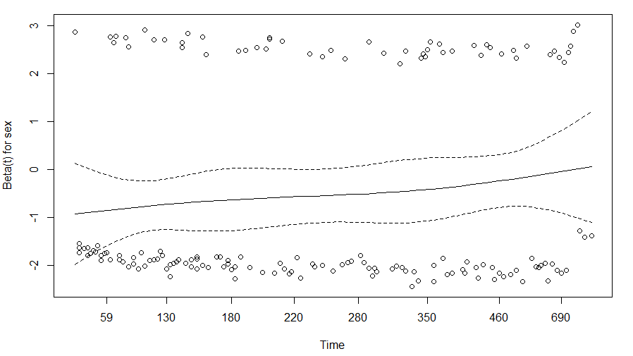

<script>
MathJax = {
  tex: {
    inlineMath: [['$', '$'], ['\\(', '\\)']]
  },
  svg: {
    fontCache: 'global'
  }
};
</script>
<script type="text/javascript" id="MathJax-script" async
  src="https://cdn.jsdelivr.net/npm/mathjax@3/es5/tex-svg.js">
</script>


<style>
img{
    width: 65%;
}
</style>


生存分析：研究因素与生存结局（阳性结局）在时间跨度上的关联


|  | 数据组成 | 
|  |  | 
| 分组信息 | e.g.A型血，B型血，O型血，AB型血 | 
| 生存结局 | 研究者设定某种阳性事件（e.g.死亡）。研究进行的时间跨度中，若事件发生则结局为1，若未发生则结局为0 | 
| 生存时间 | 从随访至阳性事件所经历的时间。可分为**完全生存时间**与非完全生存时间（又称**截尾值/删失值**，censord value） | 


|  | 分析手段 | 
|  |  | 
| 描述生存过程 | K-M曲线 | 
| 生存/风险函数是否有差异 | **LogRank**(Mantel-Haenszel): 各时间点权重一样，对远期差异敏感 <br> **Gehan Wilcoxon**(Breslow?): 以各时间点的观察例数为权重，对早期差异敏感 <br> **Tarone-Ware**: 以各时间点的观察例数的平方根为权重 <br> [详细link](https://zhuanlan.zhihu.com/p/210541300),根据事件时间分布、删失分布、曲线是否**交叉** 来决定方式与看待结果 | 
| 寻找风险因素 | Cox | 


| 术语 |  |  |  
|  |  |  |  
| 生存函数 | $$S(t)=P(T>t)$$ | 个体的生存时间大于t的概率 | 
| (ti时刻生存概率) | $$S(t_i)=S(t_{i-1})(1-\frac{d_i}{n_i})=exp[-\int_{0}^{t}h(u)du]$$ | d_i:在ti死亡的数目 <br> n_i: ti之前存活且非数据删失的数目 |  
| 风险函数 $\lambda$ | $$h(t)=\lim\limits_{\Delta t\rightarrow0}\frac{P(t\leq T<t \|T\geq t)}{\Delta t}=-\frac{dS(t)/dt}{S(t)}$$ | 个体生存到t时刻，单位时间内事件发生的rate |  
| Cox 模型 | $$h(t)=h_0(t)*\exp(b_1x_1+b_2x_2+...+b_px_p)$$ | $b>0增加h(t)，b=0于h(t)无影响，b<0减小h(t)$ |  
| Hazard Ratio | $$\frac{h_0(t)*\exp(b_1(x_1+1)+b_2x_2+...+b_px_p)}{h(t)}$$ | 若x_1增加一个单位，增加前后的风险对比，[详见](http://thisis.yorven.site/blog/index.php/2020/04/06/survival-analysis/) |  


# R示例
## Data
lung数据集，数据详情及下载见[链接](https://r-data.pmagunia.com/dataset/r-dataset-package-survival-lung)。  
```
setwd('C:\\Users\\12990\\Desktop\\s')
library("survival")
library("survminer")
lung <-read.csv("dataset-68740.csv",head=T,check.names=F)
```

## Surv(),survfit()
Surv()创建一个生存对象,随后survfit()创建一个分析图
```
Surv(time,event)

## time:  time
## event: 阳性事件发生的状态
```

如下写法数值一致
```
> survfit(Surv(lung$time,lung$status==2) ~ lung$sex)
Call: survfit(formula = Surv(lung$time, lung$status == 2) ~ lung$sex)

             n events median 0.95LCL 0.95UCL
lung$sex=1 138    112    270     212     310
lung$sex=2  90     53    426     348     550

> survfit(Surv(time,status==2) ~ sex , data = lung)
Call: survfit(formula = Surv(time, status == 2) ~ sex, data = lung)

        n events median 0.95LCL 0.95UCL
sex=1 138    112    270     212     310
sex=2  90     53    426     348     550


n: 样本数
events: 阳性事件发生数
median: 中位生存率对应的生存时间
0.95LCL: 置信区间下限
0.95UCL: 置信区间上限
```

## K-M
```
KM_sex <- survfit(Surv(time,status==2) ~ sex , data = lung)
p1 = ggsurvplot(KM_sex,
                pval = TRUE,
                ggtheme = theme_bw(),
                conf.int = TRUE,
                risk.table = TRUE,
                fun="event")


## "event" plots cumulative events (f(y) = 1-y), 
## "cumhaz" plots the cumulative hazard function (f(y) = -log(y)), 
## "pct" for survival probability in percentage.
## arrange_ggsurvplots(list(p1,p2,p3))
```


```
KM_all <- survfit(Surv(time,status==2) ~ 1 , data = lung)
ggsurvplot(KM_all,pval = TRUE, conf.int = TRUE,risk.table = TRUE)

#plot(KM_all,conf.int=T,col=c("red"),xlab="Days",ylab = "Survival probability")
#legend(0,0.5,legend=c("All"),lty=1,col=c("red"))
```


```
> summary(KM_all)
Call: survfit(formula = Surv(time, status == 2) ~ 1, data = lung)

 time n.risk n.event survival std.err lower 95% CI upper 95% CI
    5    228       1   0.9956 0.00438       0.9871        1.000
   11    227       3   0.9825 0.00869       0.9656        1.000
   12    224       1   0.9781 0.00970       0.9592        0.997
   13    223       2   0.9693 0.01142       0.9472        0.992
   15    221       1   0.9649 0.01219       0.9413        0.989
   26    220       1   0.9605 0.01290       0.9356        0.986
......
```

## log-rank test
* [参考](https://rdocumentation.org/packages/survival/versions/3.5-7/topics/survdiff): With **default rho = 0** this is the **log-rank** or Mantel-Haenszel test, and with ***rho = 1*** it is equivalent to the Peto & Peto modification of the ***Gehan-Wilcoxon*** test
```
surv_diff <- survdiff(Surv(time, status) ~ sex, data = lung, rho = 0)
p.val = surv_diff$pvalue
```

```
> surv_diff
Call:
survdiff(formula = Surv(time, status) ~ sex, data = lung)

        N Observed Expected (O-E)^2/E (O-E)^2/V
sex=1 138      112     91.6      4.55      10.3
sex=2  90       53     73.4      5.68      10.3

 Chisq= 10.3  on 1 degrees of freedom, p= 0.001 
```


## COX
* 基于风险比模型，评估不同变量对生存率的影响;**Cox模型和log-rank test都要求风险等比例（PH假定，[Assumptions](http://www.sthda.com/english/wiki/cox-model-assumptions),[pre-test](https://mp.weixin.qq.com/s/7lCRmezb0yw1JewHBw0ZrQ)）**，若否，可尝试RMST、分层、[时依协变量](https://mp.weixin.qq.com/s/CTLr-UeuxcDHe8Lf2r2DZQ)、等方法    
* *在进行多元回归前，如果因子太多，可以使用survdiff分组检验先选出显著的因子。   
* 除了Cox模型外,还要一些拟合其它分布的模型，例如指数、Weibull、Gompertz分布

### 单因素
单因素拟合Cox比例风险回归模型。风险比率exp(coef)=0.5880，说明女性（2）死亡风险是男性（1）的0.5880倍。
```
cox_sex <- coxph(Surv(time,status==2) ~ sex , data = lung)

> cox_sex
Call:
coxph(formula = Surv(time, status == 2) ~ sex, data = lung)

       coef exp(coef) se(coef)      z       p
sex -0.5310    0.5880   0.1672 -3.176 0.00149

Likelihood ratio test=10.63  on 1 df, p=0.001111
n= 228, number of events= 165

```

### 多因素
```
cox_2 <- coxph(Surv(time,status==2) ~ sex +age, data = lung)
> summary(cox_2)
Call:
coxph(formula = Surv(time, status == 2) ~ sex + age, data = lung)

  n= 228, number of events= 165

         coef exp(coef)  se(coef)      z Pr(>|z|)
sex -0.513219  0.598566  0.167458 -3.065  0.00218 **
age  0.017045  1.017191  0.009223  1.848  0.06459 .
---
Signif. codes:  0 ‘***’ 0.001 ‘**’ 0.01 ‘*’ 0.05 ‘.’ 0.1 ‘ ’ 1

    exp(coef) exp(-coef) lower .95 upper .95
sex    0.5986     1.6707    0.4311    0.8311
age    1.0172     0.9831    0.9990    1.0357

Concordance= 0.603  (se = 0.025 )
Likelihood ratio test= 14.12  on 2 df,   p=9e-04
Wald test            = 13.47  on 2 df,   p=0.001
Score (logrank) test = 13.72  on 2 df,   p=0.001

```

### 分层
加strata()按age分层计算，减少age造成的扰动
```
Call:
coxph(formula = Surv(time, status == 2) ~ sex + strata(age),
    data = lung)

       coef exp(coef) se(coef)      z       p
sex -0.6447    0.5248   0.2120 -3.041 0.00236

Likelihood ratio test=9.79  on 1 df, p=0.001756
n= 228, number of events= 165
```

### 模型检验
H0假设：风险比不会随时间而变化。p>0.05,不能拒绝H0。  
如果风险比伴随时间变化(p<=0.05)，方程中可加入类似'var\*time'的变换。  
```
## 图形法检验PH假定
plot(cox.zph(cox_2,transform=rank),var='sex')

> cox.zph(cox_2,transform=rank)
       chisq df    p
sex    2.378  1 0.12
age    0.137  1 0.71
GLOBAL 2.475  2 0.29
```



### Hazard Ratio
```
> summary(cox_sex)$coef[2]
[1] 0.5880028
```


## 参考
Survival-R: https://zhuanlan.zhihu.com/p/130316068   
**Survival**: http://thisis.yorven.site/blog/index.php/2020/04/06/survival-analysis/  
ggsurvplot：https://zhuanlan.zhihu.com/p/113676828  
**Survival**: https://zhuanlan.zhihu.com/p/497968260     
KM: https://zhuanlan.zhihu.com/p/391474891      
检验：http://www.lcgdbzz.org/custom/news/id/9442    

