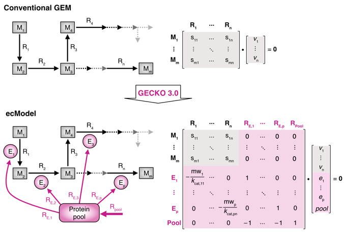

得到高质量的MAGs后，鉴定出所有的酶和代谢反应(KEGG/MetaCyc/自动化工具)，即得到GEMs(Genome-scale metabolic model)。（有点像[MetaGEM workflow](https://github.com/franciscozorrilla/metaGEM)，它加了一步[用 Smetana 进行 cross-feeding 模拟](https://smetana.readthedocs.io/en/latest/usage.html)，用 memote 生成[模型报告](https://asa-blog.netlify.app/p/gem/images/ReportSnapshot.webp)）

得到GEMs (SBML格式 --> 超图) 后，即可开始 Flux Balance Analysis（FBA）--- [What is flux balance analysis? - PDF](FBA/What_is_flux_balance_analysis.pdf) 

FBA不修改代谢模型，它只是评估不同Flux分配方案带来的产出

## Metabolic Model 

代谢模型是由一系列代谢反应组成的 Graph（Node=Metabolites,Edge=Reactions），**边权固定为化学系数**

化学反应权重固定，但反应速率可以不同；**Flux/通量**指代谢反应在单位时间、单位细胞质量下的转化速率：e.g. 代谢反应```A ⇋ B```的```net_Flux = forward - reverse```，可能在某种情况更多```A → B```、另一种情况下更多```A ← B```

数值上，负数表示消耗、正数表示产出，e.g. ```Reaction: A + 2B -> 3C``` 的反应系数可写作 ```{'A': -1,  'B': -2,  'C': +3}```

代谢模型中一些常见的网络结构：
```bash
       ┌→ v2 (分流1)
v1 → A ┼→ v3 (分流2)             分流点 
       └→ v4 (分流3)


v1 → ↘
v2 → → B → v5                    汇聚点
v3 → ↗


A → B → C → D                     Loop
↑           ↓
└───────────┘


         ┌→ R1 → R2 ┐
Start → →           → → End       并行
         └→ R3 → R4 ┘


A ⇌ B                             可逆，flux可正可负
```

代谢模型重建 (```基因注释EC/KO → 反应 → 代谢网络 → gap_filling / 排除假阳性、不重要的反应```) 可以参考[这篇论文](https://pmc.ncbi.nlm.nih.gov/articles/PMC3125167/)。对于单个微生物物种，也可以基于基因组注释信息、从物种完整的GEM中进行删减（[BiGG Models](http://bigg.ucsd.edu/data_access)，包含物种中大量经过手动验证的高质量反应），自动化工具[carveme](https://carveme.readthedocs.io/en/latest/index.html)即是如此（其它：培养基成分约束、合成辅因子/自身脂质的约束、模型简洁/最小化反应数量）

Gap Filling 指添加缺失反应（约束：基因组证据和生化合理性），使模型具备预期功能/使目标通路连通。有多种方式：[从生化反应数据库/相近GEMs中补足](https://www.pnas.org/doi/10.1073/pnas.2217400119)，比对其它组学注释，基于网络的拓扑特征 GNN [hyperlink prediction](https://www.nature.com/articles/s41467-023-38110-7)


较新的GEM框架会加入生理/热力学约束，e.g.[GECKO 3.0](https://www.siat.ac.cn/siatxww/kyjz/202412/t20241213_7457217.html) 构建酶约束模型(ecModel -- Flux受限于酶活力kcat、浓度)



对于以上话题，2025年综述总结了[ML如何辅助构建GEM](http://dianda.cqvip.com/Qikan/Article/Detail?id=7201252304) 《机器学习驱动的基因组规模代谢模型构建与优化 李斐然等》


## FBA 的约束

FBA 的约束与优化目标都是线性的，且方程式系数是整数 --- 混合整数线性规划(MILP)求解， COBRApy调用[optlang包](https://github.com/opencobra/optlang)提供的[优化器](https://cobrapy-cdiener.readthedocs.io/en/latest/solvers.html)

```bash
maximize = objective_function 

subject_to = {
    # 1. 质量平衡约束，必须满足！如上图，S--模型矩阵、v--Flux向量
    'mass_balance': 'S·v = 0'
    
    # 2. Flux lower/upper Bounds，e.g. 不可逆反应的Flux≥0，环境/培养基约束（设置交换反应model.exchanges的bounds）           
    'capacity_constraints': 'lb ≤ v ≤ ub'
}
```

[整数线性规划概念 - Video](https://www.bilibili.com/video/BV1QK4y1C73U)，[The Art of Linear Programming - Video](https://www.bilibili.com/video/BV1tN411Y7Ly/)，[线性规划 standard form problem](https://zhuanlan.zhihu.com/p/509030805)，[线性规划基础](https://oi-wiki.org/math/linear-programming/)


## FBA 模拟示例

假设有一个大肠杆菌的GEM [iML1515](http://bigg.ucsd.edu/models/iML1515)，模拟它在葡萄糖基本培养基中的好氧生长，希望预测最生长速率

使用 [cobrapy](https://cobrapy.readthedocs.io/en/latest/building_model.html)，其中 ```model.objective``` 仅针对 Reactions，若希望优化某一代谢物，只能选取与其相关的 ```model.exchanges/.demands/``` 反应（e.g.代谢物在 ```rxn.metabolites``` 中）

设置了Bound的反应才有这三种分类： ```exchanges 细胞与外部环境之间的双向交换```，```demands 细胞内代谢物的消耗或需求```，```sinks 模型填充时临时提供代谢物(？)```；对于反应 ```Exchange: co2_e ⇋ co2```/```Sink: glycogen_c ⇋ glycogen```，注意其代谢物 compartment 的设置，```_c 细胞质隔室/_e 外部隔室```

总之，参考[建模教程](https://cobrapy-cdiener.readthedocs.io/en/latest/building_model.html#Exchanges,-Sinks-and-Demands)，查看标准SBML格式示例


```py
import pandas as pd
import cobra
from cobra.util.solver import linear_reaction_coefficients
from cobra.flux_analysis import flux_variability_analysis

##  help(model) to see its attributes, like: .reactions .metabolites .genes
model = cobra.io.load_model('iML1515')      # if web fails, use .read_sbml_model('local.xml')  

## set _e intakes closed by default (-intake, +output) mmol/gDW/h
for reaction in model.exchanges:
    if reaction.id not in 
    reaction.bounds = (0, 1000)

## set medium bounds 
medium = { rxn_id:(-1000, 1000) for rxn_id in ['EX_nh4_e','EX_pi_e','EX_so4_e','EX_k_e','EX_na_e','EX_fe2_e','EX_mg2_e','EX_cl_e','EX_ca2_e','EX_cobalt2_e','EX_cu2_e','EX_mn2_e','EX_zn2_e','EX_mobd_e']}
medium.update({
    'EX_glc__D_e': (-10, 1000),    # Glucose
    'EX_o2_e': (-20, 1000),        # Oxygen, aerobic
})

for rxn_id, bounds in medium.items():
    try:
        reaction = model.reactions.get_by_id(rxn_id)
        reaction.bounds = bounds
    except:
        print(f"reaction {rxn_id} not in the model")


## run FBA 
model.objective = {                                         # print(linear_reaction_coefficients(model)) 
    model.reactions.BIOMASS_Ec_iML1515_core_75p37M: 1.0,    # default obj
    model.reactions.EX_ac_e: 0.5 
}
assert model.reactions.get_by_id("BIOMASS_Ec_iML1515_core_75p37M").upper_bound == 1000
assert model.reactions.get_by_id("EX_ac_e").upper_bound == 1000

solution = model.optimize('maximize')  ##  {None, 'maximize' 'minimize'}
print(f"{solution.fluxes['EX_glc__D_e']:.4f} mmol/gDW/h")  ## see each reactions
print(model.summary())  ## fva=0.95
flux_variability_analysis(model, model.reactions[:10], loopless=True)  ## FVA -- finds the ranges of each metabolic flux 
```


总之，设计不同的优化目标（e.g. 多产物合成=sum，碳利用效率=生长-葡萄糖消耗，...），计算理论得率，权衡不同通路的重要性/模拟不同环境下的代谢结果/模拟基因敲除后的结果（对包含这个基因的反应/这个基因```.knock_out()```，cobrapy提供单次敲除1-2个基因的批量模拟```single_gene_deletion(model)```），或筛查添加哪些反应能使模型变得可行 ```gapfill(failed_model, pan_model, demand_reactions=False, iterations=4)```

如果最优解的一致性不佳，可能存在 blocked reactions，用 ```cobra.flux_analysis.find_blocked_reactions(model)``` 查看

此外，如果认为一些通量异常的高、或FVA范围异常大，需要考虑是否是loop造成的（对比Loopless模式的结果）

如果有代谢组数据（一般是多个物种但暂且假设在一个整体循环内），可以根据其比例设置相关反应的通量约束bounds，或许也可以写一个壳子来优化这些约束（e.g.gradient）/其它Graph模拟。FBA模型本质上只是在拟合不同通路的权重，只能依据生产/消耗反应的通量来间接影响代谢物的预测浓度('flux-sum')、模型中最多设置 ```model.add_boundary(model.metabolites.xx_c, type='demand')```

除了最优解，flux sampling ```s = sample(model, 100)``` 可以探索（符合约束条件的）稳态下所有可能的Flux分布

Flux coupling analysis 则意在发现通路间的耦合：最大/最小化某个反应的通路、查看其它反应的变化
```bash
完全耦合：v₁ = k × v₂（k为常数）   e.g.糖酵解中的连续步骤
方向耦合：如果v₂ > 0，则v₁ > 0；如果v₂ < 0，则v₁ < 0      e.g.一个反应为另一个反应提供必需底物
部分耦合：如果v₁ ≠ 0，则v₂ ≠ 0     e.g.两个反应共享共同的代谢物池（如，辅因子NADH）
```


## 代谢模型 + 群落模拟

[gapseq + BacArena ](https://gapseq.readthedocs.io/en/latest/tutorials/crossfeeding.html)


