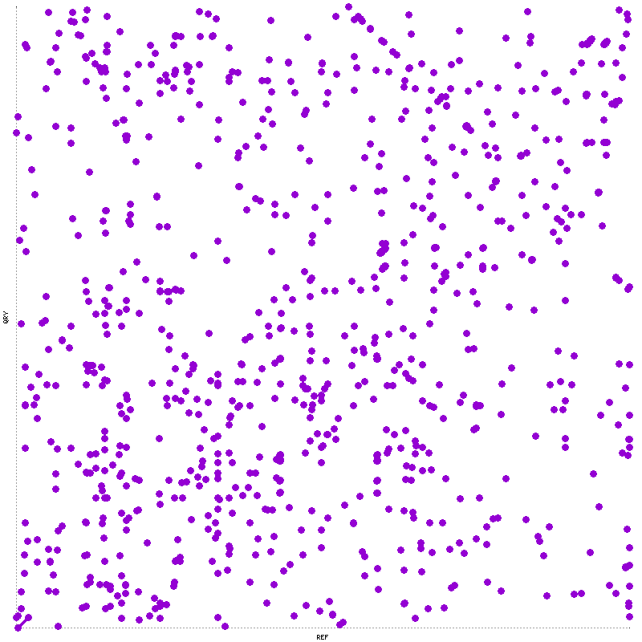
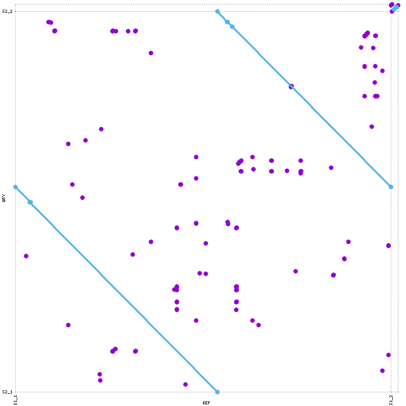
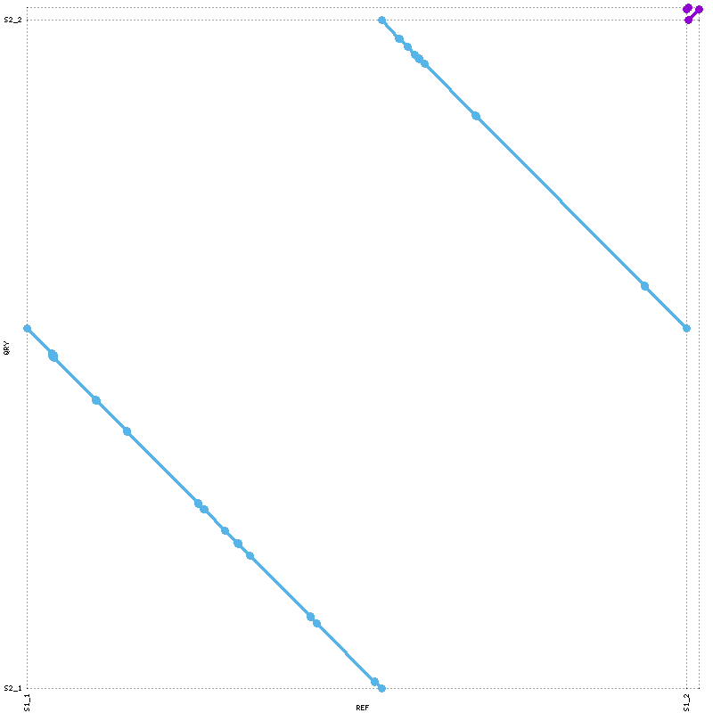
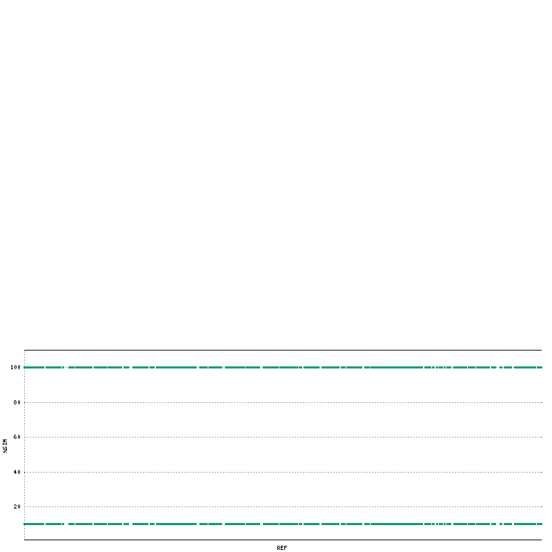
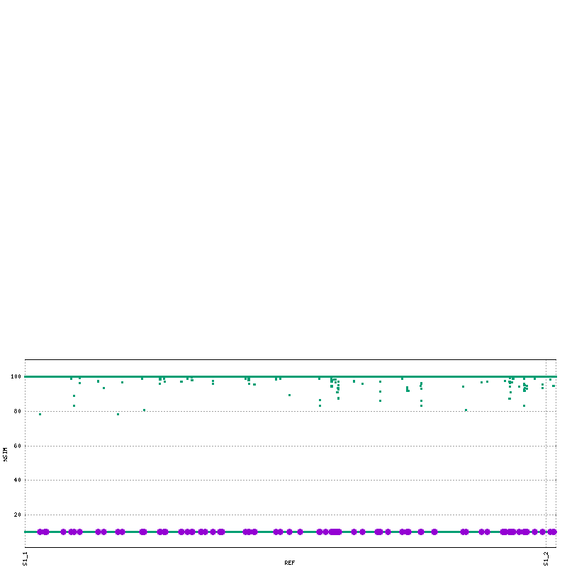
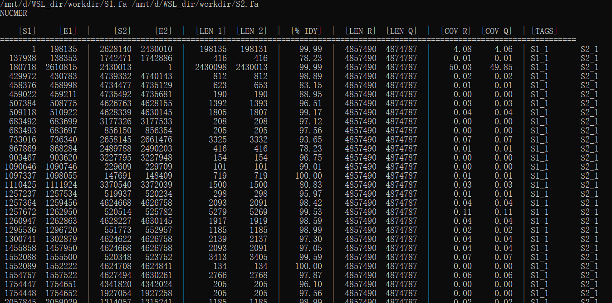
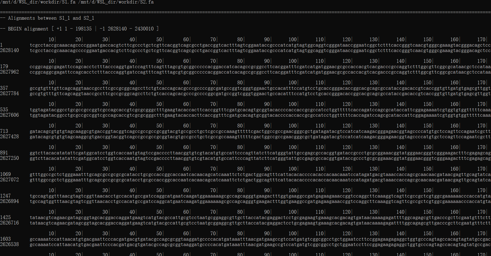

<style>
img{
    width: 30%;
}
</style>


全局比对


### Install
* Opt1-[git clone](https://github.com/mummer4/mummer.git)     
* Opt2-[mummer3](http://sourceforge.net/projects/mummer)
* Opt3-Conda  
```bash
sudo apt-get install g++
sudo apt-get install csh
sudo apt-get install gnuplot
sudo apt-get install gnuplot-x11


conda create -n mummer4
conda activate mummer4
conda install -c bioconda mummer4
conda deactivate
export PATH=$PATH:/mnt/d/WSL_dir/home/miniconda3/envs/mummer4/bin/
```
**注意，conda环境中时gnuplot可能失败，所以在环境外边plot**  

* Error1 - perl版本过高
```bash
## Can't use 'defined(%hash)' (Maybe you should just omit the defined()?) at /mnt/d/WSL_dir/home/MUMmer3.23/mummerplot line 884.
which mummerplot | while read dd ; do perl -i -pe 's/defined \(%/\(%/' $dd ; done
```

* Error2 - gnuplot出错; 此时需要**本地打开[Xming](https://sourceforge.net/projects/xming/)**，然后
```bash
export DISPLAY=localhost:0
which mummerplot | while read dd ; do sed -i "s/GNUPLOT_EXE = 'false'/GNUPLOT_EXE = 'gnuplot' /g" $dd ; done
```

### Data
下载Salmonella enterica的不同Assembly作为数据, Fasta_Header_Rename.py 本网站搜索可得。
```bash
wget https://ftp.ncbi.nlm.nih.gov/genomes/all/GCF/001/558/355/GCF_001558355.2_ASM155835v2/GCF_001558355.2_ASM155835v2_genomic.fna.gz -O S1.fa.gz
wget https://ftp.ncbi.nlm.nih.gov/genomes/all/GCF/016/028/495/GCF_016028495.1_ASM1602849v1/GCF_016028495.1_ASM1602849v1_genomic.fna.gz -O S2.fa.gz
wget https://ftp.ncbi.nlm.nih.gov/genomes/all/GCF/000/006/945/GCF_000006945.2_ASM694v2/GCF_000006945.2_ASM694v2_genomic.fna.gz -O S3.fa.gz

gunzip *

## Rename header as: S1_1, S1_2 ...
for dd in S1 S2 S3; do python3 Fasta_Header_Rename.py ${dd}.fa ${dd}.fa ${dd} ; done
```


### Alignment

* mummer: 使用suffix tree定位两个序列之间的最大唯一匹配，生成精确匹配的列表；同时最多32个Query File

* nucmer: 先找到给定长度的最大精确匹配，随后通过聚类、扩展合并形成更大的不精确对齐区域。适用于定位和显示DNA序列的高度保守区域。需要注意其中的anchor设定（默认--mumreference）

* promer: 策略同NUCmer，不过尝试翻译了6个氨基酸阅读框，因此比NUCmer具有更高的灵敏度；适用于识别在DNA水平上可能不保守的保守蛋白质序列的区域

* run-mummer1: 策略同NUCmer，不过可以处理非核苷酸序列；善于对齐非常相似的DNA序列并识别它们的差异，非常适合SNP和错误检测；适用于没有重排的one vs. one comparisons

* run-mummer3: 策略同NUCmer，不过可以处理非核苷酸序列；善于对齐非常相似的DNA序列并识别它们的差异，非常适合SNP和错误检测；适用于可能涉及重排的one vs. many comparisons

注意：conda-mummer4中无 mapview 和 run-mummer

Usage: 
```
mummer [options] <reference file> <query file1> . . . [query file32]
nucmer [options] <reference file> <query file>  
promer [options] <reference file> <query file>
run-mummer1 <fasta reference> <fasta query> <prefix> [-r]  
run-mummer3 <fasta reference> <multi-fasta query> <prefix>
```

Example: 
```bash
## Generates mummerO.mums
## mummer S1.fa  S2.fa  S3.fa  > mummerO.mums
mummer S1.fa  S2.fa > mummerO.mums


## Generates nucmerO.delta
nucmer -p nucmerO   S1.fa  S2.fa


## Generates promerO.delta
promer -p promerO    S1.fa  S2.fa

## Generates <prefix>.out, <prefix>.gaps, <prefix>.errorsgaps and <prefix>.align
## Depreted in conda-mummer4 ??
run-mummer1 S1.fa S2.fa run1_reverse -r
run-mummer3 S1.fa S2.fa run3
```


### Plot
mummerplot -h
```
mummerplot --png --prefix=mummerO   mummerO.mums
mummerplot --png --prefix=nucmerO   nucmerO.delta
mummerplot --png --prefix=promerO   promerO.delta

mummerplot --png --prefix=mummerO_Cov_SNP  --SNP  -c mummerO.mums
mummerplot --png --prefix=nucmerO_Cov_SNP  --SNP  -c nucmerO.delta
```







### Process
注：建议去[mummer3官网](https://mummer.sourceforge.net/manual/)查看Use cases and walk-throughs章节
```bash
## Filter by: identity>89, length > 1000
delta-filter -i 89 -l 1000 -1 nucmerO.delta > nucmerO.delta.filter

## Generate: xx.1coords  xx.1delta  xx.mcoords  xx.mdelta  xx.qdiff  xx.rdiff  xx.report  xx.snps
dnadiff -p nucmerO_diff  -d nucmerO.delta

## human readable table
show-coords -r -c -l -L 100 -I 50  nucmerO.delta |  less

## Show alienment of 2 sequence
show-aligns nucmerO.delta S1_1 S2_1 | less


## Not suitable for "many vs. many" assembly comparisons
## 将query contigs 贴回ref，以得到最佳映射位置；Each contig may only be tiled once, so repetitive regions may cause  difficulty
show-tiling promerO.delta  >  promerO.delta.tiling
mummerplot --png --prefix=promerO_tiling  promerO.delta.tiling
```




### 参考
mummer3: https://mummer.sourceforge.net/    
mummer4: https://github.com/mummer4/mummer    
mummer4: https://mummer4.github.io/install/install.html   
中文1: https://www.jianshu.com/p/c12f2a117892     
中文2: https://www.jianshu.com/p/2e184e5c15b7   
 
 