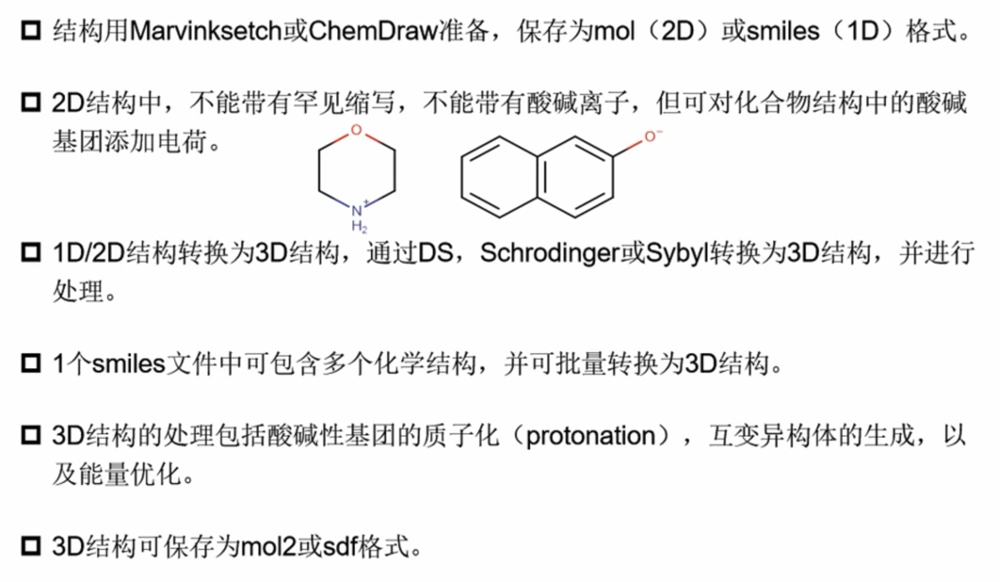
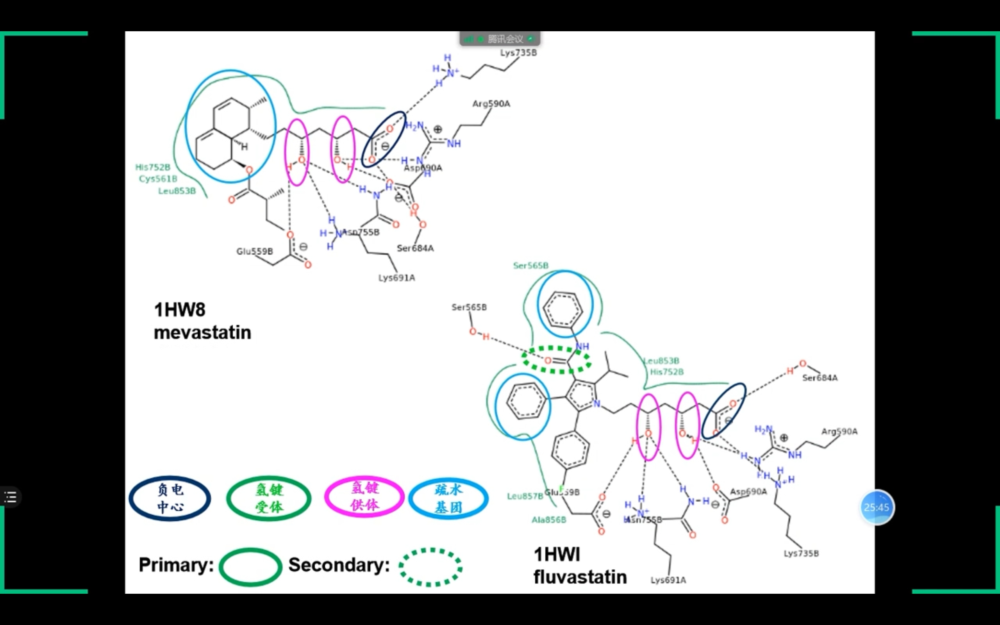
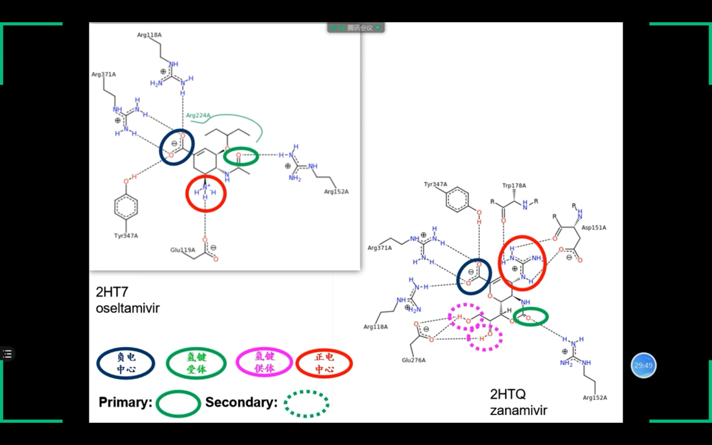
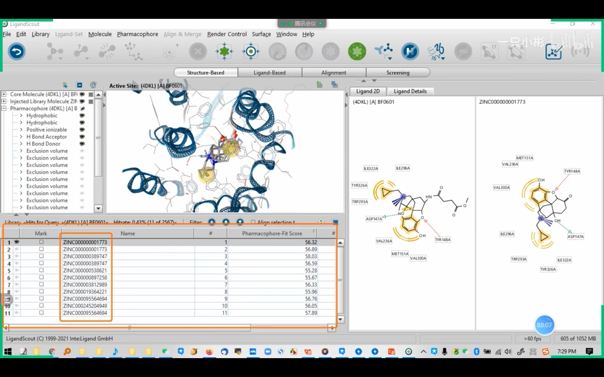
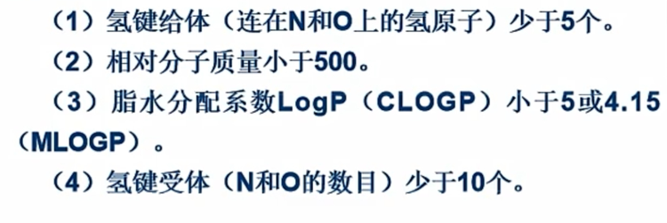
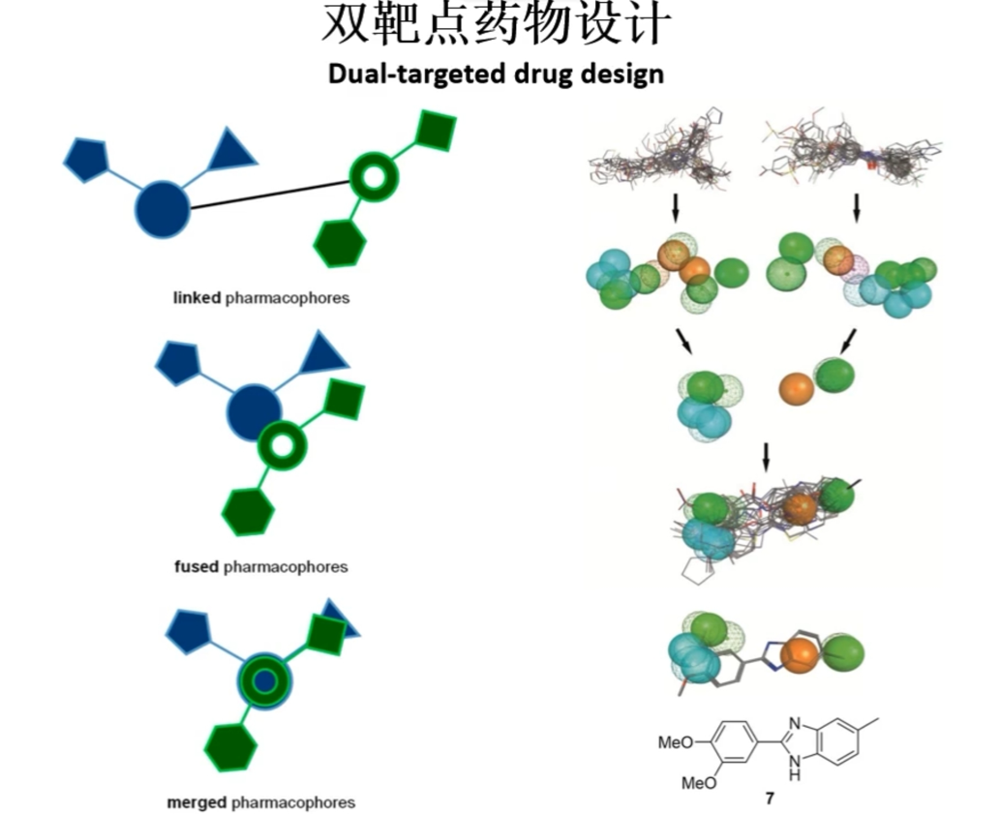
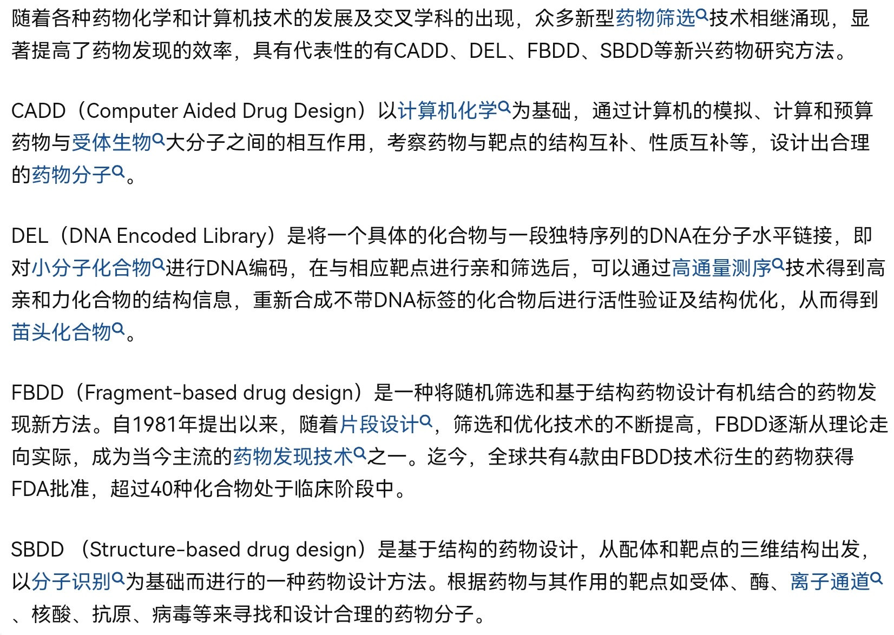

<style>
img{
    width: 30%;
}
</style>


原理：计算Ligand与Target蛋白的结合自由能，自由能越负值、二者结合越强。


## 结构文件准备

### Protein
**RCSB PDB：**输入target（e.g. HMG-CoA Reductase）或药品名称（e.g. ibuprofen, imatinib）。网页上提供3D View。  
**UniPortKB:** 蛋白质序列数据库，也可以由PDB跳转（Go to UniPortKB）；一个序列可以有多个结构（.pdb），选优即可。  

* 人源性，哺乳动物亦可
* 最好有共结晶化合物（Ligands）
* Resolution尽量小（分辨率高, <=2 A, A=1e-10）
* 有权威参考文献（Source：JMC，EJMC）   
* 根据需求选择不同覆盖程度的结构文件（参考 UniPortKB 中 ‘Positions’ 中覆盖，e.g. 229-515）   
* 预处理：修补缺失氨基酸，添加H原子，修正氨基酸构想，考察酸碱性氨基酸的质子化状态，etc
* 若无合适结构文件，则需要预测蛋白质结构：同源/de-novo


### Ligand
主要是Small Chemical，但也可以是protein    

* PDB自带
* ZINC，PubChem，BindingDB，Cambridge Structural Database下载
* 在线绘制1：http://www.swissadme.ch/
* 在线绘制2： https://chemaxon.com/marvin
* MarvinSketch 绘制   
* 1D/2D可在线绘制，1D/2D to 3D的转换可使用[RDKit](../Bioinfo/Blocks/RDKit.md)（加H、力场优化、etc）或者Discovery Studio（Chemistry Tab 处理）、Schrödinger(LigPrep:计算化合物在活性位点的不同构象时的结合自由能)等。  

  


### 可视化工具
* Discovery Studio
* [PyMOL](../Bioinfo/Gallary/Toolkit/PyMOL.md)
* Maestro (Schrödinger)
* ICM Browser
* UCSF Chimera


## 发现先导化合物
**虚拟筛选(Virtual Screening)**：对化合物库中大量分子进行筛选，发现结合方式、结合能量最好的先导化合物，也许具有活性。（缩小候选化合物范围）
### 基于药效团特征
药效团（药效特征元素）: 活性化合物共有的、对化合物的活性有重要影响的一组原子或基团的空间排列组合。 
以下2种方法结果应一致：  

* by ligand（某蛋白不同ligand的共同特征）
* by protein receptor（观察protein与ligand的binding cavity）   




#### 药效团发现
* Poseview(2D online): https://proteins.plus/
* PLIP(3D online): https://plip-tool.biotec.tu-dresden.de/plip-web/plip/index
* LigPlot
* Maestro (Schrödinger)   
* Discovery Studio，LigandScout（见下文筛选）   


##### Poseview 示例
```
Step 1: https://proteins.plus/4dkl
Step 2: create pocket  -->
Step 3: PoseView --- Settings --- Click Ligands[+] on the left to fillin 'Ligands'
Step 4: Submit Calculation
```


##### Discovery Studio 
课程截图 (Receptor-Ligand Interactions)  


#### 药效团确认
* 分析同一蛋白的多个晶体结构
* [Protein Contacts Atlas](http://pca.mbgroup.bio/index.html) 获取关键氨基酸
* 查阅文献中已验证药效团
* 综合by ligand与by protein结果
* 分子动力学模拟 获取关键氨基酸 (e.g. Schrödinger)    


#### Screening
* [ZINCPharmer](http://zincpharmer.csb.pitt.edu/): 工具某个PDB的ligand位，在线screening ZINC化合物数据库
* [Pharmit](https://pharmit.csb.pitt.edu/)：选择数据库中PDB与其Ligand，得到药效团3D模型（可以on-off相关特征）;随后可以在线Screening：Search MolPort
* **LigandScout**： 设置有ZINC数据库（Screening Settings -- Database to screen），只要读取蛋白晶体结构，选中ZINC小分子，会自动生成药效团3D展示（2D图也可）。**它有Ligand-Based和Structure-Based模式**     
 
!


### 基于分子对接
将小分子放置于受体蛋白的活性位点处，寻找合适的取向和构象，使得ligand与receptor的形状和结合自由能最佳。

* 刚性/柔性对接等，TODO：待尝试Gromacs。 
* [ZDOCK](https://zdock.umassmed.edu/)：在线对接2个pdb蛋白 
* iGEMDOCK  
!
* Discovery Studio 内置了AutoDock Vina等  
* Schrödinger部分报告（来自课程截图）   
!
!
!
!


## 优化先导化合物
修饰先导化合物，得到其衍生物；尽量降低衍生物与Target蛋白的结合自由能（e.g. -10 kcal/mol TO -16 kcal/mol）。

* Discovery Studio中修改小分子，或者修改1D格式，**待学习**


## 药性评估
**药物代谢动力学**：ADME - 吸收，分布，代谢，排出，毒性(e.g. hERG毒性)   
**类药性**：Lipinski(rule of five，基于2287个分子，便捷但粗放，Drug likeness DB 中 76.36%符合)，Ghose，Oprea  
!  

* 在线工具-swissadme：http://www.swissadme.ch/
* 在线工具-molsoft：https://molsoft.com/mprop
* 在线工具-pkcsm：https://biosig.lab.uq.edu.au/pkcsm/
* 在线工具-ADMETlab：https://admetmesh.scbdd.com/    


## 全新药物设计
!
!
!


## 其它相关概念



## 参考&其余
Discovery Studio: https://zhuanlan.zhihu.com/p/135307440  
LigPlot: https://zhuanlan.zhihu.com/p/470635337  
Ligplot & Poseview: https://zhuanlan.zhihu.com/p/366602798  
Schrödinger: https://zhuanlan.zhihu.com/p/401697711  
Maestro: https://zhuanlan.zhihu.com/p/401872578  
pkCSM: https://zhuanlan.zhihu.com/p/588494965    


Materials Studio: https://zhuanlan.zhihu.com/p/340196124     
配体结构修正: https://zhuanlan.zhihu.com/p/489114015   
分子对接: https://blog.csdn.net/weixin_42655515/article/details/113706516   
RDKit: https://zhuanlan.zhihu.com/p/82497166    


