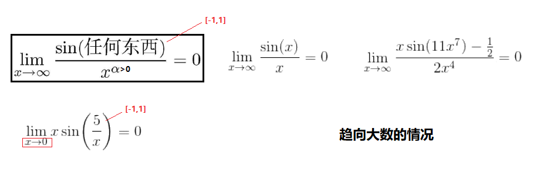
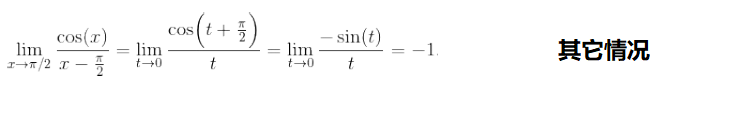

教材：《普林斯顿微积分读本》

省略：13章介绍使用导数求解最优化问题（牛顿法：13.3）

## 函数

* $f:A \rightarrow B$ 是一个函数，也可以看作是一个变换规则，$f(x)=y$表示将这个变换规则应用于变量$x$后得到$y$
* $x$的取值范围$A$称为定义域，$y$的值域（所有可能输出的集合，受$x$取值范围的限制）是上域$B$的一个子集
    - 例：$f(x)=x^2$的定义域$R$，上域$R$，值域$R^+$
* 函数$f$的反函数$f^{-1}$
    - $f(x)=y$，$f^{-1}(y)=x$
    - (图像以 $y=x$ 为镜面翻转)
* 复合函数：$f(x)=m(k(j(x)))=m \circ k \circ j$
    - 例：$f(x)=m(k(j(x)))=m \circ k \circ j$
* 一个函数可以是奇函数/偶函数/非奇非偶/即奇又偶；对取值范围内所有的$x$：
    - 奇函数：$f(-x)=-f(x)$ 图像原点对称
    - 偶函数：$f(-x)=f(x)$ 图像沿$y$轴对称

### 极限

* $f(x)$在$x=a$处时，左极限$\lim\limits_{x \rightarrow a^-}f(x)=L$，右极限$\lim\limits_{x \rightarrow a^+}f(x)=L$，则极限$\lim\limits_{x \rightarrow a}f(x)=L$
    - 上图$h(x),x=3$处因左右极限不相等，其极限不存在(DNE)
    - 上图$g(x),x=2$处极限=1
    - 上图$sin(\frac{1}{x}),x=0$处大幅震荡，其极限不存在(DNE)

* 水平渐近线：（x趋向无穷时）  

* 三明治定理/夹逼定理：（判定极限存在/求极限）  

* 如果 $\lim\limits_{x \rightarrow a}=f(a)$，函数$f(a)$在$x=a$处**连续**

* 介值定理：（e.g. 用来证明某个方程有解）  

* 如果$f$在$[a,b]$上连续，则$f$在$[a,b]$上至少有一个最大值和最小值  

### 导数

使用导数来求解微分问题

* 可导性：如果$f(x)$在$(a,b)$内可导并且在$a^+$和$b^-$处的导数都存在，则称$f(x)$在闭区间在$[a,b]$上可导；如果一个函数在$x$上可导，那么它在$x$上连续

* 二阶导数就是关于x导二次，三阶就是三次（见上图·示例），...
  - 区分：$(\frac{dy}{dx})^2$ 一阶导的平方, $\frac{d^2y}{dx^2}$关于$x$的二阶导, $\frac{dy}{d(x^2)}$关于$x^2$的一阶导

* 常用求导法则：  

* **隐函数求导**：（关于$x$求导的方程还包含变量$y$，希望求$y$随$x$的变化关系$\frac{dy}{dx}$）
  - 使用示例：求圆 $x^2+y^2=4$ 在圆上各点 $(x,y)$ 处斜率$\frac{dy}{dx}$
    1. 公式两边加上 $\frac{d}{dx}$，两边各自关于$x$求导：$\frac{d}{dx}(x^2+y^2)=\frac{d}{dx}(4)$ 
    2. （隐函数）令$u=y^2$，则$\frac{d}{dx}(y^2)=\frac{du}{dy}\frac{dy}{dx}=2y\frac{dy}{dx}$
    3. $2x +2y\frac{dy}{dx}=0$，则 $\frac{dy}{dx}=-\frac{x}{y}$
    * （拆分 & 使用链式法则）
  - 使用示例：求**反函数** $y=f^{-1}(x)$ **的导数**
    1. 公式可写为 $f(y)=x$，两边关于$x$隐函数求导
    2. $\frac{d}{dx}f(y)=\frac{d}{dx}x=1$
    3. 设 $u=f(y)$，则 $\frac{d}{dx}f(y)=\frac{du}{dx}=\frac{du}{dy}\frac{dy}{dx}=f'(y)\frac{dy}{dx}$
    4. 可知 $\frac{dy}{dx}=\frac{1}{f'(y)}$  即：$\frac{d}{dx}f^{-1}(x)=\frac{1}{f'(f^{-1}(x))}$

* 如果对于定义域内的所有$x$，函数$f$可导、且单调，则$f$的**反函数**$f'$**存在**：
    - $f'(x) >0$，则$f(x)$单调递增，反函数存在
    - $f'(x) <0$，则$f(x)$单调递减，反函数存在
    - 如果满足 $f'(x) = 0$ 的 $x$ 个数有限，也可以放宽到$\ge 0$或$\le 0$的情况

### 导数与函数图像

* **极值定理**：如果函数 $f$ 的定义域 开区间$(a,b)$ 内有一点 $c$ 为函数的**局部**最大值或最小值，则点 $c$ 一定为该函数的临界点，即，$f'(c)=0$ 或 不存在
  - 可以从多个临界点中寻找**全局**最大值或最小值

* **罗尔定理**：假设函数 $f$ 在闭区间$[a,b]$ 内连续、在开区间$(a,b)$ 内可导，如果 $f(a)=f(b)$，则开区间$(a,b)$ 内至少存在一点 $c$，使得 $f'(c)=0$ （即：$c$是拐点、或 $f$ 的图像是水平线段）

* **中值定理**：假设函数 $f$ 在闭区间$[a,b]$ 内连续、在开区间$(a,b)$ 内可导，则开区间$(a,b)$ 内至少存在一点 $c$，使得 $f'(c)=\frac{f(b)-f(a)}{b-a}$，即函数图像在点$c$处的**切线**与$a,b$两点间的**连线**平行（斜率相同）
  - 
  - 推论：如果对于 $(a,b)$ 内任意 $x$，都有 $f'(x)=0$，则函数在此区间为常函数（水平线段）
  - 推论：如果对于定义域内任意 $x$，都有 $f'(x)=g'(x)$，则 $f(x)=g(x)+C$（$C$表示任意常数）

* 二阶导数$f''(x)$的符号意味着函数的凹性
  - 
  - 区间内始终$f''(x) > 0$：凹向上
  - 区间内始终$f''(x) < 0$：凹向下
  - $f''(x) = 0$：可能是**拐点**，也可能不是（如果左右两边点的二阶导数符号相同，说明凹性没有改变、不是拐点）

* 一阶导数 $f'(c)=0$ 时的几种情况
  - 
  - 使用二阶导数进一步判断
    * $f''(c)<0$ 局部最大
    * $f''(c)>0$ 局部最小
    * $f''(c)=0$ 无法判断：可能是函数$f$的拐点，也可能是saddle point
  - 使用左右点的一阶导数进一步判断（切线斜率的变化）
    * 左正-->右负：局部最大
    * 左负-->右正：局部最小
    * 左右符号一致：水平拐点

### 求极限

* **求极限方法示例**：  

* **洛必达法则**：利用导数的知识求极限的值    

| 场景 | -- | $x \rightarrow ?$ 时 | 方法 | -- |
| -- | -- | -- | -- | -- |
| A | $\lim\limits_{x \rightarrow ?}\frac{f(x)}{g(x)}$ | $\frac{0}{0}$   $\frac{\pm \infty}{\pm \infty}$ | $\lim\limits_{x \rightarrow ?}\frac{f(x)}{g(x)}=\lim\limits_{x \rightarrow ?}\frac{f'(x)}{g'(x)}$ | **求导过程中不能使用商法则！**   [解释示例](./Calculus/14-1.png) |
| B1 | $\lim\limits_{x \rightarrow ?}[f(x)-g(x)]$ | $\pm (\infty-\infty)$ | 转换为场景A：通分或乘除共轭表达式 | [示例](./Calculus/14-2.png) |
| B2 | $\lim\limits_{x \rightarrow ?}f(x)g(x)$ | $0 \times \pm\infty$ | 转换为场景A：$\lim\limits_{x \rightarrow ?}f(x)g(x)=\lim\limits_{x \rightarrow ?}\frac{f(x)}{1/g(x)}$ | 建议选较简单的函数取倒数 |
| C | $\lim\limits_{x \rightarrow ?}f(x)^{g(x)}$ | $1^{\pm \infty}$   $0^0$   $\infty^0$ | 先取对数，可转化为场景B，求得其对数的极限：$$\lim\limits_{x \rightarrow ?}\ln[f(x)^{g(x)}]$$    $$=\lim\limits_{x \rightarrow ?}g(x)\ln[f(x)]$$    $$=L$$   然后返回原式的极限： $$\lim\limits_{x \rightarrow ?}f(x)^{g(x)} = e^L$$ | -- |

* **求极限方法总结：(14.2)**

## 三角函数

$\pi=180度$

### 极限

### 导数

### 反三角函数

三角函数的反函数，$sin^{-1}(x)$ 就是 $arcsin(x)$；详见[百科](https://baike.baidu.com/item/%E5%8F%8D%E4%B8%89%E8%A7%92%E5%87%BD%E6%95%B0/7004029)与第十章（此笔记略）  

* 示例：$y=sin^{-1}(x)$
  - 其导数 $\frac{dy}{dx}=\frac{1}{sin'(y)}=\frac{1}{cos(y)}=\frac{1}{cos(sin^{-1}(x))}$
  - （参考上文 隐函数求导）

## 指数函数-对数函数

* 指数函数：$b^x$，对数函数：$\log_b(x)$
* $e=\lim\limits_{h \rightarrow 0^+}(1+h)^{1/h}=\lim\limits_{n \rightarrow \infty}(1+\frac{1}{n})^n$
* $e^x=\lim\limits_{n \rightarrow \infty}(1+\frac{x}{n})^n$ 仅当$n$很大时成立
* $\ln(e)=1$

### 极限

### 导数

| 导数 | -- |
| -- | -- |
| $$\frac{d}{dx}a^x=a^x\ln(a)$$ | $$\frac{d}{dx}e^{kx}=e^{kx}\ln(e^{k})=ke^{kx}$$ |
| $$\frac{d}{dx}log_a(x)=\frac{1}{x \ln(a)}$$ | $$\frac{d}{dx}\ln(x)=\frac{1}{x}$$ |

对于$f(x)^{g(x)}$形式的方程，一般取它的对数后再隐函数求导：
$$y=x^{sin(x)}$$
$$u=\ln(y)=\ln(x^{sin(x)})=sin(x)\ln(x)$$
$$\frac{d}{dx}(\ln(y))=\frac{d}{dx}(sin(x)\ln(x))$$
$$\frac{1}{y}\frac{dy}{dx}=cos(x)\ln(x)+\frac{six(x)}{x}$$
$$\frac{dy}{dx}=[cos(x)\ln(x)+\frac{six(x)}{x}]y$$
  注：$\frac{du}{dx}=\frac{du}{dy}\frac{dy}{dx}=\frac{1}{y}\frac{dy}{dx}$

### 双曲函数

| $sinh(x)=\frac{e^x-e^{-x}}{2}$ | $cosh(x)=\frac{e^x+e^{-x}}{2}$ | $tanh(x)=\frac{sinh(x)}{cosh(x)}$ |
| -- | -- | -- |
| $csch(x)=\frac{1}{sinh(x)}$ | $sech(x)=\frac{1}{cosh(x)}$ | $coth(x)=\frac{1}{tanh(x)}$ |

| 导数 |
| -- |
|$\frac{d}{dx}sinh(x)=cosh(x)        $|
|$\frac{d}{dx}cosh(x)=sinh(x)        $|
|$\frac{d}{dx}tanh(x)=sech^2(x)      $|
|$\frac{d}{dx}coth(x)=-csch^2(x)     $|
|$\frac{d}{dx}sech(x)=-sech(x)tanh(x)$|
|$\frac{d}{dx}csch(x)=-csch(x)coth(x)$|

