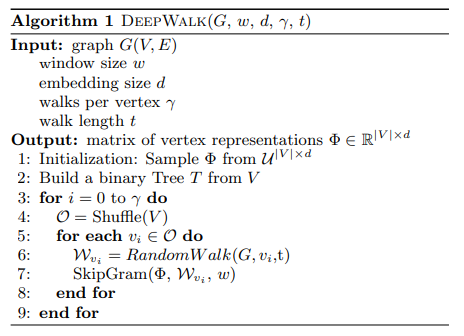
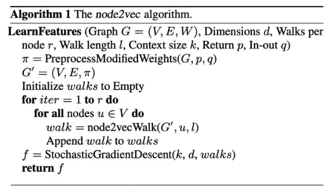

 

课程描述：cs224w    
课程主页：https://web.stanford.edu/class/cs224w/index.html   
课程笔记：https://snap-stanford.github.io/cs224w-notes/   

课程描述：bilibili-图神经网络       
视频链接：https://www.bilibili.com/video/BV1YB4y1S7An/  

此处查看实现代码：[GNN_PyTorch.ipynb](https://github.com/Jiarong-L/GAN_tutorial/blob/main/Basis/GNN_PyTorch.ipynb), networkx 计算[基本特征](GNN/concepts.py)、[Pagerank](GNN/pagerank.py)

## Traditional
Uses Hand-designed features for:

- Graph-level Task: Find features that characterize the structure of an entire graph
- Node-level Task: Node classification
- Link-level Task: Predict new links based on existing links
    - Form 1: 随机删除一些Edges，然后尝试复原  
    - Form 2: 依据t0时刻的图，预测t1时刻的Edges

### Concepts

- **G=(V,E)** -- V为顶点(Node)集合，E为边(Edge)集合

- **子图(Subgraph):** V'为V子集，E'为E子集，则G'=(V',E')为G的子图。  
*Non-isomorphic* directed subgraphs of size 3： 

- **连通图(Connected Grap):** G中任意两个不同的顶点都连通(有路径)，则称G为连通图；有向图G中，如果每对顶点都强连通（vi<-->vj）,则G是一个**强连通图**，如果原图去掉方向后 每对顶点都连通,则G是一个**弱连通图**

- **连通分量(Connected Components):** 无向图的一个极大连通子图，或有向图的一个极大强连通子图。‘极大’意为：连通图只有一个连通分量，即其自身；非连通图有多个连通分量。

- **最短路径**d(i,j): vi到vj所经过的边

- **图直径:** max(最短路径)

- **Motifs:** G中反复出现的重要互连模式(i.e.子图)，其出现频率比随即网络更高(Significance:Z-score)；允许motif间部分重叠

- **Graphlets:** ***Rooted*** connected non-isomorphic sunbraphs  
 

### Matrix
Matrix 元素 aij 表示 (i 行，j 列) 的值

- **邻接矩阵(Adjacency):** aij 表示vi指向vj的边数；行和(列和)为Node的出(入)度。

- **关联矩阵(Incidence):** aij 表示vi与ej关联的次数,取值 [0,1,2(自环)]，列和为2；若为有向图，1表示vi为起点，-1表示vi为终点，列和为0。**Question：有向图的自环怎么表示？**

- 度矩阵: dii=i列之和，其余部分0

- **拉普拉斯矩阵(Laplacian):** L = 度矩阵D - 邻接矩阵A; 对称、每一行元素之和都为0; 实际代表了图的二阶导数

### Node-level Feature
Importance-based / Structure-based Features

- **度(Degree):** 与顶点v接触的边的数目；有向图中分为出度、入度

- **中心性(Centrality):** 说明在G中这个顶点的重要程度

    - 度中心性(Degree): Degree/(n-1)， n为顶点总数

    - 特征向量中心性(Eigenvector): 对邻接矩阵A分解特征值，最大特征值对应的特征向量即为图中各顶点的特征向量中心性。（优点：也体现了邻居顶点的度）

    - 介数中心性(Betweenness): 除去该顶点外、其余顶点两两间最短路径中，经过改顶点的比例 

    - 连接中心性(Closeness): Closeness = 1/sum(此节点到其余所有节点最短路径)

- **Clustering coefficient:** 顶点v的 $e_v = \frac{相邻节点集内部的Edge数目之和}{相邻节点集内部的两两组合数}$

- **PageRank**: $PR(u)$ = $ \frac{1-d}{N} + d * \sum_{v\in B}\frac{PR(v)}{L(v)}$， 其中$B$表示所有指向u的顶点，L(v)表示顶点v的出链数目，d为阻尼因子(damping factor)。  
*d解决了Rank Leak、Rank Sink等问题；现实中，可以假设d为用户按照跳转链接来页面u的概率，余下的为通过u网址而来的概率。*

- **HITS:** $Authority(u)=\sum_{v\in B}Hub(v)$，其中$B$表示所有-->u的顶点；$Hub(u)=\sum_{v\in B}Authority(v)$，其中$B$表示所有u-->的顶点；亦是不断迭代至稳态。

- **Graph Degree Vector (GVD):** 以G中顶点v为root，计算不同Graphlets的频次
 

### Link-level Feature
2个nodes间的link的feature: 

- Distance-based Features
    - 最短路径的长度

- Local neighborhood overlap    
 

- Global neighborhood overlap
    - Katz index: 邻接矩阵$A^k$中aij就是$v_i$与$v_j$间长度K的Path的频次，Katz index = $v_i$与$v_j$间(1到无穷)长度Path的频次总和  
     

### Graph-level Feature
Kernel Methods: 基于种种kernel计算出feature频次vector、其dot product就是kernel similarity

- Bag-of-Nodes  
 

- Bag-of-Node-Degrees  
 

- **Graphlet kernel:** Bag-of-Graphlets (**unrooted**，这点不同于GVD)， worst case NP-hard   
 
 

- **Weisfeiler-Lehman kernel:** k+1时刻顶点v的颜色=HASH(k时刻顶点v的颜色、k时刻顶点v所有邻居的颜色); HASH可以是定义的任何操作(e.g. sum, 取余)。HASH完成后，统计两个G的颜色分布vector、计算WL kernel similarity。

## Graph Embedding
- encoder: 将nodes表示为向量（representation vector）
- decoder：计算embedding间的similarity   
- similarity：可以是embedding vectors间的dot product

- 特质相似的nodes的embedding应该更加相似。
    - 同质性(homophily)：节点与其邻居的embedding应该很相似   
    - 结构等价性(structural equivalence)：节点若在图上处于相似的结构位置，其embedding应该很相似

- **一些Embedding算法：** 
    - https://github.com/shenweichen/GraphEmbedding
    - https://zhuanlan.zhihu.com/p/56733145
    - DeepWalk、LINE、Node2Vec、Struc2Vec、SDNE

### Deepwalk
G中随机游走生成序列，以此序列集为SkipGram的训练资料，达成Node embedding。  
   
    

### LINE
- 一阶：考虑节点的边
      - 联合概率分布 $p_1(v_i,v_j) = \frac{1}{1+exp(-u_i^T*u_j)}$，其中$u_i$是顶点$v_i$的low-dimensional vector representation
    - 经验概率分布 $\tilde{p}_1(v_i,v_j) = \frac{w_{ij}}{W}$，其中$w_{ij}$是Edge(i,j)的权重(若无设定，则都是1)，W是G中所有w之和
    - $O_1 = \sum _{(i,j) \in E} distance(\tilde{p}_1(*,*)||p_1(*,*))$ 为两个分布的距离，distance可以是KL-divergence  
       
     

- 二阶：考虑节点的Neighbor
    - $u_j$: 该顶点本身的representation vector
    - $u_j'$: 该顶点作为其它节点邻居时的representation vector
    - $p_2(v_j|v_i) = \frac{exp({u'}_j^T*u_i)}{\sum_{k=1}^{|V|}{exp({u'}_k^T*u_i)}}$
    - $\tilde{p}_2(v_j|v_i) = \frac{w_{ij}}{W_i}$ W是$v_i$所有出链的w之和
    - $O_2 = \sum _{(i,j) \in E} \lambda_i * distance(\tilde{p}_2(*,*)||p_2(*,*))$ 为两个分布的距离，$\lambda_i$是控制节点重要性的因子，distance可以是KL-divergence  
     

### node2vec
Biased Walks生成序列(p大-倾向于DFS，q大-倾向于BFS)，以此序列集为SkipGram的训练资料   
   
  

### Struc2Vec
基于空间结构相似性    

 

- $f_{k}(u,v) = f_{k-1}(u,v) +  g( s(R_k(u)),s(R_k(v)) ) $
    - $f_{k}(u,v)$为顶点u、v间k-hop结构距离
    - $R_k(u)$为顶点u的k-hop邻居集，例如：$R_1(u)$ = {A,C,F,D}
    - $s(R_k(u))$为顶点u的k-hop邻居集对应的度，例如：$s(R_1(u))$ = {1,2,2,2}
    - $g(D1,D2)$为D1,D2之间距离函数，可用DWT
- 根据$f_{k}(u,v)$距离，构建k-hop Weighted Graph，每个hop为一个layer、layer之间也由weighted edge
    - hop内边的权重$w_k(u,v)=e^{-f_{k}(u,v)}$
    - hop之间边的权重
        - $w(u_{k},u_{k+1}) = log(\Gamma_k(u) + e)$, k= 0...k*-1
        - $w(u_{k},u_{k-1}) = 1 $     k= 1...k*    
        - $\Gamma_k(u)$ : layer k 中, 与顶点u链接、且$w$大于$\overline w_k$的边的数量    
- 随机游走采样，p表示本层游走的概率，(p-1)表示游走至其它layer的概率  
   

### SDNE
简单的来说就是用邻接矩阵的每一行作为输入，训练一个Auto Encoder来进行embedding。

### Embed Entire Graph

- sum / average Node Embeddings
- 用一个横跨(sub)graph的'virtal node'来表示(sub)graph，然后embed这个node
- **Anonymous Walk**: 设定node index为在随机游走中第一次被访问时候的index。匿名方法有助于得到网络的全局拓扑结构    
     
    - 一次Anonymous Walk后得到一条图示index vector
    - **feature-based model:** 统计index vector pattern为feature，有点统计graphlet这样的感觉  
    - **data-driven model:** 借鉴NLP思想，将一次walk视为一个word，将G视为一篇document，经过同一node的walk视为co-occurring。对于每一个节点u，采样一组co-occurring SET，训练G的embedding，目标函数：$\underset{G_{embedding}}{max} \sum_{i \in coSET}{P(word_i | words_{cooccurring}, G_{embedding})}$    

### Use Embedding
 

其它GNN：/GCN/GraphSAGE/GAT

## 参考
拉普拉斯矩阵: https://zhuanlan.zhihu.com/p/362416124   
连通分量：https://zhuanlan.zhihu.com/p/37792015   
中心性：https://www.cnblogs.com/yanFlyBlog/articles/14728305.html#度中心性degrree-centrality   
networkx: https://networkx.org/documentation/stable/tutorial.html   
pagerank: https://zhuanlan.zhihu.com/p/137561088     
pagerank: https://zhuanlan.zhihu.com/p/120962803   
**Graph Embedding：** https://zhuanlan.zhihu.com/p/56733145     

