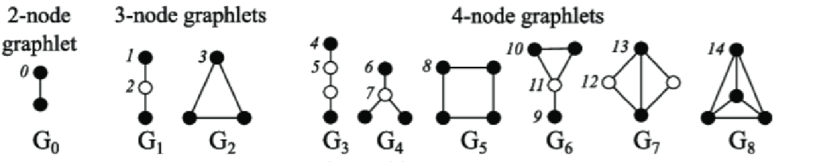
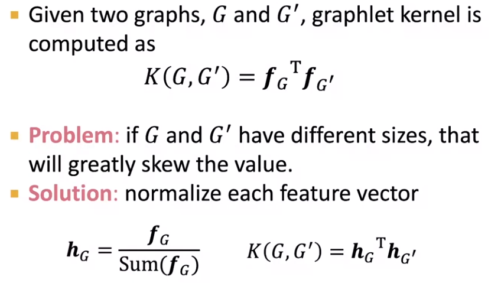
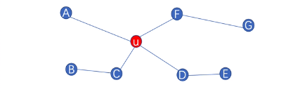
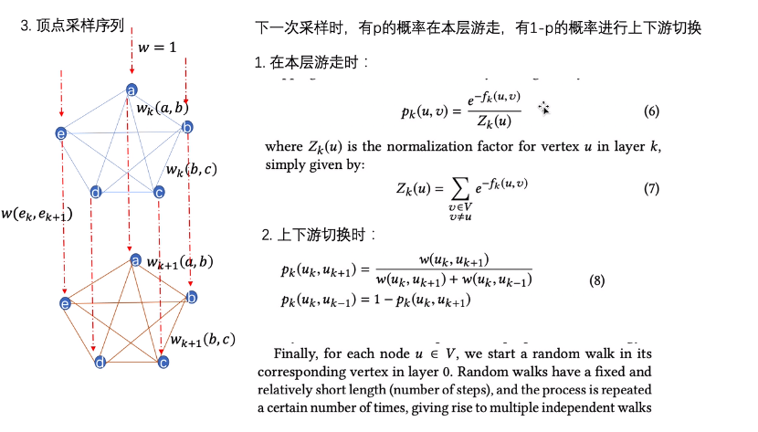
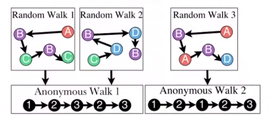
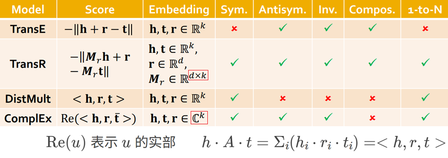

<script>
MathJax = {
  tex: {
    inlineMath: [['$', '$'], ['\\(', '\\)']]
  },
  svg: {
    fontCache: 'global'
  }
};
</script>
<script type="text/javascript" id="MathJax-script" async
  src="https://cdn.jsdelivr.net/npm/mathjax@3/es5/tex-svg.js">
</script>


<style>
img{
    width: 60%;
}
</style>

 

课程描述：cs224w    
课程主页：https://web.stanford.edu/class/cs224w/   
课程笔记：https://snap-stanford.github.io/cs224w-notes/   
视频链接：https://www.bilibili.com/video/BV1YB4y1S7An/


此处查看实现代码：[GNN_PyTorch.ipynb](https://github.com/Jiarong-L/GAN_tutorial/blob/main/Basis/GNN_PyTorch.ipynb), networkx 计算[基本特征](GNN/concepts.py)、[Pagerank](GNN/pagerank.py)


推荐网上的详细课程笔记！ [‘小角龙’](https://zhang-each.github.io/My-CS-Notebook/CS224W/)，[‘王半仙’](https://banxian-w.com/article/2024/12/21/2816.html)


## 图论

[Graph Theory - 图论手写笔记(pdf)](GNN/图论_2020_笔记.pdf)  数学知识储备


## Traditional
Uses Hand-designed features for:

- Graph-level Task: Find features that characterize the structure of an entire graph
- Node-level Task: Node classification
- Link-level Task: Predict new links based on existing links
    - Form 1: 随机删除一些Edges，然后尝试复原  
    - Form 2: 依据t0时刻的图，预测t1时刻的Edges

### Concepts

- **G=(V,E)** -- V为顶点(Node)集合，E为边(Edge)集合

- **子图(Subgraph):** V'为V子集，E'为E子集，则G'=(V',E')为G的子图。  
*Non-isomorphic* directed subgraphs of size 3： 

- **连通图(Connected Grap):** G中任意两个不同的顶点都连通(有路径)，则称G为连通图；有向图G中，如果每对顶点都强连通（v<sub>i</sub><-->v<sub>j</sub>）,则G是一个**强连通图**，如果原图去掉方向后 每对顶点都连通,则G是一个**弱连通图**

- **连通分量(Connected Components):** 无向图的一个极大连通子图，或有向图的一个极大强连通子图。‘极大’意为：连通图只有一个连通分量，即其自身；非连通图有多个连通分量。

- **最短路径(Minimal Path) d(i,j)=** v<sub>i</sub>到v<sub>j</sub>所经过的边

- **图直径(Diameter):** max(最短路径)

- **Motifs:** G中反复出现的重要互连模式(i.e.子图)，其出现频率比随即网络更高(Significance:Z-score)；允许motif间部分重叠

- **Graphlets:** ***Rooted*** connected non-isomorphic sunbraphs  
 


### Matrix (详见图论笔记)
Matrix 元素 a<sub>ij</sub> 表示 (i 行，j 列) 的值

- **邻接矩阵(Adjacency):** a<sub>ij</sub> 表示v<sub>i</sub>指向v<sub>j</sub>的边数；行和(列和)为Node的出(入)度。

- **关联矩阵(Incidence):** a<sub>ij</sub> 表示v<sub>i</sub>与e<sub>j</sub>关联的次数,取值 [0,1,2(自环)]，列和为2；若为有向图，1表示v<sub>i</sub>为起点，-1表示v<sub>i</sub>为终点，列和为0。**Question：有向图的自环怎么表示？**

- 度矩阵: d<sub>ii</sub>=i列之和，其余部分0

- **拉普拉斯矩阵(Laplacian):** L = 度矩阵D - 邻接矩阵A; 对称、每一行元素之和都为0; 实际代表了图的二阶导数


### Node-level Feature
Importance-based / Structure-based Features

- **度(Degree):** 与顶点v接触的边的数目；有向图中分为出度、入度

- **中心性(Centrality):** 说明在G中这个顶点的重要程度

    - 度中心性(Degree): Degree/(n-1)， n为顶点总数

    - 特征向量中心性(Eigenvector): 对邻接矩阵A分解特征值，最大特征值对应的特征向量即为图中各顶点的特征向量中心性。（优点：也体现了邻居顶点的度）

    - 介数中心性(Betweenness): 除去该顶点外、其余顶点两两间最短路径中，经过改顶点的比例 

    - 连接中心性(Closeness): Closeness = 1/sum(此节点到其余所有节点最短路径)

- **Clustering coefficient:** 顶点v的 $e_v = \frac{相邻节点集内部的Edge数目之和}{相邻节点集内部的两两组合数}$

- **PageRank** 衡量节点重要性的某种权重: $PR(u)$ = $ \frac{1-d}{N} + d * \sum_{v\in B}\frac{PR(v)}{L(v)}$， 其中$B$表示所有指向u的顶点，L(v)表示顶点v的出链数目，d为阻尼因子(damping factor)。  
*d解决了Rank Leak、Rank Sink等问题；现实中，可以假设d为用户按照跳转链接来页面u的概率，余下的为通过u网址而来的概率。*

- **HITS:** $Authority(u)=\sum_{v\in B}Hub(v)$，其中$B$表示所有-->u的顶点；$Hub(u)=\sum_{v\in B}Authority(v)$，其中$B$表示所有u-->的顶点；亦是不断迭代至稳态。

- **Graph Degree Vector (GVD):** 以G中顶点v为root，计算不同Graphlets的频次
 


### Link-level Feature
2个nodes间的link的feature: Edge/Path的特征

- Distance-based Features
    - 最短路径的长度

- Local neighborhood overlap    
 

- Global neighborhood overlap
    - Katz index: 邻接矩阵$A^k$中a<sub>ij</sub>就是$v_i$与$v_j$间长度K的Path的频次，Katz index = $v_i$与$v_j$间(1到无穷)长度Path的频次总和  
     


### Graph-level Feature
Kernel Methods: 基于种种kernel计算出feature频次vector、其dot product就是kernel similarity

- Bag-of-Nodes  
 

- Bag-of-Node-Degrees  
 

- **Graphlet kernel:** Bag-of-Graphlets (**unrooted**，这点不同于GVD)， worst case NP-hard   
 
 

- **Weisfeiler-Lehman kernel:** k+1时刻顶点v的颜色=HASH(k时刻顶点v的颜色、k时刻顶点v所有邻居的颜色); HASH可以是定义的任何操作(e.g. sum, 取余)。HASH完成后，统计两个G的颜色分布vector、计算WL kernel similarity。


## Node Embedding

- Encoder: 将nodes表示为向量 (representation vector)，特质相似的nodes的embedding应该更加相似 (e.g. embedding vectors 间的 dot product 尽可能大)
    - 同质性(homophily)：节点与其邻居的embedding应该很相似   
    - 结构等价性(structural equivalence)：节点若在图上处于相似的结构位置，其embedding应该很相似


有些时候，我们可以将 Encoder 视为一个矩阵 ```Z = d × |V|```，它可以将 ```G(V,E)``` 中的每一个顶点 ```v = [0 0 ... 1 0 ...]``` 都映射到d-维嵌入空间


### Walks + SkipGram

NLP中，Word2Vec 的两种建模方法都基于上下文词组获取 word embedding：经常一起出现的词，它们的Embedding也理应相似(dot product 尽可能大)

```bash
1. SkipGram: 给定word，预测上下文词组[a,b,c,d]  
[word: one-hot] --> [word: Embd] --> [P(?|word): for the full dictionary]

训练时，设定窗口大小为2时，输入语句 We are about to study the idea of deep learning

于是某个单词 study 窗口内的上下游词组可组成训练集-正样本对：(目标词,上下文词)
(study, about)
(study, to)
(study, the)
(study, idea)

2. CBOW: 给定上下文词组[a,b,c,d]，预测 word 
[a: one-hot] --> [a: Embd] --> Merged / [word: Embd] --> [P(?|abcd): for the full dictionary]
[b: one-hot]     [b: Embd]
    .....          .....
```

[Deepwalk](GNN/img/Deepwalk.png): G中随机游走生成序列，以此序列集为[SkipGram](GNN/img/SkipGram.png) 的训练资料，达成Node embedding

[Node2Vec](GNN/img/node2vec.png) : [Biased Walks](GNN/img/biasedWalks.png)生成序列(p大-倾向于远处-DFS，q大-倾向于周边-BFS)，以此序列集为SkipGram的训练资料


### LINE: 1-hop

1. 一阶相似度：两个顶点间（顶点向量的内积 -> 顶点相似度 -> 边权）
    - 联合概率分布 $p_1(v_i,v_j) = \frac{1}{1+exp(-u_i^T u_j)}$，其中$u_i$是顶点$v_i$的低维向量表示
    - 经验概率分布 $\tilde{p}\_1(v_i,v_j) = \frac{w_{ij}}{W}$，其中$w_{ij}$是Edge(i,j)的权重(若无设定，则都是1)，W是G中所有w之和
    - 优化目标为最小化两个分布的距离 $O_1 =  distance(\tilde{p}\_1(∙,∙) | p_1(∙,∙))$，distance可以是[KL-divergence](GNN/img/KL.png)，忽略常数项后 $O_1 = - \sum \_{(i,j) \in E} w_{ij} \log p_1(v_i,v_j)$

2. [二阶相似度](GNN/img/LINE2.png)：顶点Neighbors的重合程度（与所有其他顶点间的1阶相似度向量 -> 内积 -> 邻居相似度）
    - $p_2(v_j|v_i) = \frac{exp({u'}\_j^T u_i)}{\sum_{k=1}^{|V|}{exp({u'}\_k^T u_i)}}$，$u_j$: 该顶点本身的向量表示，$u_j'$: 该顶点作为其它节点邻居时的向量表示
    - $\tilde{p}\_2(v_j|v_i) = \frac{w_{ij}}{W_i}$ W是$v_i$所有出链/Degree的w之和
    - 优化目标 $O_2 = \sum \_{(i,j) \in E} \lambda_i * distance(\tilde{p}\_2(∙,v_i)||p_2(∙,v_i))$ 为两个分布的距离，$\lambda_i$是控制节点重要性的因子，distance可以是KL-divergence，忽略常数项后 $O_2 = - \sum \_{(i,j) \in E} w_{ij} \log p_2(v_j|v_i)$


[SDNE (Structural Deep Network Embedding)](https://www.cnblogs.com/BlairGrowing/p/15622594.html) 简单的来说就是用邻接矩阵作为输入（Neighbor信息），训练一个AutoEncoder来进行Embedding，它的1st/2nd-Order定义和LINE一样 (Loss_1 = 相邻顶点Embedding_y的距离，Loss_2 = 邻接向量_x的重构误差)且加入正则与稀疏图的应对


### Struc2Vec: k-hop + walk

注：[这个笔记更清晰](https://banxian-w.com/article/2024/3/22/2696.html) & k应该不会需要很大，毕竟有时候3-hop的邻居就会覆盖全图了

对不同距离的邻接信息建立图层（1/边权 = 顶点间距离 = 上一层距离 + 本层邻居集差异），然后在图层中或图层之间游走，得到的序列输入SkipGram（空间结构相似性 - 指远处的邻居信息？）    

 

- $f_{k}(u,v) = f_{k-1}(u,v) +  g( s(R_k(u)),s(R_k(v)) ) $
    - $f_{k}(u,v)$为顶点u、v间k-hop结构距离
    - $R_k(u)$为顶点u的k-hop邻居集，例如：$R_1(u)$ = {A,C,F,D}
    - $s(R_k(u))$为顶点u的k-hop邻居集对应的度，例如：$s(R_1(u))$ = {1,2,2,2}
    - $g(D1,D2)$为D1,D2之间距离函数，可用[DWT](GNN/img/DWT.png)
- 根据$f_{k}(u,v)$距离，构建k-hop Weighted Graph，每个hop为一个layer、layer之间也由weighted edge
    - hop内边的权重$w_k(u,v)=e^{-f_{k}(u,v)}$
    - hop之间边的权重
        - $w(u_{k},u_{k+1}) = log(\Gamma_k(u) + e)$, k= 0...k*-1
        - $w(u_{k},u_{k-1}) = 1 $     k= 1...k*    
        - $\Gamma_k(u)$ : layer k 中, 与顶点u链接、且$w$大于$\overline w_k$的边的数量    
- 随机游走采样，p表示本层游走的概率，(p-1)表示游走至其它layer的概率  
   


### GCN

我们不建议将G的接邻矩阵和特征矩阵直接作为DL模型的输入，因为这对节点的顺序非常敏感

GCN/**GraphSAGE** 本质上可以视为对 k-hop neighbors 的层级加权聚合，从(k-1)层起、每一个的顶点都由其邻居聚合而来、直到0层的目标顶点（以一种确定计算图/**采样邻居、训练每一层的Aggregator**），获得的 node embedding 可被投入后续DL模型

 

Graph Attention Network (GAT) 用注意力定义估邻居节点的权重


## Graph Embedding

- 整合所有Nodes的嵌入向量 (e.g.Sum/Concat)
- 将(sub)graph视为一个'virtal node'
- **Anonymous Walk**: 设定node index为在随机游走中第一次被访问时候的index。匿名方法有助于得到网络的全局拓扑结构    
     
    - 一次Anonymous Walk后得到一条图示index vector
    - **feature-based model:** 统计index vector pattern为feature，有点统计graphlet这样的感觉  
    - **data-driven model:** 借鉴NLP思想，将一次walk视为一个word，将G视为一篇document，经过同一node的walk视为co-occurring。对于每一个节点u，采样一组co-occurring SET，训练G的embedding，目标函数：$\underset{G_{embedding}}{max} \sum_{i \in coSET}{P(word_i | words_{cooccurring}, G_{embedding})}$    


## Use Embedding

可以是对于 Node/Graph 某种特征的判断或预测、是否有异常的节点或结构，Nodes间是否有关系、关系的方向

 


## Heterogeneous Graph

异构图（Heterogeneous Graph）中，存在不同类型的节点和边 --- 定义```(源节点类型,边类型,目标节点类型)```为一种**关系**，不再自由跳转全图、而是限定在相应关系可达的子图中

想象 Heterogeneous Edge (Relation) 的情况，共有三种不同的边类型(A/B/C)、存储于相应的三个矩阵中；NodeX 的多条边中，三种边类型所对应的邻节点也可相应的分为三种；**对每个种类分别进行**聚合、再聚合A/B/C类型的结果 ([RGCN](GNN/img/RGCN.png) ) 

原版GAT不支持异构图，因为为每种关系引入一组注意力神经网络代价太高。[Heterogeneous Graph Transformer (HGT) Fig2](https://arxiv.org/pdf/2003.01332)将注意力机制分解为节点注意力和边注意力，因而可行

```bash
想象有 N=3 种节点和 E=2 种边，(源节点,边,目标节点)的可能组合有 N*E*N = 3*2*3 种，即需要18种注意力
但HGT只需要 5 种
```

### Knowledge graph


知识图（Knowledge graph）也算是一种异构图，节点表示实体（n.药/蛋白/基因）、边表示两个实体之间的关联（v.治愈/抑制/编码）写作三元组 ```(h,r,t)```；实体、关系都嵌入同一个k维空间：```(h,r)```的表示应该尽可能接近```t```的表示

如何定义接近？不同算法设计了不同的 $f_r(h,t)$ score



(离散数学二元关系的一些性质-图论笔记P5: Sym, Antisym, Compos/Transitive)


KG的常见任务是图谱补全 ```(h,r) -> t``` 即**推理任务(Reasoning)**，表述为一系列的Query：[Query嵌入表示 q = h + r1 + r2 + ...](GNN/img/KGE-Path.png)


| KG Queries | $(h,r) -> t$ | 说明 |
| -- | -- | -- |
| One-hop | $(h=Flu,(r=Causes))$ | Flu 造成了什么 |
| Path | $(h=v_a,(r=r1,r=r2))$ | 从r1的结果中再查询r2的指向 |
| Conjunctive | $(h=D1,(r=Treat)) , (h=D2,(r=Cause))$ | 两个 One-hop 查询结果的交集 |


我们可以用一个 box (center,offset) 框住某个单次查询的结果，也可以将每个实体视为一种 zero-volume box；而关系则是一种投影运算 ```Box * r -> Box```；这样求交集的操作会变得简单（不过Box不支持Union操作，建议把合并挪到最后一步）：[Query2box](GNN/img/KGE-Box.png)

一般采用实体与box的边界的距离；当实体在box内部时，距离值为负数

