

Guyton and Hall Textbook of Medical Physiology 摘要、笔记

## Ch 1 概览

* **Human Physiology**: explain the specific characteristics and mechanisms of the human body that make it a living being
* The basic living unit of the body is the **cell**. Each **tissue or organ** is an aggregate of many different cells held together by intercellular supporting structures (相同微环境).
* 人体60%是液体，包含：
    - Intracellular fluid：相对静止的；potassium, magnesium, phosphate ions
    - Extracellular fluid：持续流动的；sodium, chloride, bicarbonate ions, nutrients (oxygen, glucose, fatty acids, amino acids), waste products (carbon dioxide, wastes to kidneys....)
        * Interstitial fluid
        * Circulatory system：血液、淋巴液系统
* **Homeostasis**: maintenance of nearly constant conditions in the internal
environment (extracellular fluid)
* **Disease**: A disruption to homeostasis；Extreme dysfunction leads to death; moderate dysfunction leads to sickness
* 代偿：身体为了回归稳态所尝试的努力；有时为了某个tissue的稳态可能会打破另一个地方的稳态，因此有时难以区分primary cause与代偿反应
* 获取nutrients
    - Respiratory System：oxygen
    - Gastrointestinal Tract：carbohydrates, fatty acids, amino acids
    - Liver and Other Organs That Perform Primarily Metabolic Functions：分泌酶、储存 
    - Musculoskeletal System：获取食物
* 排出waste products
    - Lungs：Carbon Dioxide
    - Kidneys：血液中大部分wastes
    - Gastrointestinal Tract：Undigested materials
    - Liver：drugs and chemicals
* 身体机能的调控系统
    - Nervous System：sensory input portion + central nervous system (or integrative portion) + motor output portion
    - Hormone Systems：transported in the extracellular fluid to other parts of the body to help regulate cellular function
* Control Systems
    - Negative Feedback Loop：超出正常范围会有抑制机制；维持稳态
    - Positive Feedback Loop：其提升会刺激进一步提升；(e.g. 受伤召唤凝血因子、Childbirth、nerve signals)；受Negative Feedback抑制、防止升级至危险状态
* Adaptive Control：大脑发送前馈信号控制peripheral parts进行动作，即，信号传递至外围部位后，活动部位返回sensory nerve signals，大脑会依据状况修正后续动作

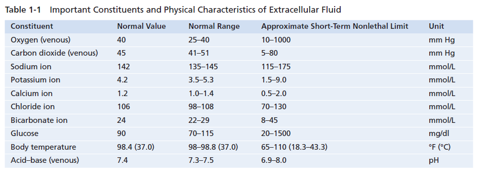  

## Ch 2 细胞器
    

* Protoplasm
    - water: 占70%~85%
    - electrolytes: potassium, magnesium, phosphate, sulfate, bicarbonate, and sodium, chloride, and calcium
    - proteins: structural, functional
    - lipids: phospholipids, cholesterol
    - carbohydrates: 提供能量或合成glycoprotein
* Cell Membrane：双重磷脂     
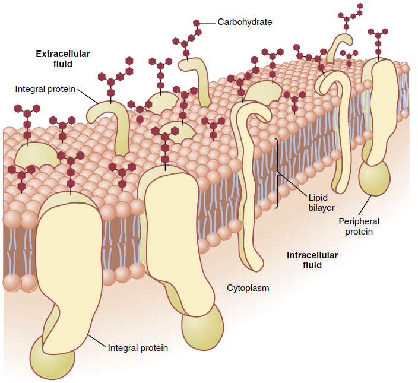
* Endoplasmic Reticulum：Rough ER 合成蛋白，Smooth ER 合成 lipids   
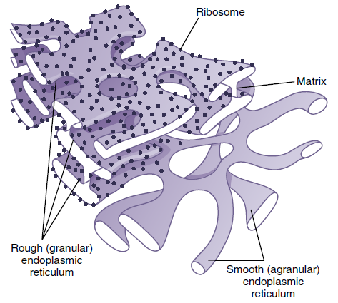
* Golgi apparatus：接收ER生成物，生成碳水化合物，下一步可形成 Lysosomes 等分泌小泡   

* Mitochondria：数量不定，生成ATP   

* Cytoskeleton：Filament and Tubular Structures   

* Nucleus：遗传物质   
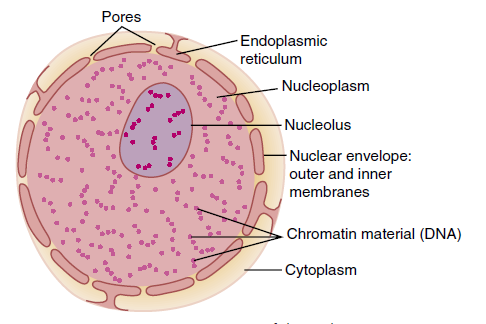
* Endocytosis（胞吞）：Pinocytosis（胞饮），Phagocytosis（胞吃/吞噬）
* Autophagy（自噬）：移除老化organelles
* 细胞移动：
    - Ameboid motion：细胞一端伸出假足将自己固定到新的区域，向这个方向形变（后方发生吞噬、于前方Exocytosis，则成功挪动这一部分细胞膜）
    - Cillary movement 纤毛运动，需要ATP与appropriate ionic conditions；e.g. 呼吸系统分泌粘液

## Ch 3 蛋白合成与细胞复制

<!--    -->
<!--     -->
<!--     -->

* RNAs
    - Small nuclear RNA (**snRNA**) directs the splicing of pre-mRNA
to form mRNA（去除introns）
    - **mRNA** 指导合成蛋白（消耗ATP）：Transfer RNA (**tRNA**) 运输AA，Ribosomal RNA (**rRNA**) 提供核糖体结构框架
    - MicroRNAs (**miRNAs**) 与mRNA结合(blocking)，调节转录和翻译
* Polyribosomes：由多个核糖体串连在一条mRNA分子上高效地进行肽链的合成
* ATCG化学式  
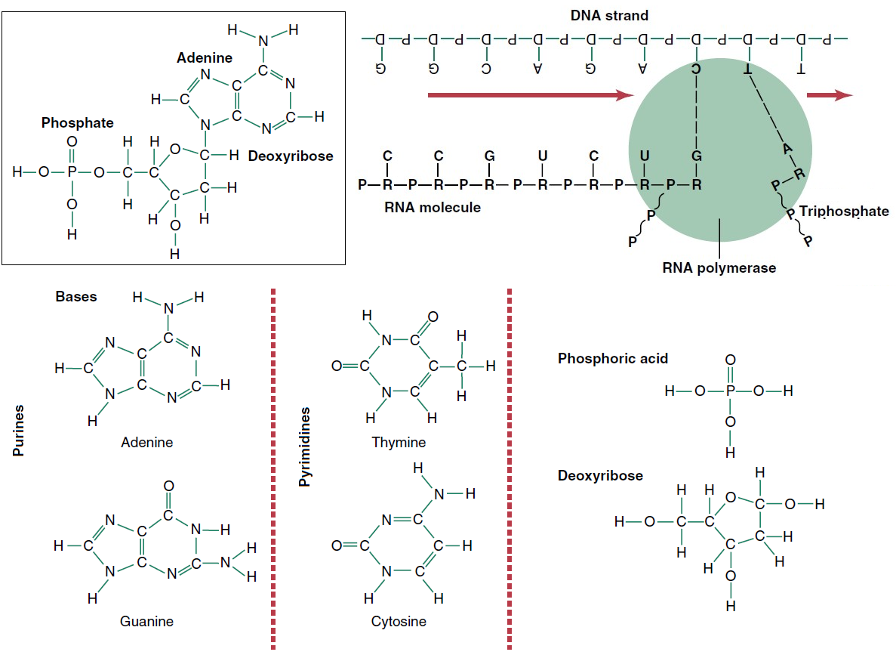    
* Codon Table 详见 [NCBI-The Genetic Codes](https://www.ncbi.nlm.nih.gov/Taxonomy/Utils/wprintgc.cgi)，同一种氨基酸具有两个或更多个密码子（简并密码子）  
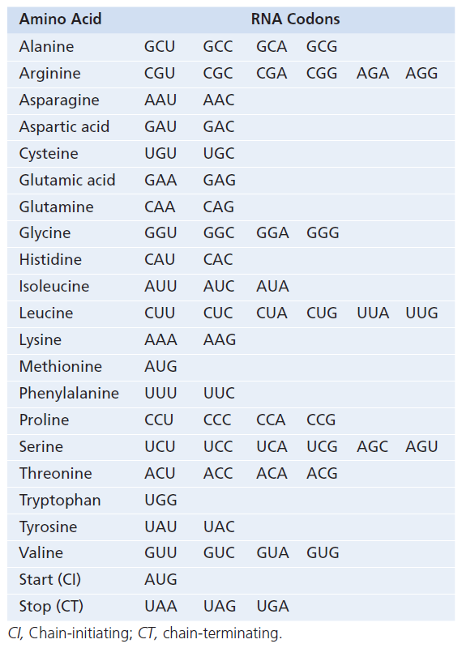   
* Gene transcription in eukaryotic cells  
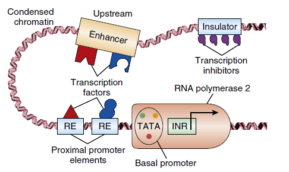  
* 细胞通过 Mitosis 进行复制  
  
    - Interphase：interval between mitosis，其占细胞95%以上生命周期。DNA在分裂开始前约10h开始复制，并且需要通过 Proofreading (是否与模板一致) 与 DNA Repair 以降低错误率。不过，假定人类30年一代，预计依旧会累计10个以上的Mutation 给下一代
    - Prophase 前期：纺锤体形成，染色体被压缩
    - Prometaphase 前中期：核膜消失，microtubule aster 结合着丝粒，将成对的chromatids 向两极施加拉力
    - Metaphase 中期：asters 相互挤压、形成纺锤体，chromatids 于赤道面排列
    - Anaphase 后期：chromatids 被拉开
    - Telophase 末期：两边各自形成新的核膜，microfilaments 形成 contractile ring 将细胞分开
    - Mitosis的调节：Growth Factors，细胞密度（相互挤压、环境中 cell's own secretion 的浓度） 
* 细胞寿命：每次复制端粒（Telomeres）会变短，骨髓中的端粒酶可修复端粒长度
* Apoptosis：细胞程序性死亡：shrink，condense，disassemble cytoskeleton，在表白加上标记、以便免疫细胞及时清除
* Necrosis：细胞被动死亡，内容物释放到微环境
* Oncogene 一般是促进细胞生长的基因、缺乏抑制，因此 Cancer 中细胞无度生长、与正常细胞争夺养分；Cancer 可能来源：Ionizing radiation，Chemical substances，Physical irritants 如持续磨损，家族遗传，Certain types of oncoviruses

## Ch 4 跨膜运输

   

* Diffusion 由物质浓度、电离浓度综合驱动
    - 脂类可通过细胞膜扩散；水溶性小分子可通过 protein “pores” (aquaporins) 渗透，比水大20%，渗透效率降低1000倍
    - Protein channels 有两个特性：
        1. selectively permeable（e.g. K离子专用通道）
        2. electrical signals / chemicals 控制 gates 开合（voltage-gated / ligand-gated）
    - 受限于Carrier protein 的形变速度，Facilitated diffusion 有速度上限（上图所示Vmax）
    - Nernst equation：EMF (in millivolts) = ±61*log(C1/C2)；EMF 指细胞膜内外 voltage；C1、C2 指细胞膜内外待扩散物质的浓度；此式满足则达成扩散平衡
    - Osmosis：水分子也可以渗透通过细胞膜；由渗透压驱动
        * 1 osmole = 1mol osmotically active solute 存在于1L溶剂中；e.g. 1mol某物质溶于水形成 2mol ions，则 2 osmoles；若不分解成ions，则依旧 1 osmole
        * 区别：Osmolality（osmoles per kilogram），Osmolarity（osmoles per liter of solution）

* Active transport 可逆浓度梯度转运物质，由载体蛋白消耗能量驱动
    - Primary：消耗ATP运输某种物质；e.g. Na-K Pump 维持平衡，Ca Pump 储钙于内质网中，H Pump 胃酸生成   
    
    - Secondary：形成浓度梯度/...，以运输另一种物质
        1. Co-Transport   
            
        2. Counter-transport   
        

## Ch 5 动作电位

**本章节关注 Nerve Cells**；Cardiac Cells 也有电位（Ca，此处不述）

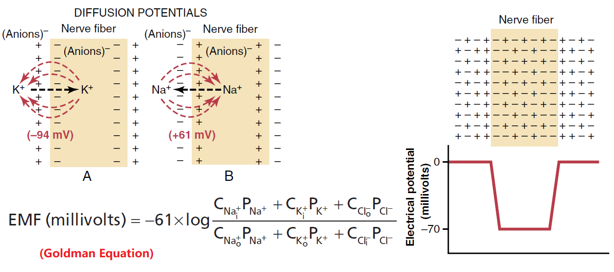  

* 上图，静息状态表格指膜内电位相对于膜外电位，e.g. -60mv 表示膜内电位负于膜外 60mV

* 静息状态时达成平衡，Nerve fiber 细胞内部含有大量K，细胞外部含有大量Na。因为多种离子的平衡电位不同 (K:–94 mV,Na:+61mV)，**静息电位**可用 Goldman equation 计算，其值为负，因：
    - Na-K pump: 泵出3 Na+, 泵入2 K+
    - K "leak" channels: 渗出 K+
* 将电位从−70mV提升至10mV的**测试**中，可以发现Na、K 通道的反应速度不同   
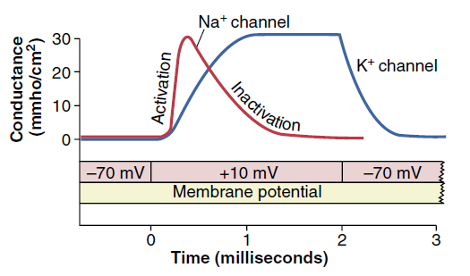
* 标准动作电位示意图（左）；带节律的动作电位（中）调节心脏节律，Hyperpolarization 与 K 流出有关；Plateau（右）延长了去极化的时间（与Ca通道有关），使心脏肌肉的收缩时间相同    

* **动作电位**激发后 Na 涌入细胞，到达电位顶点后通道迅速关闭；随后 K 加速流出细胞，到达平衡电位后通道关闭     
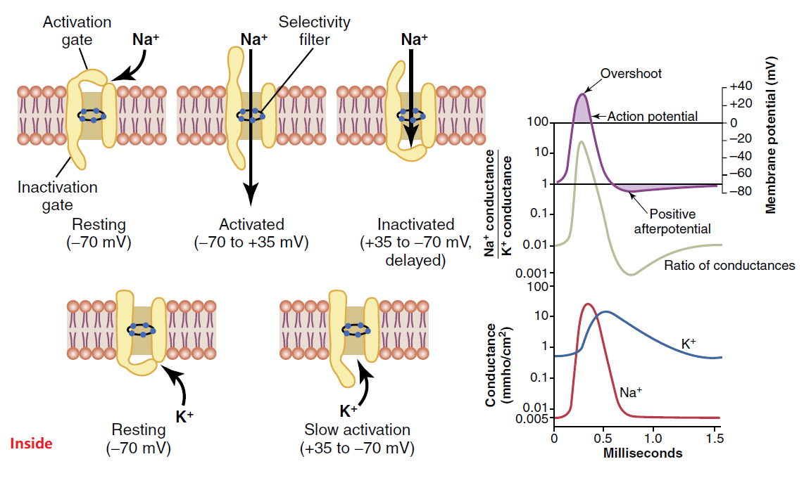
* 动作电位可沿着 conductive fiber 向两侧传导；也可 Saltatory conduction （跳跃式传导，更快）：Schwann cell 包裹 nerve fiber，间隔着留下 Node of Ranvier 以供跳跃式传导       

* 当前一个动作电位未结束时，后一个电位不会被激活，因为激活后不久Na通道就会关闭，直至再次达到静息电位前都不能再激活；下图（B）无法被激活，因为此时正处于 absolute refractory period (1/2500 second for nerve fibers)；下图（A）因为impulse未达到动作电位而未能激活     
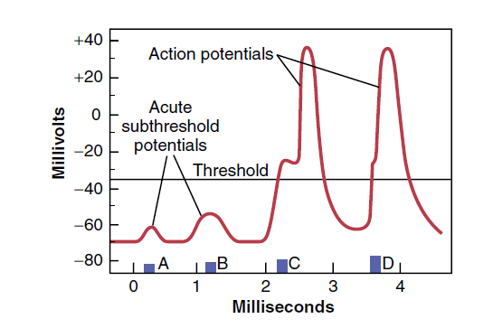
* 细胞外液钙离子浓度高会降低细胞膜对钠离子的通透性，因此 Ca 是 stabilizer
* 一些麻醉药提高Na通道的激活难度（提高 excitability threshold）

## Ch 6,7  骨骼肌

* 骨骼肌（Skeletal Muscle）的肌肉纤维束（Muscle fasciculus）由许多肌纤维（Muscle fiber）组成；每一根肌肉纤维外由肌膜（Sarcolemma）包裹、延申成横向的 T小管（Transverse tubule） 使动作电位得以快速传递，由肌浆（Sarcoplasm）填充、纵向的肌浆网（Sarcoplasmic Reticulum）调节钙离子；纤维内依次排列着多个肌节（Sarcomere）  
    - 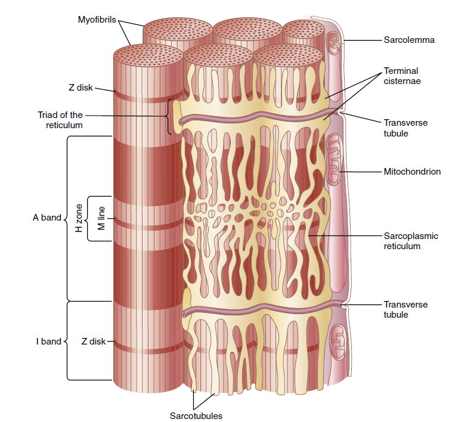
* 骨骼肌收缩
    - 
    - 动作电位由 Nerve 传递至肌纤维，Nerve 分泌少量神经递质 乙酰胆碱（acetylcholine）
    - 乙酰胆碱打开通道，大量Na离子涌入肌膜内侧、导致局部去极化，进一步打开钠离子通道，在膜上产生动作电位
    - 动作电位继续扩散，并且至肌纤维的中心、释放肌浆网内钙离子
    - 受钙离子刺激，Actin and Myosin filaments 开始滑动，肌肉收缩
        * （当 Active sites 未暴露时）Myosin Head 裂解ATP，产生 ADP+Pi+能量，此时其与Actin**垂直** 
        * 钙离子结合 Troponin complex，其形变拉动 tropomyosin 露出 Active sites 以结合 Myosin
        * Myosin 结合 Active sites 后形变**倾斜**，达成牵拉
        * 牵拉后释放ADP+Pi，结合新ATP，重复...
    - 在几分之一秒后，钙离子抽回肌浆网，肌肉收缩停止
    - e.g.骨骼肌）收缩时，Motor unit 指被一个Nerve（多个末梢）控制的一束纤维，它们同时收缩
* 骨骼肌能量来源：phosphocreatine（5-8s即可用），glycolysis（水解glycogen以用于生成ATP），oxidative metabolism（最慢）
* 两种肌纤维
    - slow fiber (red muscle)：更小，血管发达、供氧更好（偏向 oxidative metabolism），nerve 更少
    - fast fiber (white muscle)：更大，更偏向使用 glycolysis 等可以无氧代谢的快速能源（线粒体更少），存储大量钙离子
* 骨骼肌张力（Tone）：即使处于休息状态，通常也会有一定程度的紧绷，由来自脊髓的低频率神经冲动引起
* Muscle Remodeling
    - Hypertrophy and Atrophy（肥大/萎缩）：当肌肉蛋白合成加速/泛素水解时发生；肌肉失去神经支持也会快速萎缩（失去收缩能力后很难再恢复弹性）
    - Adjustment of Muscle Length：当肌肉被拉伸过长时发生
    - Hyperplasia of Muscle Fibers：纤维数量的增加（不是纤维肥大），分裂自此前已变大的纤维

* 运动终板（Motor End Plate）：神经元与肌纤维相接触的部位，被多个 Schwann cells 覆盖，使其与周围的液体隔绝（神经信号 乙酰胆碱不会快速发散，只能从 synaptic cleft 走）。
    - 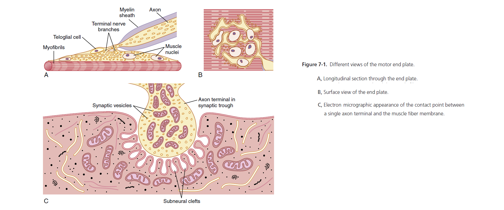
    - 乙酰胆碱会被迅速分解，因此信号不会一直持续
    - 肉毒杆菌毒素（botulinum toxin）：使神经末梢减少释放乙酰胆碱
    - Fatigue of the Junction：持续释放乙酰胆碱后，乙酰胆碱储备不足
    * carbachol、nicotine 作用类似乙酰胆碱，且代谢缓慢；这样的持久刺激可能造成肌肉痉挛（spasm）；一些使乙酰胆碱酯酶失活（使之不能快速分解）的药物也可能达成这样的效果
* 骨骼肌的动作电位与神经元的相似（参考Chapter 5），一些参数不同：
    - 静息膜电位约比神经元更负10到20毫伏
    - 动作电位持续时间为 1-5 ms （更长）
    - 传导速度为 3-5m/s（更慢）

## Ch 8 平滑肌

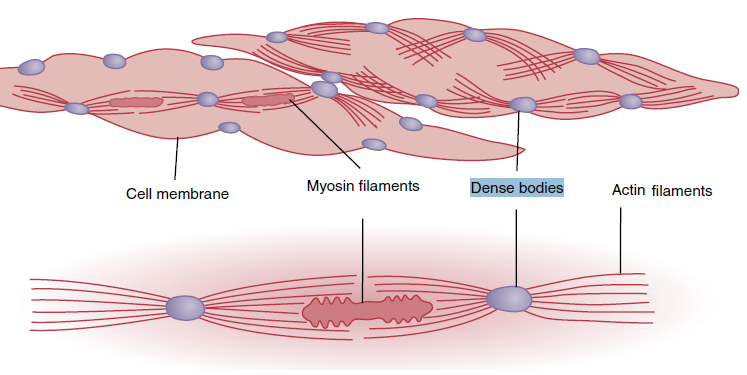

* 平滑肌（Smooth Muscle）一般有两种型态
    - Multi-Unit：每一根纤维都独立地运作、受神经控制；在需要精细控制的地方出现，e.g.眼睛
    - Unitary (Visceral)：纤维成片、束排列为一个整体，细胞膜相互粘附、离子可以通过这些缝隙连接在细胞间流通；出现在内脏壁、血管导管处（Stress-Relaxation、reverse stress-relaxation：压力缓冲的能力很强，例如膀胱壁）
* 平滑肌收缩：
    - 神经冲动/递质-->动作电位（仅Unitary有，Multi-Unit太小了、故无）-->钙离子泵
    - CaM 结合钙离子后激活 MLCK，使 Myosin 磷酸化、附着 Actin，肌肉收缩
    - 钙离子被泵出后 Myosin 不再磷酸化，同时 Myosin phosphatase 进行去磷酸化，肌肉放松
    - 对比骨骼肌收缩：
        * 神经递质因器官而异；此外，Unitary 通常可以由非神经施加的刺激引起收缩（e.g.stretch使阈值更易达到、于是自动节律的电位也可以造成收缩）（e.g.激素，氧气）
        * 钙离子更多来自于胞外（骨骼肌Ca多来自肌浆网）
        * 没有 troponin，故而对钙离子的反应也更慢、Myosin Cross-bridges（收缩）更慢
        * 耗能更少
        * Dense bodies（同时也是 intracellular protein bridges） 代替了 Z disk 位置

## Ch 9 心脏

**血液循环**：lung **-->** Left atrium **-->** Left ventricle **-->** Aorta(body) **-->** Right atrium **-->** Right ventricle **-->** Lungs

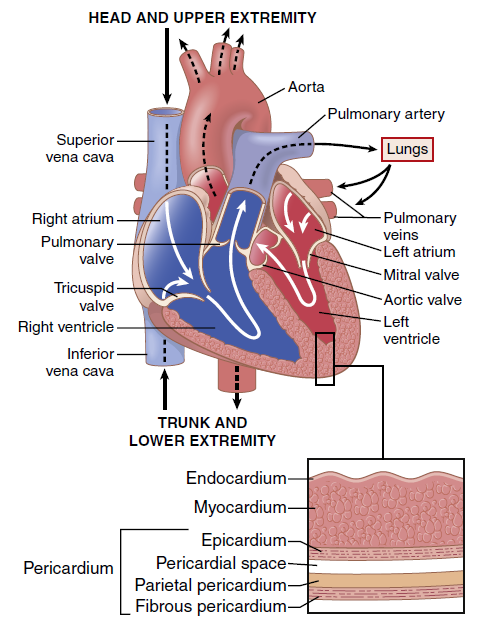 

* 心肌的动作电位扩展至T小管，激活 L-type Ca channel 令钙离子进入细胞，激活肌浆网中的钙离子也泵入胞质；收缩结束后钙离子泵出细胞
    - 有Plateau，因为开启L型钙离子通道使Ca流入细胞，延长了去极化(Depolarization)的时长
    - 骨骼肌中过早的收缩会引起 wave summation；但**心肌在达成复极化(Repolarization)前无法再次激发动作电位**

* Cardiac Muscle
    - Atrial Muscle
    - Ventricular Muscle：Pump
    - Conductive Muscle Fiber：传递电子信号，使心脏模块(atrium、ventricle)内部保持同步缩放（Syncytium：Fibers 互相贴合为一个整体，由 Intercalated discs 传递 ion signals 以保持节律）

* **Cardiac cycle** = Systole + Diastole；心跳加速时，Diastole 部分时长缩短最多
    - Isovolumic: 收缩/舒张导致压力变大，但valve还没有开启，因此血液容量无变化（等容收缩/舒张）
    - Left Heart 视角
       * （----Diastole----）
       1. Mitral valve 打开，血液从 Left atrium 流入 Left ventricle
       * （----Systole----）
       2. Mitral valve 关闭，防止 Left ventricle 血液逆流入 Left atrium （同时等容收缩）
       3. Aortic valve 冲开，开始 ejection
       4. Aortic valve 关闭（同时等容舒张）
    - Phonocardiogram 视角
        * P：S-A node firing，atrium 中信号开始传导、
        * QRS：A-V node firing，ventricle 中信号开始传导、收缩

* 影响 Cardiac Output 的因素
    - 自主神经系统（见下章）
    - 细胞外过量K离子可能阻断心脏冲动的传导（去极化，使膜电位不那么负，导致动作电位的强度变弱）；相对的，细胞外过量Ca离子可能导致心脏持续痉挛性收缩
    - 动脉压

## Ch 10 心脏节律
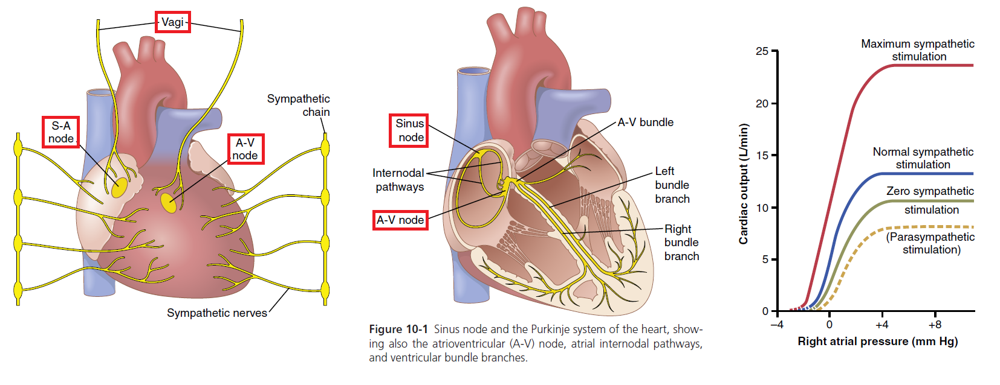

* 自主神经系统（autonomic）调节心跳
    - 副交感神经（parasympathetic）：迷走神经（Vagi）控制 S-A node、A-V node，控制心率（e.g. acetylcholine 减慢心跳）
    - 交感神经（sympathetic）：直接影响肌肉收缩，可同时控制心率、收缩强度（e.g. Norepinephrine 加速离子置换：K-加速达到电位阈值、Ca-收缩增强）

* 节律传递：Atrium先收缩、随后再Ventricle
    1. （Right Atrium 中）S-A node 产生自主节律脉冲，通过 Internodal pathways 传导至 A-V node
    2. （A-V bundle 处延迟一会儿，随后信号进入ventricles）
    3. （Ventricle 中）信号传递给 Purkinje fibers 的左右 bundle

* 自主节律：S-A node、A-V node 可以受Vagi调节，也可以自主产生节律脉冲（其静息电位不如正常的负）；正常心跳节律由 S-A node 产生；A-V node 的自主节律 S-A node 慢，当外源信号迟迟不至时才起作用（escape beat）；Purkinje fibers 的自主节律更慢

## Ch 11,12 心电图
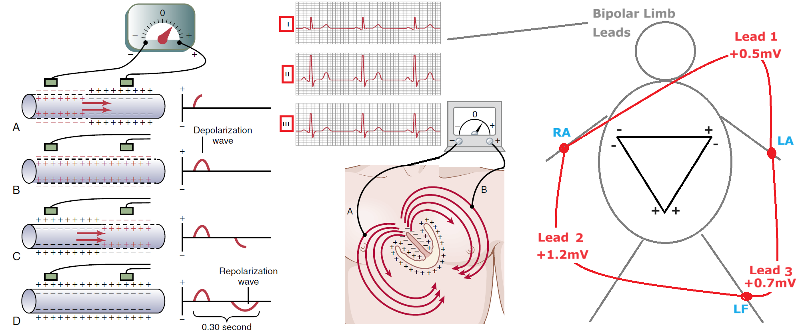  
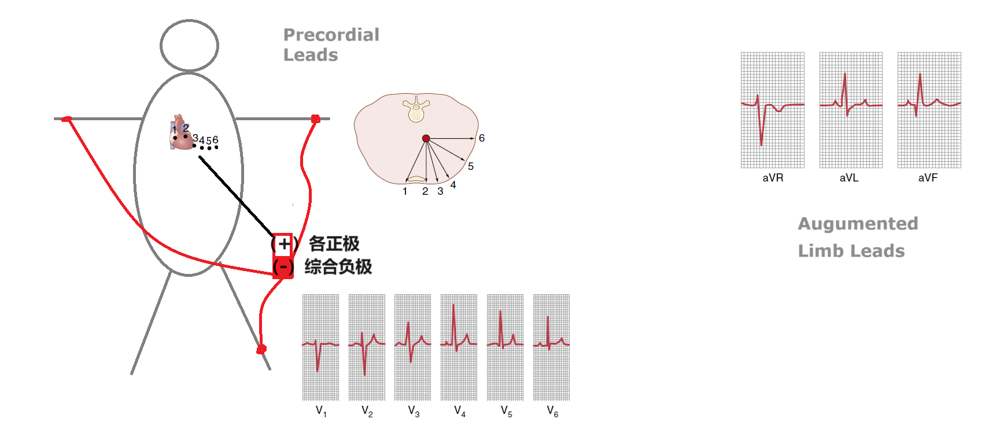

* PR区间 AV node 慢速传递电信号，QT区间 Ventricle 收缩

* 心肌[去极化(Depolarization)](./Medical_Physiology/9-8.png)时，大量 Na 进入细胞使得胞内正电荷、胞外负电荷(-)；而 极化(Polarized) 后达成静息电位，此时胞外正电荷(+)
    - [PQRS过程中的电荷分布与心电图](Medical_Physiology/12-7.png)
        * P (Atrial P Wave)：**atria** 从 sinus node 开始极化; 其从远端部分开始去极化，产生 Atrial T Wave
        * QRS：信号从 A-V bundle 处进入 **ventricles** 并扩散，使之去极化
        * T：**ventricles** 复极化；注意，因为最先极化的 septum and endocardial areas 收缩时间较长，因此是从 apex 开始复极化
        * 当ventricles极化耗费过长时间传递时，有可能 septum 等已经完成收缩，先进行复极化，（或者是药物导致部分区域加速完成去极化、先行复极化），此时会有[异常的 T wave 图像](Medical_Physiology/12-24.png)
    - 电流趋势方向：负电荷 --> 正电荷

* EKG/ECG Leads 摆法：不同 Leads 都可通过正负极之间的电流测得电信号的大致方向以形成心电图
    - （正负电极测量两个位点电位之间的差别、**方向**，注意图中符号）
    - Bipolar Limb Leads：正负极摆法如图；其中 Leads 2 最符合电信号趋势，因此信号最强
    - Precordial Leads：肢体合并为整个负极，将正极放置于心脏周围不同处，可以分辨出整个信号传导过程
    - Augmented Limb Leads：aVR（Right arm 正极，其余二者负极），aVL（Left arm 正极，其余二者负极），aVF（Left Foot 正极，其余二者负极）；是 Bipolar Limb Leads 的信号加强版

* Vectorcardiogram：趋势向量（不同时间）的轨迹图

* QRS 的 Mean electrical axis：确定 QRS 时 Bipolar Limb Leads 2个方向上的向量长度（所有正数值-所有负数值），二者**顶端的垂线**相交于某一点、连通原点得到一个新的向量轴
    - 对于正常的 ventricles，其标准值是 59°（在 20°-100°之间都是正常的）；改变 apex 的位置会造成一定程度的 axis shifts：躺下（to left）、站起（to right）
    - **单侧**心肌异常/信号传递受阻可能导致 axis 偏移：**因其去极化时间变久，axis转向此侧**，例如-单侧心室肥厚，单侧 Bundle Branch Block

* QRS的范围一般在 0.5mV 至 2mV 之间
    - 高于 4mV 则认为有高血压：心脏的某一部分负荷过重，肌肉量增加，更多电流
    - 过低则可能：有陈旧性心肌梗死导致肌肉量减少；或心包积液(pericardial effusion)过多，使大部分电信号通过积液传递，降低到达身体外表面的心电图电压；或肺气肿形成绝缘体包裹心脏

* 正常QRS复合体持续0.06 ~ 0.08秒，超过0.09则不正常
    - 心室肥大或扩张，QRS延长至0.09 ~ 0.12秒
    - 传导系统（例如-Purkinje system）被阻塞：QRS持续超过0.12秒
    - 疤痕也会减慢传递速度，因为信号需要绕过它

* 损伤电流(current of injury, COI)：部分心肌细胞一直处于去极化状态，使[电流异常，可测得 J point](Medical_Physiology/12-17.png)
    - 不能完全复极化：机械损伤使膜保持透性
    - 感染：肌膜损伤
    - 局部缺血：局部冠状动脉闭塞
    - 以 J point 为 Baseline（排除杂乱电流信号），可结合不同leads的心电图，以确定损伤部位：绘制 [Injury potential 的 Mean electrical axis](Medical_Physiology/12-18.png)，新向量的**负端**指向 ventricles 中损伤的位置
    

## Ch 13 心律失常

| -- | -- | 机制 |
| -- | -- | -- |
| ABNORMAL SINUS RHYTHMS | TACHYCARDIA  (心跳加速) | sympathetic nervous system：体温上升1摄氏度，心跳每分钟加速18下 |
| -- | BRADYCARDIA  (心跳减慢) |  parasympathetic nervous system（Vagal Stimulation）；或，运动员静息状态下心跳较慢 |
| -- | SINUS ARRHYTHMIA | 髓质呼吸中枢的信号外溢到邻近的血管舒缩中枢，影响了sympathetic/vagus传递给sinus的信号：深呼吸加速心跳，呼气减慢心跳 |
| 心内传导通路阻塞 | SINOATRIAL BLOCK  (S-A node block) | 只能依赖更慢的 A-V node 的自主节律产生P wave，导致心率变慢 |
| -- | ATRIOVENTRICULAR BLOCK  (A-V node block) | **First-Degree Block**：P-R逐渐延长后心跳漏拍    **Second-Degree Block**：P-R长度固定，但随机出现dropped beats（P wave无法传导成QRS）   **Third-Degree**/Complete Block：QRS随机出现，与P完全无关联    **病因**：可能由于 A-V node 缺血/疤痕压迫/炎症，或 vagus nerves 极度兴奋，或药物：digitalis/beta-adrenergic拮抗剂   **Stokes-Adams Syndrome**: 突然出现Complete Block，等待Ventricular节律期间缺血昏迷 |
| -- | Ventricular内部阻塞 | 可能由于Purkinje system跟不上加速的心跳（ELECTRICAL ALTERNANS），或者缺血/疤痕压迫/炎症/拮抗剂导致Purkinje system阻塞 |
| PREMATURE CONTRACTIONS  早搏/异位(ectopic)心跳 | 房性早搏(PAC) | P wave过早出现，P-R缩短（**异位信号起源于atria中**靠近A-V node处），与下一个收缩的间隔会稍微延长（因sinus node 激活较晚、所以discharge late） **常见于**：运动员、吸烟、睡眠不足、摄入过多咖啡、酗酒... |
| -- | A-V NODAL OR A-V BUNDLE | **异位信号起源于A-V node**，信号同时传入atria、ventricles；P wave叠加至QRS |
| -- | 室性早搏(PVC) | **异位信号起源于ventricular中**，QRS延长（因为信号不是通过高速Purkinje system传递的）、high voltage；[T wave 总是与QRS极性相反](./Medical_Physiology/13-1.png)  [long QT syndrome (LQTS)](./Medical_Physiology/13-12.png)：增加室性心律失常的易感性；病因：低镁/钾/钙血症... 或服用过量抗心律失常的药物 |
| PAROXYSMAL TACHYCARDIA   （阵发性心动过速） | 心房/Nodal/心室都可能突发快速节律信号，无清晰起因 | 其中，室性心动过速通常源于严重的缺血性损伤，且容易引发 ventricular fibrillation（在一系列早搏的刺激下） |
| [VENTRICULAR FIBRILLATION](./Medical_Physiology/13-16.png)  (室颤) | 致死，需要 1 min内 [除颤](./Medical_Physiology/13-18.png) | 心室肌肉群发生无序的激动，其节律和舒缩功能消失；病因：电击/按压心脏/缺血/... |
| ATRIAL FIBRILLATION | cardic output 降低（但不致死，因为还有passive filling）  | -- |
| CARDIAC ARREST | 失去心脏中所有信号 | 深度麻醉/缺氧/... |

## Ch 14 血液循环

* 血液循环的基本特征
    - 血液可按Tissue的需求调节
    - Cardiac output = 所有 local tissue flows 之总和
    - Arterial pressure regulation **不受** local blood flow control 与 cardiac output control 的**影响**

* Velocity = Flow / Cross-Sectional_Area
    - Flow恒定为Cardiac output，故而横截面小者流速快

* Resistance：以PRU（Peripheral Resistance Unit）为单位，见Ohm’s law
    - 近血管壁处阻力比血管中心处大
    - 增加Viscosity（例如增加细胞）可以提高Resistance

* Conductance = 1/Resistance = 与(Vessel_Diameter^4)成比例
    - 大血管的Conductance = 其所有分枝的Conductance之和
 
* Blood Pressure: the force exerted by the blood **against** any unit area of the **vessel wall**
    - 1 mmHg = 1.36 cm water pressure

* Ohm’s law：压力梯度与阻力决定了流量
    - Flow = (Pressure_1-Pressure_2)/Resistance 
    - 1 ml/sec = (1 mmHg)/(1 PRU)；
    - **由 Ohm’s law 对应 Systemic pressure（100mmHg）与 Cardiac output（100 ml/sec）**

* Poiseuille’s law: 影响流量的各种因素
    - Flow = Pi × (Pressure_1-Pressure_2) × (Vessel_Radius^4) / （8 × Viscosity_coefficient × Vessel_Length）

* Reynolds’ number 判别粘性流体流动状态
    - Re = Velocity × Vessel_Diameter × Density / Viscosity_coefficient
    - 数值越大越趋向于 Turbulence，例如：笔直光滑血管中 >2000、分支血管中 >200~400 （arteries中经常是湍流）
    
* Autoregulation：根据血压调节血管的 dilation/constriction

## Ch 15 动脉-静脉

* Vascular distensibility = Increase_in_volume / (Increase_in_pressure × Original_volume)
    - 扩张性：压力每升高1毫米汞柱，血液量增加的**倍数**
    - 允许血管适应心脏的脉动输出并平均化压力脉动
    - 血管中最易扩张的是静脉（大约是动脉的8倍），储存大量额外血液

* Vascular_compliance = Increase_in_volume / Increase_in_pressure
    - 顺应性：压力每升高1毫米汞柱，血液的**增量**
    - 全身静脉的顺应性约为相应动脉的24倍（8倍扩张性×3倍容积）

* 可以使用 [Volume-pressure curves](Medical_Physiology/15-1.png) 来表示压力与体积的关系
    - 全身动脉系统中，容积通常在700毫升左右，此时平均动脉压是100 mmHg；当容积降至400毫升时，动脉压迅速降为0
    - 全身静脉系统中，容积通常在2000到3500毫升之间；其顺应性很高，故而人体可以承受多达半升的快速输血
    - 交感神经刺激血管张力（vascular tone）升高、降低顺应性，血压升高；交感神经抑制同理

* [Delayed Compliance of Vessels](Medical_Physiology/15-2.png)：容积变动的初期血压大幅变化，但几分钟到几小时内可通过血管壁中平滑肌的渐进延迟拉伸恢复正常

* [Pulsations（脉搏）](Medical_Physiology/15-3.png)：动脉承受着心脏每一次收缩的输出压力，舒张期又无血流
    - 当血液流至毛细血管时，Arterial tree的顺应性将脉搏降低至几乎无，令血流平缓连续
    - 图中 Sharp incisura 是由 valves 开合产生的
    - Pulse pressure = Stroke_volume / Arterial_compliance

* [测血压](Medical_Physiology/15-7.png)：压迫动脉至无血流（脉搏），逐渐松开，过程中记录第一次出现声音时的血压（收缩压）、最后一次出现声音时的血压（舒张压）
    - 平均血压更接近舒张压，因为舒张耗时更长（除非心动过速时、舒张更短）
    - 随着年龄增加，血压也逐渐增加

* Central venous pressure = Right atrial pressure，受以下两个因素的影响
    - 心脏泵血入肺的能力：right atrium -- right ventricle --  lungs （泵血能力更强，造成的压力更高）
    - 血液从 peripheral veins 回收至 right atrium 的趋势（e.g. vessel tone升高，更多血液回流入心）

* 由于其顺应性，Large veins 对血液流动的阻力几乎为零，但在进入胸腔后会有一些压迫点造成一些血流阻力，故而平躺时外周小静脉的压力通常比Right atrial高 4-6 mmHg
    - 例如：大气压使颈静脉塌陷，第一根肋骨压迫手部静脉，不同器官和腹内压力的压迫，...

* [重力也会对静脉压造成影响](Medical_Physiology/15-10.png)，站立时，接近足部的压力最高
    - 腿部的肌肉收缩起到泵血的作用，[Venous valves](Medical_Physiology/15-11.png) 防止过程中静脉血回流
    - 怀孕、长期站立会让腿部静脉持续高压，损伤 Venous valves，血液无法正常泵出、造成静脉曲张（Varicose Veins）

* 人体血液储备包括：（其中静脉存储了约65%的血液）
    - [spleen](Medical_Physiology/15-13.png)：约 100 ml 血液
    - liver：约 几百 ml 血液
    - large abdominal veins：约 300 ml 血液
    - venous plexus beneath the skin：约 几百 ml 血液
    - heart： 50 ~ 100 ml 血液（交感神经刺激时收缩放血）
    - lungs： 100 ~ 200 ml 血液（当肺动脉压降至较低值时）

## Ch 16 微循环-淋巴系统

* 毛细血管(Capillary)的 [Microcirculation](Medical_Physiology/16-1.png): the transport of nutrients to the tissues and removal of cell excreta
    - Capillary Wall 非常薄，仅 1 cell thick，可通过 Caveolae 运输脂溶性物质（例如 氧气、二氧化碳）
    - Precapillary sphincters 控制进入毛细血管的血流量（根据需氧量）
    - Intercellular cleft (内皮细胞之间的‘Pores’)，可通过水溶性物质（例如 sodium ions、glucose）
        * brain：很严格，只允许通过water, oxygen, carbon dioxide
        * liver：很宽松，允许几乎所有plasma中溶质通过，包括蛋白
        * gastrointestinal capillary membranes：中庸
        * glomerular capillaries of the kidney：其内皮细胞有被称为 fenestrae 的孔（仅可通过小分子），故而不需要通过 clefts

* 血管舒缩(Vasomotion): 由于 sphincters 的间歇性收缩，血液在毛细血管中断断续续的流动

* [Interstitium](Medical_Physiology/16-4.png)主要由 Collagen fibers（骨架）与 Proteoglycan filaments（gel-like填充物）组成
    - 水肿(edema)时，会存在大量 free fluid

* [静水压(hydrostatic pressure) v.s. 渗透压(osmotic pressure)](https://www.jishulink.com/post/1910514)
    - 静水压 P = rho × g × height: 流体在接触表面的每单位面积上施加的垂直力（由于重力作用，静水压会在任何时间点施加，在底部最大）
    - 渗透压 π = iCRT；其中 i=Vant_Hoff因子，C=溶质的摩尔浓度，R=通用气体常数，T=温度

* [capillary 通过 Diffusion 实现与 interstitial fluid spaces 之间的物质交换](Medical_Physiology/16-3.png)
    - 由于发生大量水交换（80倍于血流量），最主要的物质交流还是通过 Intercellular cleft
    - 高浓度的物质更有可能被扩散出去，不过同时也需要考虑此物质的渗透性（Permeability）
    - [Net filtration pressure (NFP) 是血管内/外，血压、渗透压的综合效果](Medical_Physiology/16-5.png)（更多液体渗入，或更多液体渗出），统称这四个力为 ‘Starling forces’
    - 液体从血管至间质：Filtration = Kf × NFP，其中capillary filtration coefficient (Kf)衡量渗透性

* 毛细血管的静水压可通过 micropipette cannulation 直接插入血管测量，或测量其周边的松散组织，不同方法得到的数值不同
    - [毛细血管的静水压为 Filtration 提供助力](Medical_Physiology/16-2.png)：人血浆(Plasma Colloid)的渗透压约为 28 mmHg（19 mmHg 来自其溶质蛋白，9 mmHg 来自 Donnan effect - 与蛋白结合的阳离子），这大于间质的渗透压、光靠渗透压无法使液体渗出至间质；所以动脉中静水压很高令总体力向外、渗出液体，静脉中则反之回收液体；但总体而言力是向外的，因为还有淋巴系统从间质中抽取液体
    - 大多数组织中，由于淋巴系统的缘故，间质可以维持负压、从血管中抽取液体
    - 在一些被紧密包裹的组织中，间质是正压、但小于其包囊组织对外部的压力（有压力差则可以发生 Filtration）；例如，肾脏被纤维囊包裹，肾间质液压约为 +6 mmHg，纤维囊压约为 +13 mmHg；其他例子如 巩膜包裹的眼球、被 cranial vault 包裹的大脑 

* [淋巴系统(lymphatic system)](Medical_Physiology/16-6.png)从间质中带走多余液体（可以调节 interstitial fluid pressure，保持负压防止结缔组织水肿），带走不能再被吸收的蛋白或其他物质；最终通过返回到静脉系统
    - lymphatic vessels 的 Valves 使得液体只进不出；如果其不堪重负，可能会发生水肿
    - 淋巴液的蛋白浓度很高，且吸收了食物中几乎所有 fats（肠道不能吸收），另外可能还有细菌、病毒等（lymph nodes中有免疫细胞）

* 提高 interstitial fluid pressure 可提高 lymph flow，方法包括：
    - 提高毛细血管的静水压
    - 降低血浆的渗透压
    - 提高间质渗透压
    - 提高血管壁的通透性

* lymph flow 机制：（并且有valves防止回流）
    - 骨骼肌收缩
    - 身体各部位的运动
    - 邻近淋巴管的动脉搏动
    - 体外物体压迫组织

## Ch 17 局部血流调控

* 各 tissue 的血流量都是按需控制的
    - 肾脏起到过滤血液的作用，因此血流量很大
    - 肌肉在放松时代谢弱，因此不充血

* [**Acute control**](Medical_Physiology/17-3.png): Precapillary sphincter 控制 rapid 血管收缩/舒张
    - Vasodilator Theory: 代谢物令血管扩张
    - Oxygen Demand Theory: Precapillary sphincter 存在周期性的开合(vasomotion)，其收缩需要氧气；如果氧含量不足，则血管扩张的状态更持久

* Autoregulation：Arterial Pressure 突然变化，血流初期剧烈变化但逐渐回归正常水平
    - Metabolic theory: 剧烈加强的血流洗去代谢物，令血管舒张
    - Myogenic theory: 剧烈加强的血流拉伸血管壁的平滑肌，使其收缩，导致血流阻力增加，血流减缓
    - 肾中 tubuloglomerular feedback： 当被滤出的液体量过多时，macula densa 发送信号，减少肾脏血流量
    - 大脑血流量不仅受氧含量控制，也受 carbon dioxide、hydrogen ions 的影响
    - 皮肤血流量受温度控制：温度上升，血流增加，出汗增加

* **Long-term control**: 某组织代谢率发生变化，长期需要大量血流，会长出新的血管(angeogenesis)，或发生 [Vascular Remodeling](Medical_Physiology/17-8.png)

| Acute | Vasoconstrictor | Vasodilator |
| -- | -- | -- |
| 代谢物 | -- | ADP   Ions... |
| Endothelium-Derived | Endothelin: 受伤时产生，防止失血过多 | [Nitric Oxide](Medical_Physiology/17-6.png): 因 Shear stress 产生；也可能当 angiotensin II 收缩血管时释放少量 NO 以防过度收缩 |
| Humoral | Norepinephrine and Epinephrine   Angiotensin II   Vasopressin | Bradykinin   Histamine |
| Ions | calcium                   | potassium   magnesium   hydrogen ion   Anions: acetate and citrate   carbon dioxide |

## Ch 18 血流及动脉压的神经调节(TBA)

## Ch 19 肾脏与动脉压长期调控(TBA)
## Ch 20 心输出量-静脉回流(TBA)
## Ch 21 (TBA)
## Ch 22 心脏衰竭(TBA)

## Ch 23 心音

* Heart valves 闭合时会产生声音，正常心脏会有1st、2nd心音，听诊器中 “lub, dub, lub, dub”；[鉴于心脏杂音与可听阈值](Medical_Physiology/23-1.png)，听诊器可听见的频率在 40~520 cycles/sec

| [Heart Sounds](Medical_Physiology/23-3.png) | 说明 | 其它 |
| -- | -- | -- |
| 1st | ventricles 收缩使血液回流至 A-V valves, 随后 A-V valves 闭合-->向atria紧绷-->将血液反弹回 ventricles | (tricuspid and mitral valves) |
| 2nd | semilunar valves  闭合时血液回流至动脉中 | (aortic and pulmonary valves) |
| 3rd | 猜测因 atria 向ventricles 注入血液过快而在 ventricles 中产生湍流 | 儿童、运动员中正常有此音，systolic heart failure 的老人亦有此音 |
| 4rd | 因 ventricular wall compliance 降低、ventricular filling 阻力增加，atrial 收缩以强制向 ventricles 灌注 | 左心室肥厚者有此音；频率<20 cycles/sec 故而听诊器听不见 |

**Phonocardiograms**：Heart valves 病变可以导致心音变化：  

* Rheumatic fever：Autoimmune 使 valves 渗漏/粘连 (C/E)，通常因 streptococcal toxin 引起
* 主动脉瓣狭窄：或因衰老导致主动脉瓣肥大 (B)

| [Heart Sounds](Medical_Physiology/23-3.png) | - | 说明 | 其它 | 
| -- | -- | -- | -- | 
| A | 正常心脏 | -- | -- | 
| B | 主动脉瓣狭窄 | 血液从 left ventricle 泵出至主动脉时发生阻塞 | -- | 
| C | 二尖瓣返流 | 血液从 left ventricle 渗漏流回 left atrium | -- | 
| D | 主动脉瓣返流 | 血液从主动脉渗漏流回 left ventricle | -- | 
| E | 二尖瓣狭窄 | left atrium 流向 left ventricle 的单向阀门打开不完全  | left atrium / Pulmonary artery 高压，可能导致肺水肿 | 
| F | 动脉导管未闭 | 主动脉和肺动脉之间存在异常通道，发生分流 | Ductus arteriosus 应在出生后4-5天闭合 | 

**B/D情况都使 net stroke volume output 减小，因而导致：**

* 左心室肥厚（代偿）；若最终左心室衰竭无法泵出血液，压力传导至左心房中，进一步传导导致肺动脉高压
* Increase in blood volume （kidney对血流减小的反应）
* Increase in red blood cell mass （tissue轻微的缺氧）

**TETRALOGY OF FALLOT (法洛四联症)**：室间隔缺损、肺动脉狭窄 --> 持续缺氧状态

* 左右心室无间隔，导致动、静脉血液混合
* 由于肺动脉狭窄，大部分血液绕过肺部、直接进入主动脉
* 右心室原先对接肺动脉，此时也直面主动脉的高压，代偿下右心室增大

## Ch 24 (TBA)
## Ch 25 (TBA)
## Ch 26 (TBA)
## Ch 27 (TBA)
## Ch 28 (TBA)
## Ch 29 (TBA)
## Ch 30 (TBA)
## Ch 31 (TBA)
## Ch 32 (TBA)
## Ch 33 (TBA)
## Ch 34 (TBA)
## Ch 35 (TBA)
## Ch 36 (TBA)
## Ch 37 (TBA)
## Ch 38 (TBA)
## Ch 39 (TBA)
## Ch 40 (TBA)
## Ch 41 (TBA)
## Ch 42 (TBA)
## Ch 43 (TBA)
## Ch 44 (TBA)
## Ch 45 (TBA)
## Ch 46 (TBA)
## Ch 47 (TBA)
## Ch 48 (TBA)
## Ch 49 (TBA)
## Ch 50 (TBA)
## Ch 51 (TBA)
## Ch 52 (TBA)
## Ch 53 (TBA)
## Ch 54 (TBA)
## Ch 55 (TBA)
## Ch 56 (TBA)
## Ch 57 (TBA)
## Ch 58 (TBA)
## Ch 59 (TBA)
## Ch 60 (TBA)
## Ch 61 (TBA)
## Ch 62 (TBA)
## Ch 63 (TBA)
## Ch 64 (TBA)
## Ch 65 (TBA)
## Ch 66 (TBA)
## Ch 67 (TBA)
## Ch 68 (TBA)
## Ch 69 (TBA)
## Ch 70 (TBA)
## Ch 71 (TBA)
## Ch 72 (TBA)
## Ch 73 (TBA)
## Ch 74 (TBA)
## Ch 75 (TBA)
## Ch 76 (TBA)
## Ch 77 (TBA)
## Ch 78 (TBA)
## Ch 79 (TBA)
## Ch 80 (TBA)
## Ch 81 (TBA)
## Ch 82 (TBA)
## Ch 83 (TBA)
## Ch 84 (TBA)
## Ch 85 (TBA)

