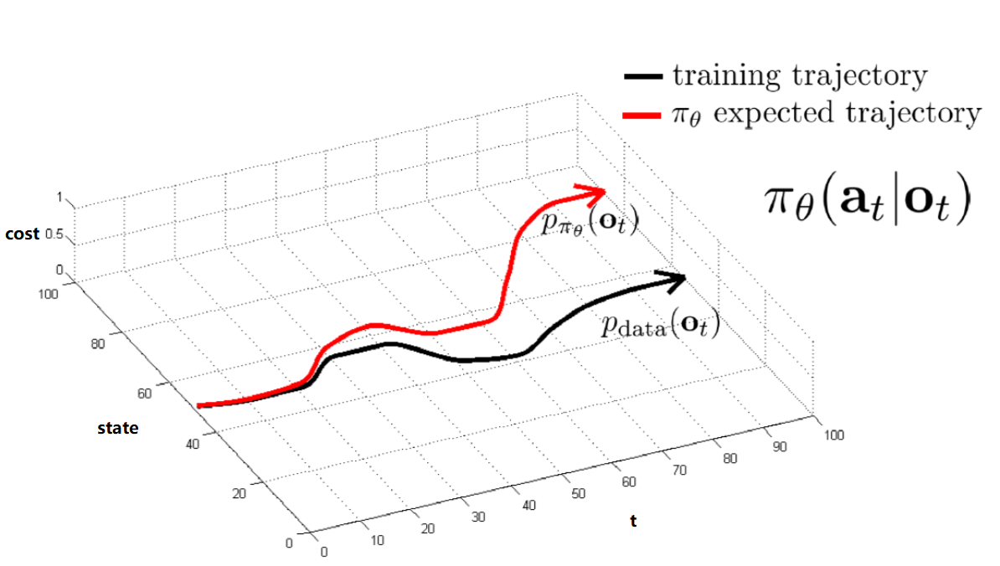

CS285 - 2019  
http://rail.eecs.berkeley.edu/deeprlcourse/resources    
https://www.bilibili.com/video/BV15441127ua/    

## Notations
*t* - timestep *t*  
$s_t$ - state     
$o_t$ - observation   
$a_t$ - action   
$\pi_\theta(a_t|o_t)$ - policy (partially observed)  
$\pi_\theta(a_t|s_t)$ - policy (fully observed)    
$p_{data}(o_t)$ - 符合data分布的数据，i.e. 采样得到的observation   
$p_{\pi_\theta}(o_t)$ - 符合$\pi_\theta$分布的数据，i.e. 运行model得到的新observation    
$\tau$ - Trajectory，运行model得到的一系列($s_t$,$a_t$)组合

## Imitation Learning

准备好数据集，进行supervised learning；然而随着timestep推进，训练集与实际state的细微差别会越来越大：  
 

为了尽量使 $p_{data}(o_t) = p_{\pi_\theta}(o_t)$，有智能驾驶的两个实例：

* DAgger：直接安装$p_{\pi_\theta}(o_t)$收集数据，i.e.运行 policy 生成新 observation 后再人工加上注释
* Stable Controller：车两侧各加上摄像头，提供了轻微偏离 Trajectory 的数据，一旦有偏离是苗条就可以及时修正

有时训练的 model 并不能很好的模仿训练数据，原因可能有：

* non-markovian: $\pi_\theta(a_t|o_t) \neq \pi_\theta(a_t|o_1 ... o_t)$；此时应改用state
* causal confution: e.g. 训练自动驾驶时见人应停，但事实上模型误以为见刹车灯亮起应停
* Multimodel behavior：

| 模型 | -- | -- |
| -- | -- | -- |
| Gaussian Models | $\pi_\theta(a_t\|o_t)=\sum_i{w_iN(\mu_i,\Sigma_i)}$ | NN最外层输出n组$w_i,\mu_i,\Sigma_i$；缺点是action space有限 |
| Latent variable models | 依据某种分布生成随机输入训练NN，希望能够展示不同 modes | VAE |
| Autoregressive Discretization | 将高维 action space 离散化   单层dim可以加softmax来离散化   可以是RNN模型  |  img作为NN输入   输出的Dim_1离散化后得到Val_1   img+Val_1作为NN输入   输出的Dim_2离散化后得到Value_3   ...  |

### Cost/Reward

$c(s,a)=$ 0 if $a=\pi^*(s)$ otherwise 1  

$r(s,a) = logp(a=\pi^*(s)|s)$

#### Naive $O(\epsilon T^2)$
Assume for all $s \in D_{train}$, $\pi_{\theta}(a \neq \pi^*(s)|s) \leq \epsilon$,   
$E[\sum_tc(s_t,a_t)] \leq \epsilon T + (1-\epsilon)(\epsilon (T-1)+(1-\epsilon)(...))$     ----> T terms, each $O(\epsilon T)$

#### Dagger $O(\epsilon T)$
Assume for all $s \in p_{train}(s)$, $\pi_{\theta}(a \neq \pi^*(s)|s) \leq \epsilon$,   
$E[\sum_tc(s_t,a_t)] \leq \epsilon T $   

#### Behavial Cloning $O(2\epsilon T^2)$
Assume $p_{train}(s) \neq p_{\theta}(s)$,  
Step1: $p_{\theta}(s_t) = (1-\epsilon)^tp_{train}(s_t) + (1-(1-\epsilon)^t)p_{mistake}(s_t)$   
Step2: $|p_{\theta}(s_t)-p_{train}(s_t)| = (1-(1-\epsilon)^t)|p_{mistake}(s_t)-p_{train}(s_t)|$   
$\qquad  \leq (1-(1-\epsilon)^t) \times 2$  $\qquad  \because p\in[0,1]$  
$\qquad  \leq 2\epsilon t$  
Step3: $\sum_tE_{p_{\theta}(s_t)}[c_t]=\sum_t{\sum_{s_t}p_{\theta}(s_t)c_t(s_t)}$   
$\qquad \leq(\sum_t{p_{tr} + (p_{\theta}-p_{tr})}) \times c_{max} $  
$\qquad \leq(\sum_t{p_{tr} + (p_{\theta}-p_{tr})}) \times 1 $  
$\qquad \leq \sum_t{\epsilon+ 2\epsilon t}$  
$\qquad \leq \ \epsilon T+ 2\epsilon T^2$   

## Markov
### Markov Chain  
 
### Markov Decision Process
 
### Partially Observed Markov Decision Process
 

## Trainning RL
### RL Goal
Goal of RL:  Maximize Rewards  
 
 

注意，因有时$r(x)$不平滑，我们一般使用平滑的$E_{\pi_{\theta}[r(x)]}$

### V/Q Function
Q Function- 自$s_t$采取$a_t$后的总累计reward  
V Function- 自$s_t$后的总累计reward  

 

### Algorithms Overview

选择方法的时候需要考虑Tradeoffs：  

* On Policy - 一旦policy改变，就必须重新采样
* Off Policy - 可以使用旧样本，不过最好配合 Importance Sampling 使用

也需要考虑Assumptions：stochastic/deterministic，连续/离散，周期性/无穷，full/partial observed，....

| -- | 说明 | 其它 |
| -- | -- | -- |
| Direct Policy Gradients | 对Objective直接微分、更新policy: $\theta \leftarrow  \theta + \alpha \nabla_{\theta}J(\theta)$ | $$J(\theta) = E_{\pi}[\sum_t{r_t}] \approx \frac{1}{N}\sum_n^N{\sum_{t}{r_t^n}}$$ |
| Value-based | 对 optimal policy 预测 V or Q 后, $\pi(s)=\mathop{\arg\min}\limits_{a}Q(s,a)$ | -- |
| Actor-critic | 对 current policy 预测 V or Q 后, 更新policy: $\theta \leftarrow  \theta + \nabla_{\theta}E[Q(s,a)]$ | -- |
| Model-based | 预测transitional model: $p(s_{t+1} \| s_t,a_t)$，然后... | 1. planning (no explicit policy)   2. improva policy   3. learn V or Q function   ... |

## Direct Policy Gradients

