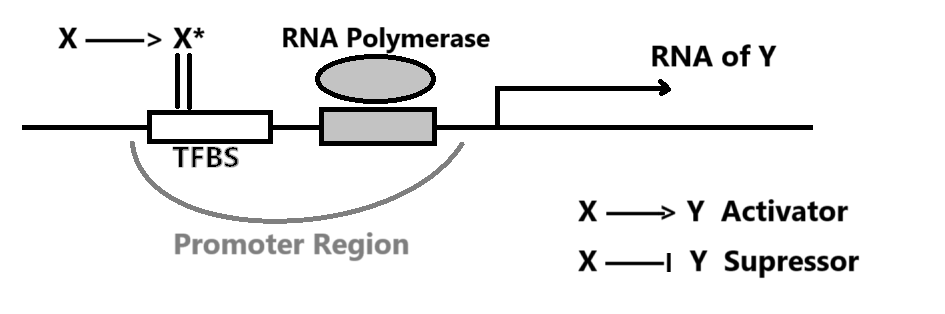

课程描述：[Systems Biology 2018 ／ Uri Alon](https://www.bilibili.com/video/BV1YT411c7Y9/)

下文默认公式中的 $X$、$Y$ 指它们的浓度

## Lecture 1

人的 GRN 由约 4500 Gene、10k edge 组成，单个 TF 可以影响 1-1000 个基因，单个基因也可以由 0-6 个 TF 共同调控。

假设有一个 TF $X$ 遇见糖分后形变为激活态 $X^{+}$，随后 $X^{+}$ 与 Promoter Zone 结合，影响转录 gene $Y$ 的效率。一般通过实验数据推断 $X^{+}$ 对 $Y$ 的影响。

可观测到的 $Y$ 生成速率 $\frac{dY}{dt} = \beta - \alpha Y$ 可由 **Removal Rate** $\alpha$ 以及 **Production Rate** $\beta$ 简单表示。

一般而言，生物体出于能源考虑，不会频繁降解蛋白，对于一些细菌而言降解周期是它们的一生。忽略 $\alpha = \frac{1}{Y寿命}$ 时， $Func(\beta,n,k)$ 大体上的表现如下图示。

**Steady State** 时 $0 = \frac{dY}{dt} = \beta - \alpha Y$，即 $Y_{st} = \frac{\beta}{\alpha}$

**假设**我们从乌有开始生成 $Y$，即突然使其 $\beta: (0 \rightarrow 1)$，则这个瞬间 
$$\frac{dY}{dt} = 1 - \alpha Y_{st}$$
$$Y = Y_{st} （1-e^{-\alpha t}）$$

随着时间变化，达成理论稳态的一半 $Y = \frac{1}{2} Y_{st}$，所需时间 $T_{\frac{1}{2}} = \frac{log2}{\alpha}$

**假设**现有一个初始的 Steady State $Y_{st}^{Old}$，突然使其 $\beta: (1 \rightarrow 0)$，则这个瞬间 
$$\frac{dY}{dt} = 0 - \alpha Y_{st}^{Old}$$
$$Y = Y_{st}^{Old} e^{-\alpha t}$$

随着时间变化，达成旧稳态的一半 $Y = \frac{1}{2} Y_{st}^{Old}$，所需时间 $T_{\frac{1}{2}} = \frac{log2}{\alpha}$

随着时间变化，达成新稳态 $Y = 0$，所需时间 $T = \infty$

如此，Removal Rate $\alpha$ 才是达成 $\frac{Y_{st}}{2}$ 的关键。有丝分裂即 $Y_{st} \rightarrow \frac{Y_{st}}{2}$，可以根据 Cell Generation Time $T_{\frac{1}{2}}$ 来估算 $\alpha$

## Lecture 2

