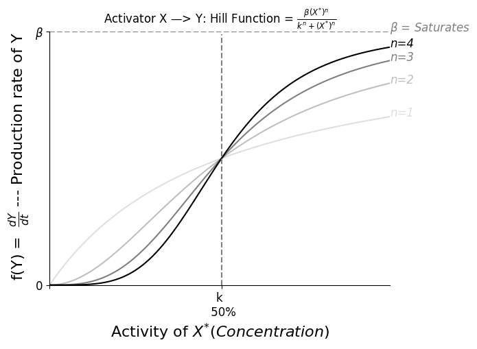
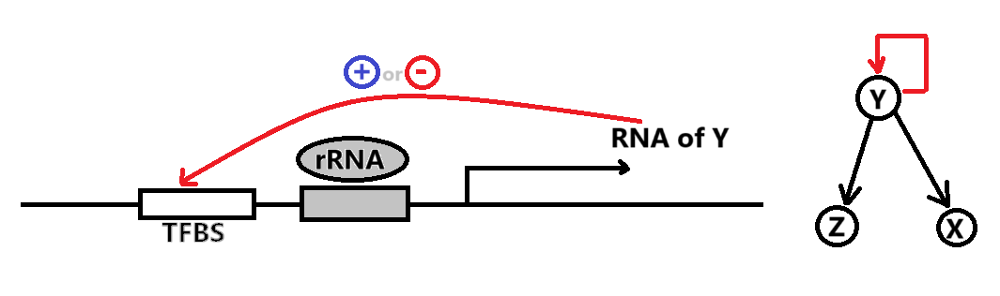
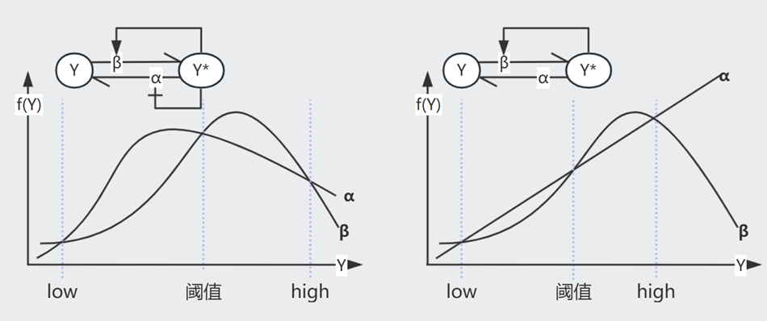
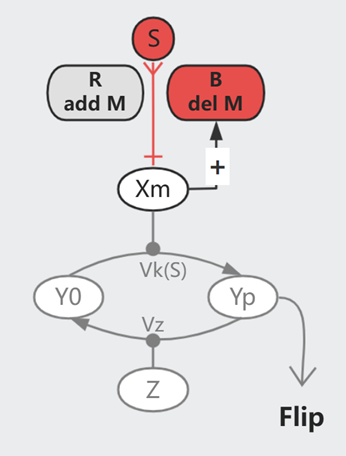

<script>
MathJax = {
  tex: {
    inlineMath: [['$', '$'], ['\\\\(', '\\\\)']]
  },
  svg: {
    fontCache:   'global'   // 'local',or 'global' or 'none'
  }
};
</script>
<script type="text/javascript" id="MathJax-script" async
  src="https://cdn.jsdelivr.net/npm/mathjax@3/es5/tex-svg.js">
</script>

<style>
img{
    width: 49.9%;
}
</style>


课程描述：[Systems Biology 2018 ／ Uri Alon](https://www.bilibili.com/video/BV1bE411372m/)

下文默认公式中的 $X$、$Y$ 指它们的浓度

研究手法：**x-nullcline** 即 $\frac{dx}{dt}=f(x,y)=0$ 的曲线，这条线上 x 方向的变化率为零；相似的还有 **y-nullcline** 。x/y-nullcline的交点是系统静止或平衡的状态

## Lecture 1 Removal/Production

人的 GRN 由约 4500 Gene、10k edge 组成，单个 TF 可以影响 1-1000 个基因，单个基因也可以由 0-6 个 TF 共同调控。

假设有一个 TF $X$ 遇见糖分后形变为激活态 $X^{+}$，随后 $X^{+}$ 与 Promoter Zone 结合，影响转录 gene $Y$ 的效率。一般通过实验数据推断 $X^{+}$ 对 $Y$ 的影响。


可观测到的 $Y$ 生成速率 $\frac{dY}{dt} = \beta - \alpha Y$ 可由 **Removal Rate** $\alpha$ 以及 **Production Rate** $\beta$ 简单表示。

一般而言，生物体出于能源考虑，不会频繁降解蛋白，对于一些细菌而言降解周期是它们的一生。忽略 $\alpha = \frac{1}{Y寿命}$ 时， $Func(\beta,n,k)$ 大体上的表现如下图示。




**Steady State** 时 $0 = \frac{dY}{dt} = \beta - \alpha Y$，即 $Y_{st} = \frac{\beta}{\alpha}$

**假设**我们从乌有开始生成 $Y$，即突然使其 $\beta: (0 \rightarrow 1)$，则这个瞬间 
$$\frac{dY}{dt} = 1 - \alpha Y_{st}$$
$$Y = Y_{st} （1-e^{-\alpha t}）$$

随着时间变化，达成理论稳态的一半 $Y = \frac{1}{2} Y_{st}$，所需时间 $T_{\frac{1}{2}} = \frac{log2}{\alpha}$


**假设**现有一个初始的 Steady State $Y_{st}^{Old}$，突然使其 $\beta: (1 \rightarrow 0)$，则这个瞬间 
$$\frac{dY}{dt} = 0 - \alpha Y_{st}^{Old}$$
$$Y = Y_{st}^{Old} e^{-\alpha t}$$

随着时间变化，达成旧稳态的一半 $Y = \frac{1}{2} Y_{st}^{Old}$，所需时间 $T_{\frac{1}{2}} = \frac{log2}{\alpha}$

随着时间变化，达成新稳态 $Y = 0$，所需时间 $T = \infty$


如此，Removal Rate $\alpha$ 才是达成 $\frac{Y_{st}}{2}$ 的关键。有丝分裂即 $Y_{st} \rightarrow \frac{Y_{st}}{2}$，可以根据 Cell Generation Time $T_{\frac{1}{2}}$ 来估算 $\alpha$


## Lecture 2 Self-Loop

回顾 GNN 课程，我们一般会通过对比随机图（networkx里也提供多种模型）来获得一些显著的 Motif，我们也可以很容易的解释这些 Motif 的生物意义。

**Negative Auto-regulation (NAR)** 即是负反馈的 Self-Loop




已知 NAR 情况下，随着时间的推进，Production Rate $\beta = f(Y)$ 随着产物浓度 $Y$ 的升高而递减（左图）

相比于恒定的 $\beta = b$（右图），当 $\alpha$ 或 $\beta$ 发生变化时，NAR 曲线的 $Y_{st}$ 变化较小（抵挡噪音），且未平衡时其 $\beta-\alpha$ 曲线间的 Gap 较恒定 $\beta$ 更大（加速达成 $Y_{st}$）


再换一个角度，假设 $\alpha = 0$，想象 $\beta = f(Y) = \begin{cases} \beta \quad Y<k  \\\\ 0 \quad Y \ge k \end{cases} $ 的情况，此时 

```
    Y    bt
    |   /
    |  /________ Y_st = k 是最终平衡状态 
    | /                  防止无止境的生成产物
    |/___________
    0            t
```

-------------------------------

**Positive Auto-regulation (PAR)** 是一种正反馈的 Self-Loop，提供了某种惯性（或记忆），对于发育过程 GRN 而言很重要。

一共有如图所示的 $Y_{low}$, $Y_{阈值}$, $Y_{high}$ 三个 Steady State。观察 $\frac{dy}{dt}=\beta-\alpha$ 的符号（哪一条线在上方），可知会有两种最终结局。

具体来说，即使信号消失，但只要 $Y$ 跨越了阈值，它依然会上升至 $Y_{high}$，否则会下降回 $Y_{low}$



注意，PAR 可以同时影响 $\alpha$ 和 $\beta$（图一），相较于只影响 $\beta$ 的情况（图二），此时它可以在更大程度的变化中保存三个交叉点

## Lecture 3 FFL-Gate

三元素的Motif中有8种 **Feed Forward Loop (FFL)**，最主要的2种在E.coli网络中占80%


以 Type-1 Coherent FFL (C1-FFL) 为例，我们可以假设 $Z$ 通过一个 Gate 处理来自 $X$ 和 $Y$ 的信号。

当 $X$ 打开或关闭的瞬间，其下游的 $Y^{+}$ 需要一段时间才能达到 k 浓度（开关阈值）。

AND Gate 时，打开 $X$ 后由于需要等待达成 $Y^{+}$，因此生成 $Z$ 的时间相较于 $X$ 的变化有延迟。而关闭 $X$ 则对 $Z$ 即刻起效。这个机制可以过滤掉短暂的激活信号，但灵敏应对任何抑制信号。

OR Gate 时，打开 $X$ 对 $Z$ 即刻起效，而关闭 $X$ 则效果延迟。


注意，当 Node 间是抑制作用时，Strong Supression 令下游产物归零，Partial Supression 虽然令下游产物的 $Z_{st}$ 降低，但事实上缩短了达成此 low $Z_{st}$ 水平所需的时间，因此也可以被视为一种加速手段。以下图 Incoherent FFL 为例


想象一下，在面对急性压力时，会唤起快速响应的Loop；当压力转变为长期状态时，打开了其它较慢的Loop。


## Lecture 4 FFL-More

**Single Input Model (SIM)** 常见于一系列基因的调控（e.g.操纵子中），以 Arg 生成为例，其生成需要一系列基因（$argA/B/C$）的参与。在 Arg 浓度充足的情况下，$argR^{+}$处于激活态，抑制这一系列基因，不再生成 Arg；而当 Arg 浓度不足时，$argR^{+}$ 在自抑制 Loop 的影响下逐渐衰减，$argA/B/C$ **依次**激活（对$argR^{+}$浓度耐受**阈值**不同），开始生成 Arg。


**Multi-output FFL** 类似于一种多层调控（总开关/小开关）


**Bifan** 一般组成 [Dense Overlapping Regulons](https://www.nature.com/articles/nrg2102)


此外，我们还需要注意速度的影响（e.g.转录速度不同），Graph 中```-->```可快可慢，组合在一起用则称为 **hybrid** network motif made of fast and slow interaction


关于 Mutual Regulation 展开想象：
```
X <--> Y    常见，结局：(X AND Y)=High OR (X AND Y)=Low
X |--| Y    常见，结局：(X OR Y)=High

X |--> Y    不稳定，会形成(High,Low,..)震荡的曲线
```

## Lecture 5 Bifunctional Components

细胞信号通路常见的一个模式是**磷酸化**：细胞膜表面受体 X 被外界的信号分子 S 激活、将 Y0 磷酸化为 Yp，同时有一组 Z 帮助 Yp 去磷酸化为 Y0。


我们可以假设上图的简单模型，平衡状态下
$$\frac{dYp}{dt} = Vk \cdot Y0 \cdot X - Vz \cdot Yp \cdot Z = 0$$

$$Yp = \frac{ Vk \cdot Y_{All} \cdot X}{Vz \cdot Z + Vk \cdot X}$$

如此，最终的信号强度 Yp 受到细胞蛋白水平（X/Y/Z）的影响。而已知每个细胞内的蛋白分布并非一致，但它们可以对外界刺激保持同步的反应（同类型的细胞），简单模型无法对此进行解释。


上图的**双功能组件** X 可维持信号的 Robustness。每输入一个ATP则生成一个磷酸基(Pi)、由Xp向Y传递，X0则作用相反。

只考虑模型的输入输出，平衡状态下

$$\text{Phosphorylation}= \text{Dephosphorylation}$$

$$\text{ATP Consumption}= \text{Dephosphorylation}$$

$$Va \cdot X0 = Vp \cdot X0 \cdot Yp$$

$$Yp = \frac{Va}{Vp}$$

与细胞的蛋白水平无关了！

（以上只是 **0.1 seconds 尺度**的概念模型，不属于长期调控；而且 ATP、Y总量、...不会是无限的，所以 Yp 会有一个上限）

## Lecture 6 Integral Feedback

在漫游的过程中，细菌会依据化学物质的**梯度变化**调节其**翻滚转向的频率**，以此保证前进方向的正确，即是趋化性（Chemotaxis）。

如果只是改变一次化学浓度，翻滚频率在最初的激烈变化后，将逐渐回复到最初的水平（Exact adaptation），即已逐渐适应新浓度。


这个适应过程是依靠 Methelylation/Demethelylation 达成的，注意，甲基化修饰较缓慢(**~min**)，曲线较为平缓。


平衡状态下，$\frac{dm}{dt} = \text{Add M} - \text{Remove M}= 0$ 即

$$\text{Add M [Const rate]}= \text{Remove M [Increase with Xm]}$$

$$V_R \cdot R= V_B \cdot B \cdot Xm_{st}$$


$$Xm_{st} = \frac{V_R \cdot R}{V_B \cdot B}$$

换句话说，$\frac{dm}{dt} = V_B \cdot B (Xm_{st} - Xm)$，即 $m= \int error = \int (Xm_{st} - Xm)$ 是一种典型的 integral feedback，可以快速响应周围的变化直至达成新的平衡。




在这个模型中，原本活跃的受体被 Stimuli 抑制（如下图），其活跃度的 $k \sim e^{\Delta G}$。而甲基化会增加自由能，于是 $k \sim e^{\Delta G + m\gamma}$，即以指数级提高 $k$。

（**回忆一下**，$k$ 指 50% 受体被结合时的 Stimuli 浓度）

从生物意义来讲，甲基化使得受体得以适应更高浓度的刺激，例如逐渐适应噪音/气味环境。（在一定范围内，因为甲基化也不是无限的）


总之，在这个反馈中，Add Methyl 的速率是恒定的，由 Del Methyl 的速率来动态的适应刺激信号的强度。不同的个体可以有不同的甲基化能力，但终究还是会达成 Exact adaptation，区别只在于平衡时的 Flipping Rate，也算是种群的一种多样性吧。


## Lecture 7 Fold Change Detection


在安静环境中，我们或许可以感知到微小的声音；但在嘈杂环境中，只能感受到较大的音量。Fold Change Detection (FCD) 使我们能够基于环境决定感受的阈值，不至于对细小变化过于敏感。

**FCD**: 如果 $s_0 \rightarrow Const \cdot s_0$，Reaction 幅度将保持不变

可以整合不同的 FCD 信号（$C_1 \cdot C_2 \cdot ...$）

---------------------------------------------

简化一下 Lecture 6 的模型图：假设 $Xm \sim Action$，

  

已知，甲基化的 $k \sim e^{\Delta G + m\gamma}$，即 $k = k_0  e^{m\gamma}$，于是

$$\frac{dk}{dt} = k_0 \gamma e^{m\gamma} \frac{dm}{dt} = \gamma k \frac{dm}{dt} = \gamma k \cdot V_B \cdot B (Xm_{st} - Xm) = Const \cdot k  (Xm_{st} - Xm)$$


$$\text{即，在这个时刻 }\begin{cases}  \frac{dk}{dt}= C \cdot k(a_{st} -a)  \\\\ a = f(\frac{s}{k})   \quad  \text{即 HillFunc = } \frac{1}{1+(\frac{s}{k})^n}   \end{cases}  $$

**证明这个机制可达成 FCD**：

回忆一下，$k$ 指 $a = f(\frac{s}{k})$=50% 时的 Stimuli 浓度，$k$ 与 $s$ **共享一个 scaling factor**，**假设一次变换**是 $s_0 \rightarrow s$

$$\text{rescale k and s，得到}\begin{cases}  \frac{d k'}{dt}= C \cdot k'(a_{st} -a)  \\\\ a = f(\frac{s/s_0}{k/s
_0} ) = f(\frac{\text{Fold Change}}{k'})     \end{cases}  $$


**这样来看，只要每次 $s$ 的 Fold Change 程度一致，Action $a$ 的烈度也会一致，而与变化的初始状态 $s_0$ 无关**


---------------------------------------------

另一方面，[Incoherent FFL I (Y-Strong)](./System_Biology/3-2.png) 时，若 ```Y >> k```  

$$\begin{cases} \frac{dy}{dt} = \beta_1 X - \alpha_1 Y = 0  \quad \text{解得 } Y_{st} = \frac{\beta_1 X_{st}}{\alpha_1} \sim X_{st} \\\\   \frac{dz}{dt} = \frac{\beta_2 X}{k + Y} - \alpha_2 Z = 0 \quad \text{解得 }  Z_{st} = \frac{\beta_2 X_{st}}{(k + Y_{st})\alpha_2} \approx \frac{\beta_2 X_{st}}{Y_{st}\alpha_2} = \frac{\beta_2 X_{st} \alpha_1}{\beta_1 X_{st} \alpha_2} = Const  \end{cases}$$


**证明这个机制可达成 FCD**：即如果每次 $x$ 的 Fold Change 程度保持不变，$z$ 将保持不变

**假设一次变换**是 $x \rightarrow Cx$，，则此时 $(x,y,z) \rightarrow (Cx,Cy,z)$，且 $(\frac{dy}{dt},\frac{dz}{dt}) \rightarrow (C\frac{dy}{dt},\frac{dz}{dt})$

将上述声明带入原式，约去C后，方程与上文一致

$$\begin{cases} C\frac{dy}{dt} =  C \beta_1 X - C \alpha_1 Y   \\\\  \frac{dz}{dt} =  \frac{C \beta_2 X}{Ck + CY} - \alpha_2 Z  \end{cases}$$


## Lecture 8 Dynamic Compensation

人体维持着动态的平衡，以血糖调控为例：进食后血糖升高，**胰岛B细胞**分泌胰岛素令体细胞储存 Glucose、以此降低血糖。


$$ \text{如图示 }\begin{cases}
\frac{dG}{dt} = meal - SIG   \quad    \text{血糖}\\\\
\frac{dI}{dt} = qXf(G) - \alpha I = qXG^2 - \alpha I   \quad    \text{胰岛素}\\\\
\frac{dX}{dt} = X (\text{proliferation} - \text{death})   \quad    \text{B cell 数量}
\end{cases}$$


解 $\frac{dG}{dt} = 0$ 得 $G_{st} = \frac{meal}{SI_{st}}$

解 $\frac{dI}{dt} = 0$ 得 $G_{st}^2 = \frac{\alpha I_{st}}{qX} = \frac{\alpha}{qX} \frac{meal}{S G_{st}}$，即 $G_{st} = (\frac{\alpha  \cdot meal}{qXS})^{1/3}$


由表达式可知，假如 B cell 数量恒定，Insulin resistance ($S \downarrow$) 的病人的血糖 $G$ 将异常高，然而事实上 80% 的病人在此阶段可以维持正常的 $G$，这是因为 **B cell 数量进行了代偿**（~ weeks）

但血糖过高会造成 B cell 死亡，糖酵解造成的 oxidative stress 即 **Glucotoxicity**，每个人的耐受程度由基因决定。长期高糖会陷入某种 vicious cycle，最终造成二型糖尿病（T2DB）

Glucotoxicity 某种意义上也避免生成过于敏感的 B cell，因为它们在低浓度时即被杀死


（注意，代偿需要约一周来生成细胞，在达成前的这段时间，Insulin resistance 患者的血糖依然会有异常波动）


## Lecture 9 Oscillator


Oscillator 是形成节律的机制（e.g.心跳、生物钟），Lecture 4 中提到过 ```X |--> Y ``` 会形成 [Damped oscillation](./System_Biology/9-1.png)（即 Undamped 的简谐运动时因阻尼而逐渐停止）


$$ \text{见 Motif 1 }\begin{cases}
\frac{dx}{dt} = \beta_2 - \alpha_1x
\quad \text{其中 } \beta_2 = f(y) \text{  递减，$y_{st}$ 处斜率 } \frac{\partial f}{\partial y} \vert_{y_{st}}= \beta_1
\\\\
\frac{dy}{dt} = \beta_1 - \alpha_2y
\quad \text{其中 } \beta_1 = g(x)\text{ 递增，$x_{st}$ 处斜率 } \frac{\partial g}{\partial x} \vert_{x_{st}}= \beta_2 
\end{cases}$$


当 $(\alpha_1-\alpha_2)^2 < 4\beta_1\beta_2$ 时 **Underdamped**，即 $x$、$y$ 的留存时间不应相差过大，feedbacks $\beta$ 也不可以太微弱


Damped oscillation 最终将收敛，若想达成持续的节律，需要周期性的干预推动（施加外力的频率 = trapped in Fixed Point 的频率），即 **Noise-induced oscillation**. 这个外力可以是 X with PAR（Motif 2），在 X 浓度超过某一阈值后自加速生成 X、然后被抑制至低于阈值（过程类似一个 spike ```_|_```）

此外，**Repressilator**（Motif 3）也可以产生周期曲线，不过此时 XYZ 曲线不再 in phase.


**频率**，主要是由 **delay** 控制，即生物反应所需要的时间。Motif 2 中可以在维持恒定振幅的情况下调节频率，因为它受外力 Noise 的调节。但如果不减小 Motif 3 的振幅，就不能改变它的频率。


## Lecture 10

生物的进化过程，实际上就是通过改变基因型，不断提升自身在这个环境下的适应度。以 E.coli 为例，测算负责分解 lactose 的 ```lacZ``` 对 Fitness 的影响：定义 ```Fitness:  Growth Rate```，```Property: lacZ protein```

注意，E.coli还可以分解其它营养物质，而 lacZ 的存在可以增加 Growth Rate。约定在 lactose 不限量的情况下，每一个 ```lacZ``` 带来的增速为 ```Bo```.

对于 WildType E.coli 而言，培养皿中更多 lactose 时会生成更多 lacZ，lactose 不限量的情况下最高可达成 ```lacZ = 60k per cell```。

IPTG 的结构近似 lactose，它可以诱导生成 lacZ，但不可用于细胞生长，即生成 lacZ 的 ```COST```。用 IPTG 取代 lactose 进行实验，在 ```lacZ = 60k``` 时，Growth Rate 下降了 5%，即 ```Co * 60k = 5%```；在 ```lacZ = 1.8 * 60k = M``` 时，细胞死亡。


于是，在 ```lacZ = Z```,```lactose = L``` 时 
```
Fitness(Z,L) = BENEFIT(Z,L) - COST(Z)

COST(Z)= Co * Z / (1 - Z/M)
BENEFIT(Z,L)= Bo * Z * L / (K + L)

其中 Binding coefficient K 即   Z+L <--(K)-->  ZL
```

计算 $\frac{dFitness}{dZ}=0$ 可得这个环境的最优 $Z_{opt} = M (1- [\frac{Co(K+L)}{Bo \cdot L}]^{1/2})$，也知从 lacZ 中获利的 lactose $L$ 阈值是 $Co(K+L)=Bo \cdot L$

如果遇见 lactose 的几率很高，则 ```Fitness(Z,L)``` 在大多数情况下有利，即更加适应环境，进化过程将倾向于保留这个基因。

## Lecture 11

为了在复杂环境中生存，生物性状是在对多个目标进行取舍后的结果
```
   [Gene1,2,3..]             ---> Performance(Task1) \
     Genotype ---> Phenotype ---> Performance(Task2)   ---> Fitness(i.e. Offsprings)
                             ---> Performance(Task3) /
```


以 ```Performance(TaskX)``` 为坐标轴组成一个空间，对于每个 ```Task``` 都有一个最优模型 ```Archetype```。综合 Fitness 最优的 Phenotype 可以分布在如图红色区域，即距离各 ```Archetype``` 欧氏距离之和最小的区域。

一些生物选择均衡发展，另一些选择成为某方面的专家（图示中 靠近某一个 Archetype）


## Lecture 12

在进行进化模拟时，最简单的方法是将个体视为 Gate 网络：

```
Genome ---------**********++++++++++........
        Gene1     Gene2      Gene3     ...
        Gate1     Gate2      Gate3     ...
```

Gate 设定为接收 2 个 ```0/1``` 输入:

| InputA | InputB | AND | NAND | XOR | OR |
| -- | -- | -- | -- | -- | -- |
| 0 | 0 | 0 | 1 | 0 | -- |
| 0 | 1 | 0 | 1 | 1 | -- |
| 1 | 0 | 0 | 1 | 1 | -- |
| 1 | 1 | 1 | 0 | 0 | -- |


模拟步骤很简单：已知优化目标 ```OUTPUT``` 和一组可能的输入组合
```
0. 有一个初始群体的 Genome 网络

1. Each Individual get 10 offsprings
    - Rewire network     [Mutation]
    - add/del Gate       [gene gain/lost]

2. Each offspring: 
  loop through all possible Input stress, 
  then Calculate Fitness = C/A - gate_Err
      C = num of Correct OUTPUTs
      A = num of possible input set [1,1,0,1] (16 for 4 gates)
      gate_Err = err * num_of_gates

3. 选择 top 50% Fitness 的子代个体作为下一个 Loop 的初始群体
```

有趣的是，如果优化目标恒定不变 ```[GoalA]```，最终得到优化网络是 Non Modular（有点类似过拟合？），但如果每隔几代交替使用优化目标 ```[GoalA,GoalB]```，最终得到优化网络 Modular --- 更符合实际的生物网络


