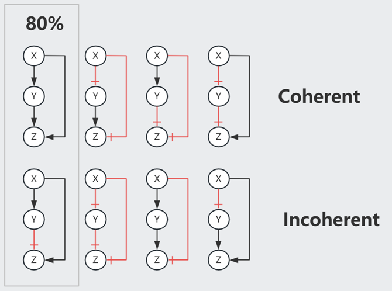

<script>
MathJax = {
  tex: {
    inlineMath: [['$', '$'], ['\\\\(', '\\\\)']]
  },
  svg: {
    fontCache:   'global'   // 'local',or 'global' or 'none'
  }
};
</script>
<script type="text/javascript" id="MathJax-script" async
  src="https://cdn.jsdelivr.net/npm/mathjax@3/es5/tex-svg.js">
</script>

<style>
img{
    width: 49.9%;
}
</style>


课程描述：[Systems Biology 2018 ／ Uri Alon](https://www.bilibili.com/video/BV1YT411c7Y9/)

下文默认公式中的 $X$、$Y$ 指它们的浓度

研究手法：**x-nullcline** 即 $\frac{dx}{dt}=f(x,y)=0$ 的曲线，这条线上 x 方向的变化率为零；相似的还有 **y-nullcline** 。x/y-nullcline的交点是系统静止或平衡的状态

## Lecture 1 Removal/Production

人的 GRN 由约 4500 Gene、10k edge 组成，单个 TF 可以影响 1-1000 个基因，单个基因也可以由 0-6 个 TF 共同调控。

假设有一个 TF $X$ 遇见糖分后形变为激活态 $X^{+}$，随后 $X^{+}$ 与 Promoter Zone 结合，影响转录 gene $Y$ 的效率。一般通过实验数据推断 $X^{+}$ 对 $Y$ 的影响。


可观测到的 $Y$ 生成速率 $\frac{dY}{dt} = \beta - \alpha Y$ 可由 **Removal Rate** $\alpha$ 以及 **Production Rate** $\beta$ 简单表示。

一般而言，生物体出于能源考虑，不会频繁降解蛋白，对于一些细菌而言降解周期是它们的一生。忽略 $\alpha = \frac{1}{Y寿命}$ 时， $Func(\beta,n,k)$ 大体上的表现如下图示。


**Steady State** 时 $0 = \frac{dY}{dt} = \beta - \alpha Y$，即 $Y_{st} = \frac{\beta}{\alpha}$

**假设**我们从乌有开始生成 $Y$，即突然使其 $\beta: (0 \rightarrow 1)$，则这个瞬间 
$$\frac{dY}{dt} = 1 - \alpha Y_{st}$$
$$Y = Y_{st} （1-e^{-\alpha t}）$$

随着时间变化，达成理论稳态的一半 $Y = \frac{1}{2} Y_{st}$，所需时间 $T_{\frac{1}{2}} = \frac{log2}{\alpha}$


**假设**现有一个初始的 Steady State $Y_{st}^{Old}$，突然使其 $\beta: (1 \rightarrow 0)$，则这个瞬间 
$$\frac{dY}{dt} = 0 - \alpha Y_{st}^{Old}$$
$$Y = Y_{st}^{Old} e^{-\alpha t}$$

随着时间变化，达成旧稳态的一半 $Y = \frac{1}{2} Y_{st}^{Old}$，所需时间 $T_{\frac{1}{2}} = \frac{log2}{\alpha}$

随着时间变化，达成新稳态 $Y = 0$，所需时间 $T = \infty$


如此，Removal Rate $\alpha$ 才是达成 $\frac{Y_{st}}{2}$ 的关键。有丝分裂即 $Y_{st} \rightarrow \frac{Y_{st}}{2}$，可以根据 Cell Generation Time $T_{\frac{1}{2}}$ 来估算 $\alpha$


## Lecture 2 Self-Loop

回顾 GNN 课程，我们一般会通过对比随机图（networkx里也提供多种模型）来获得一些显著的 Motif，我们也可以很容易的解释这些 Motif 的生物意义。

**Negative Auto-regulation (NAR)** 即是负反馈的 Self-Loop


已知 NAR 情况下，随着时间的推进，Production Rate $\beta = f(Y)$ 随着产物浓度 $Y$ 的升高而递减（左图）

相比于恒定的 $\beta = b$（右图），当 $\alpha$ 或 $\beta$ 发生变化时，NAR 曲线的 $Y_{st}$ 变化较小（抵挡噪音），且未平衡时其 $\beta-\alpha$ 曲线间的 Gap 较恒定 $\beta$ 更大（加速达成 $Y_{st}$）


再换一个角度，假设 $\alpha = 0$，想象 $\beta = f(Y) = \begin{cases} \beta \quad Y<k  \\\\ 0 \quad Y \ge k \end{cases} $ 的情况，此时 

```
    Y    bt
    |   /
    |  /________ Y_st = k 是最终平衡状态 
    | /                  防止无止境的生成产物
    |/___________
    0            t
```

-------------------------------

**Positive Auto-regulation (PAR)** 是一种正反馈的 Self-Loop，提供了某种惯性（或记忆），对于发育过程 GRN 而言很重要。

一共有如图所示的 $Y_{low}$, $Y_{阈值}$, $Y_{high}$ 三个 Steady State。观察 $\frac{dy}{dt}=\beta-\alpha$ 的符号（哪一条线在上方），可知会有两种最终结局。

具体来说，即使信号消失，但只要 $Y$ 跨越了阈值，它依然会上升至 $Y_{high}$，否则会下降回 $Y_{low}$


## Lecture 3 FFL-三元素

三元素的Motif中有8种 **Feed Forward Loop (FFL)**，最主要的2种在E.coli网络中占80%




以 Type-1 Coherent FFL (C1-FFL) 为例，我们可以假设 $Z$ 通过一个 Gate 处理来自 $X$ 和 $Y$ 的信号。

当 $X$ 打开或关闭的瞬间，其下游的 $Y^{+}$ 需要一段时间才能达到 k 浓度（开关阈值）。

AND Gate 时，打开 $X$ 后由于需要等待达成 $Y^{+}$，因此生成 $Z$ 的时间相较于 $X$ 的变化有延迟。而关闭 $X$ 则对 $Z$ 即刻起效。这个机制可以过滤掉短暂的激活信号，但灵敏应对任何抑制信号。

OR Gate 时，打开 $X$ 对 $Z$ 即刻起效，而关闭 $X$ 则效果延迟。


注意，当 Node 间是抑制作用时，Strong Supression 令下游产物归零，Partial Supression 虽然令下游产物的 $Z_{st}$ 降低，但事实上缩短了达成此 low $Z_{st}$ 水平所需的时间，因此也可以被视为一种加速手段。以下图 In-coherent FFL 为例


想象一下，在面对急性压力时，会唤起快速响应的Loop；当压力转变为长期状态时，打开了其它较慢的Loop。


## Lecture 4 FFL-四元素

**Single Input Model (SIM)** 常见于一系列基因的调控（e.g.操纵子中），以 Arg 生成为例，其生成需要一系列基因（$argA/B/C$）的参与。在 Arg 浓度充足的情况下，$argR^{+}$处于激活态，抑制这一系列基因，不再生成 Arg；而当 Arg 浓度不足时，$argR^{+}$ 在自抑制 Loop 的影响下逐渐衰减，$argA/B/C$ **依次**激活（对$argR^{+}$浓度耐受**阈值**不同），开始生成 Arg。


**Multi-output FFL** 类似于一种多层调控（总开关/小开关）


**Bifan** 一般组成 [Dense Overlapping Regulons](https://www.nature.com/articles/nrg2102)


此外，我们还需要注意速度的影响（e.g.转录速度不同），Graph 中```-->```可快可慢，组合在一起用则称为 **hybrid** network motif made of fast and slow interaction


关于 Mutual Regulation 展开想象：
```
X <--> Y    常见，结局：(X AND Y)=High OR (X AND Y)=Low
X |--| Y    常见，结局：(X OR Y)=High

X |--> Y    不稳定，会形成(High,Low,..)震荡的曲线
```

## Lecture 5 Bifunctional components

细胞信号通路常见的一个模式是磷酸化：细胞膜表面受体 X 被外界的信号分子 S 激活、将 Y0 磷酸化为 Yp，同时有一组 Z 帮助 Yp 去磷酸化为 Y0。


我们可以假设上图的简单模型，平衡状态下
$$\frac{dYp}{dt} = Vk \cdot Y0 \cdot X - Vz \cdot Yp \cdot Z = 0$$

$$Yp = \frac{ Vk \cdot Y_{All} \cdot X}{Vz \cdot Z + Vk \cdot X}$$

如此，最终的信号强度 Yp 受到细胞蛋白水平（X/Y/Z）的影响。而已知每个细胞内的蛋白分布并非一致，但它们可以对外界刺激保持同步的反应（同类型的细胞），简单模型无法对此进行解释。


上图的**双功能组件** X 可维持信号的 Robustness。每输入一个ATP则生成一个磷酸基(Pi)、由Xp向Y传递，X0则作用相反。

只考虑模型的输入输出，平衡状态下

$$\text{Phosphorylation}= \text{Dephosphorylation}$$

$$\text{ATP Consumption}= \text{Dephosphorylation}$$

$$Va \cdot X0 = Vp \cdot X0 \cdot Yp$$

$$Yp = \frac{Va}{Vp}$$

与细胞的蛋白水平无关了！

（以上只是 seconds 尺度的概念模型，不属于长期调控；而且 ATP、Y总量、...不会是无限的，所以 Yp 会有一个上限）

## Lecture 6 Chemotaxis


