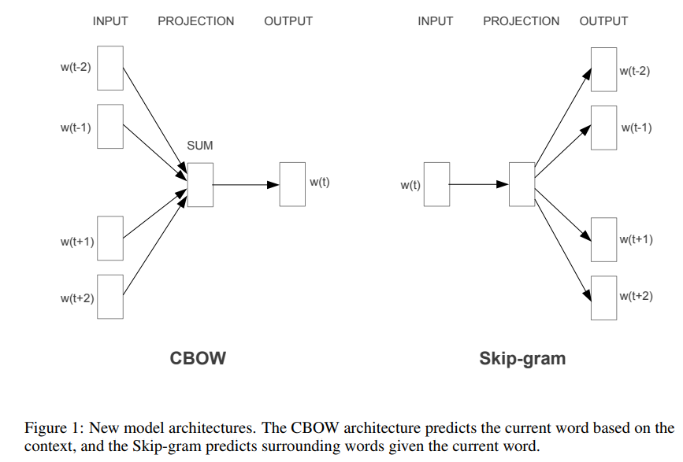

<style>
img{
    width: 80%;
}
</style>

# word2vec

根据语料中词汇一起出现的频率（co-occurrence），进行word embedding。

## 原理示意

   


## 工具包：[gensim](https://radimrehurek.com/gensim/auto_examples/tutorials/run_word2vec.html#sphx-glr-auto-examples-tutorials-run-word2vec-py)

```
pip install gensim
```


## 参考

[1-原文] https://arxiv.org/pdf/1301.3781.pdf  
[2-优化Skip-gram] https://arxiv.org/pdf/1310.4546.pdf  
[3-释意] https://arxiv.org/pdf/1411.2738.pdf  
[4-帮助理解-数学描述] https://zhuanlan.zhihu.com/p/595381757  
[5-帮助理解-负采样] http://mccormickml.com/2017/01/11/word2vec-tutorial-part-2-negative-sampling/

