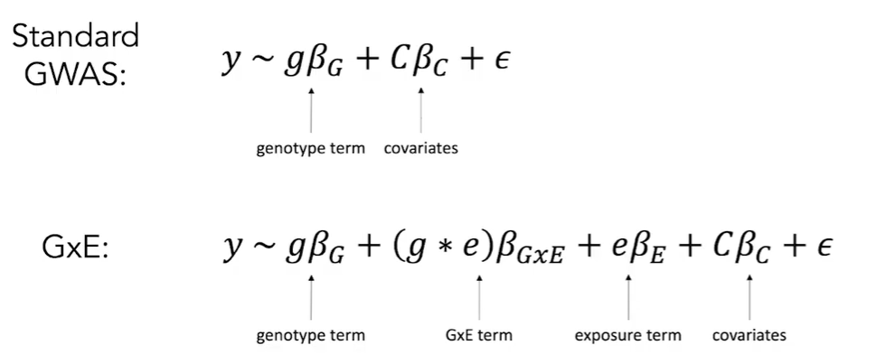
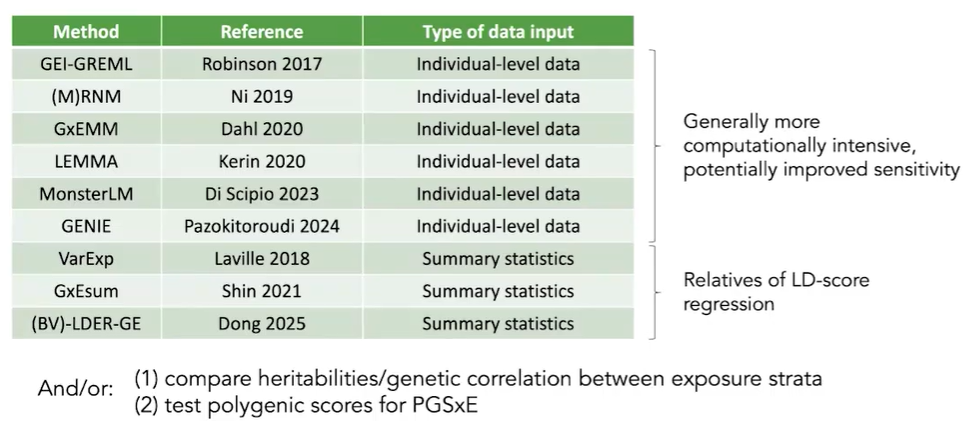

<!-- 

 -->

<!--  -->

一些讲座话题

### [GxE analysis](https://www.bilibili.com/video/BV1gVyQBrEz2/)

忘记 GWAS 是否将 Gene-Env 也纳入回归模型 （之前好像只是数据分层？），但很明显 Gene / Env 并不总是互相独立 (e.g.正常人能接受的饮食，PAH退化的病人不能接受)

一些全基因组范围的 GxE 模型，只是由 GxE Heritability 解释的 variance 只有 1-10%（最高也不到其 G Heritability 解释的一半）

作者认为，h(GxE) 有很大一部分被计入 h(G)，他们做了一个实验：模拟一个只有 GxE 作用存在的数据集，然后用统计学模型进行回溯。结果：仅有一小部分 variance 被 h(GxE) 解释

以上的 G 不仅可以是单个 Gene，也可以是 PGS 或 Pathway-specific，一些研究也会关心 GxE 发生在哪些 Gene/loci/功能 中

注，PGS/PRS (Polygenic Risk score, 与某性状相关的一组loci的作用之加权和)，可查询 [PGS Catalog 数据库](https://www.pgscatalog.org/) 及参考 [GWASLab 系列讲解](https://gwaslab.org/2022/11/07/%e5%a4%9a%e5%9f%ba%e5%9b%a0%e9%a3%8e%e9%99%a9%e5%88%86%e6%95%b0-prs-polygenic-risk-score%e7%b3%bb%e5%88%97%e4%b9%8b%e5%8d%81-prs-csx-%e8%b7%a8%e7%a5%96%e5%85%88prs%e7%9a%84%e6%9e%84%e5%bb%ba/)

