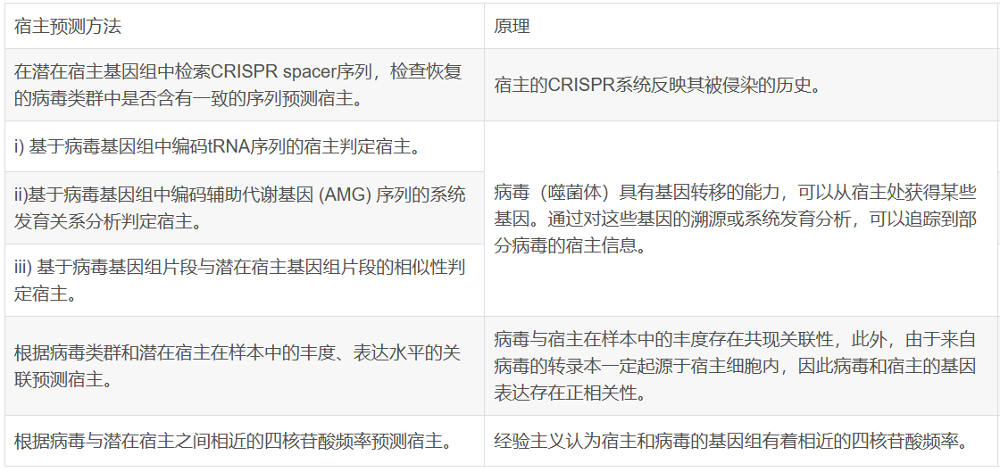

## 论文速览: [Nature Portfolio](https://www.nature.com/subjects/metagenomics)

2024

* [甘蔗内部或周围的MAGs](https://www.nature.com/articles/s41597-024-03379-w)：亮点可能在于植物微生物群宏基因组研究较少？以及植物样本处理方法、**使用Nanopore数据组装接近完整基因组的bin**
* [暴露学研究：肠道共生体对环境污染的反应](https://www.nature.com/articles/s41467-024-48739-7)：**α多样性(物种丰富度)在各组之间没有差异，β多样性(微生物成分)有显著差异**
* [流行病学：肯尼亚东北部多种细菌性人畜共患的诊断](https://www.nature.com/articles/s41598-024-62714-8)
* [流行病学：按蚊基因组中的外源序列（有点像pathseq?）](https://www.nature.com/articles/s42003-024-06337-9)：通过 [Microsoft Premonition’s Bayesian mixture model based (BMM)](http://microsoft.com/premonition) 宏基因组pipeline 分析 Anopheles gambiae 1000 Genomes Project 按蚊基因组。在基因组中发现噬菌体/细菌/疟原虫 reads、人类/灵长类病毒序列，提示存在按蚊媒介-家畜宿主-病原体相互作用 **数据处理方式值得参考**
* [微生物与癌症](https://www.nature.com/articles/s41598-024-63774-6)：拟杆菌门激活LPS介导的炎症通路，促进食管癌细胞的增殖、迁移和侵袭（通过对比两组样本，找到丰度与LPS水平显著相关的细菌）
* [深海海山沉积物中病毒的多样性和潜在的宿主相互作用](https://www.nature.com/articles/s41467-024-47600-1)：**vConTACT2病毒分类注释**，且对vOTU预测宿主     
  
* [Pangaea MAG组装工具](https://www.nature.com/articles/s41467-024-49060-z)：改善短读段组装高/中等丰度微生物基因组组装的连续性。1. 基于 barcode 特异性对 reads 分簇，分别组装得到高/中等丰度微生物；2. 多阈值重组，不同的丰度阈值来细化低丰度微生物的组装；3. OLC算法进行整合

