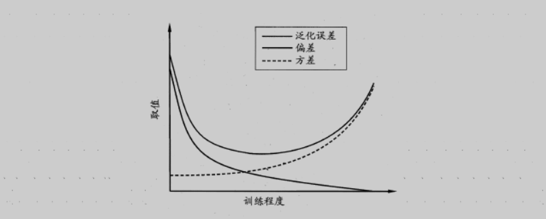

# 模型评估与选择

教材：《机器学习》-周志华

泛化误差 = bias + var + $\epsilon$

 

## 性能度量
衡量模型泛化能力的评价标准，就是性能度量；模型的好坏是相对的，它取决于任务需求

* 错误率：$err=\frac{1}{m}\sum\limits^m_{i=1}I(f(x_i) \neq y_i)$ 分类错误样本占总样本比例
* 精度：$acc=1-err$ 分类正确样本占总样本比例
* 其它：回归常用MSE

### PR

二分类混淆矩阵：

| -- | 预测P | 预测N |
| -- | -- | -- |
| 真实P | TP | FN |
| 真实N | FP | TN |

查准率 $P=\frac{TP}{TP+FP}$，查全率 $R=\frac{TP}{TP+FN}$   

PR曲线绘制时候，先将样本进行排序，随后**假设真实值的不同情况**、连点绘制曲线：（假设真值都是N）--->（假设真值都是P）

 

* 实际中，PR曲线不会如此光滑
* 如果模型A的PR曲线被模型B的“包住”，B优于A
* 平衡点（BEP）值大的模型也被认为较优，不过F1度量更加常用

$F1=\frac{2PR}{P+R}=\frac{2 \times TP}{样例总数+TP-TN}$  

F-Score 一般形式：$F_{\beta}=\frac{(1+\beta^2)PR}{\beta^2P+R}$ ，$\beta$越大、R影响越大

* 当有多个混淆矩阵时，有两种方法计算F1
    - macro-F1：先计算单独矩阵的P、R，随后取均值得到 macro-P、macro-R以计算F1
    - micro-F1：取各矩阵的均值，根据TP、FP等的均值计算F1

### ROC

ROC的曲线画法类似PR曲线，假设真实值的不同情况；下图为偷懒方法

 

* $TPR=\frac{TP}{TP+FN}$
* $FPR=\frac{FP}{TN+FP}$
* AUC=曲线下面积、越大越优

有时，不同类型错误的严重程度不同，用户可以为错误赋予“非均等代价”：（二分类代价矩阵）

| -- | 预测P | 预测N |
| -- | -- | -- |
| 真实P | 0 | cost_FN |
| 真实N | cost_FP | 0 |

绘制代价曲线：对ROC曲线上每个点计算(FPR,FNR)后连线，每个点转化为一条线段；所有线段的下界即为**代价曲线**，其围成的面积为模型的**期望总体代价**

 

* p为正例的概率
* $FNR=1-TPR$
* $P(+)cost=\frac{p \times cost_{FN}}{p \times cost_{FN} + (1-p) \times cost_{FP}}$
* $cost_{norm}=\frac{FNR \times p \times cost_{FN} + FPR \times (1-p) \times cost_{FP}}{p \times cost_{FN} + (1-p) \times cost_{FP}}$

## 实验评估方法

&emsp;一般称模型在训练集上的误差为“训练误差”或“检验误差”（training/empirical error），在新数据集上的误差为“泛化误差”（generalization error）。我们希望使泛化误差最小化，但是实际只能努力使训练误差最小化。 
&emsp;模型学习能力过强时，模型将训练集自身特点也进行学习，导致泛化性能下降，是为“过拟合”（overfitting）；而模型学习能力低下时，会发生“欠拟合”（underfitting）。欠拟合可通过扩大模型来解决，过拟合无法彻底解决，只能**评估泛化误差**、选择最优的模型。

* hold-out：将数据集$D$划分为两个互斥的集合：训练集$S$与测试集$T$
* k-fold cross validation：将数据集均等划分为k个互斥的集合，进行k次训练：每一次训练留下一份为测试集，其余合并为训练集
* bootstrapping：对数据集$D$进行**有放回的**采样，得到含重复样本的训练集$D'$，测试集是没有被采样进$D'$的样本 ($D$ \ $D'$)（约占$D$的1/e）

**多次测试**（e.g. k-fold）后可以得到**多个**性能度量值，随后可以进行统计分析。以错误率为例：

* 当测试错误率均值为$\epsilon_0$时，求泛化错误率$\epsilon$的($1-\alpha$)置信区间（潜在的最大错误率称为临界值）
* paired-t检验比较模型A、B的错误率是否相同
* Friedman检验比较多个模型的错误率是否相同，若有不同、则进行后续检验（Post-hoc）找出确切的模型（ML常用 Nemenyi，[Basis Regression](Basis_Regression.md#_18) 也提到一些）

