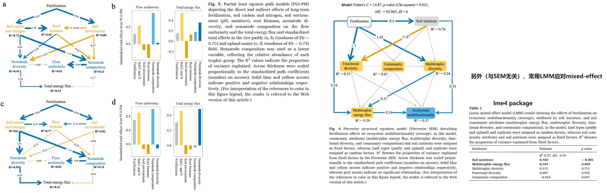

<style>
img{
    width: 60%;
}
</style>

注意，设计模型时候应该考虑模型的 Goodness-of-Fit：A  maximum-likelihood χ2  goodness-of-fit test


## PLS-PM

基于（线性预测的）相关性总结因果关系图

```R
## install.packages("plspm")

library("plspm")
data(russett)

rus_blocks = list(
    colnames(russett)[1:3],                             ## AGRIN ：由3个环境因子组成的‘block’
    colnames(russett)[4:5],                             ## INDEV 
    colnames(russett)[6:length(colnames(russett))]      ## POLINS 
)

rus_path = rbind(                                       ## network's adjacent matrix
    c(0, 0, 0),
    c(0, 0, 0),
    c(1, 1, 0)
)
colnames(rus_path) = c('AGRIN','INDEV','POLINS')
rownames(rus_path) = c('AGRIN','INDEV','POLINS')

rus_modes = rep("A", 3)    ## "A", "B", "newA", "PLScore", "PLScow"

rus_pls = plspm(russett, rus_path, rus_blocks, modes = rus_modes)


summary(rus_pls)
plot(rus_pls)                                      ## plot of rus_pls$inner_model；blocks之间的关联
plot(rus_pls, what = "loadings", arr.width = 0.1)  ## plot of rus_pls$outer_model；环境因子对各自blocks的贡献/关联
```


## piecewiseSEM

Piecewise structural equation model，一般用于 "多营养级数据的网络分析"：自己定义营养级blocks（例如，土壤碳元素/氮元素/biomass是BlockA，线虫多样性/biomass是BlockB），研究blocks之间/内部的关联

```R
## install.packages("piecewiseSEM")
library("piecewiseSEM")

data <- data.frame(                     ## 假设有 X Y 两个block
  x = runif(100),
  y1 = runif(100),
  y2 = rpois(100, 1),
  y3 = runif(100)
)

modelList <- psem(
  lm(y1 ~ x, data),                     ## blocks 之间因素的关联模型
  glm(y2 ~ x, "poisson", data),
  lm(y3 ~ y1 + y2, data),               ## blocks 内部因素的关联模型
  data
)

modelList_c <- update(modelList, y2 %~~% y1)  ## Address conflict by adding correlated errors (??)

plot(modelList,
     node_attrs = list(shape = "rectangle", color = "black",  fillcolor = "orange")
     )

summary(modelList, direction = c("y2 <- y1"))
summary(modelList_c)
```


## 参考
PLS-PM https://zhuanlan.zhihu.com/p/675497368     
piecewiseSEM  https://soilecology.njau.edu.cn/info/1016/1595.htm      
piecewiseSEM  https://www.rdocumentation.org/search?q=piecewiseSEM       



