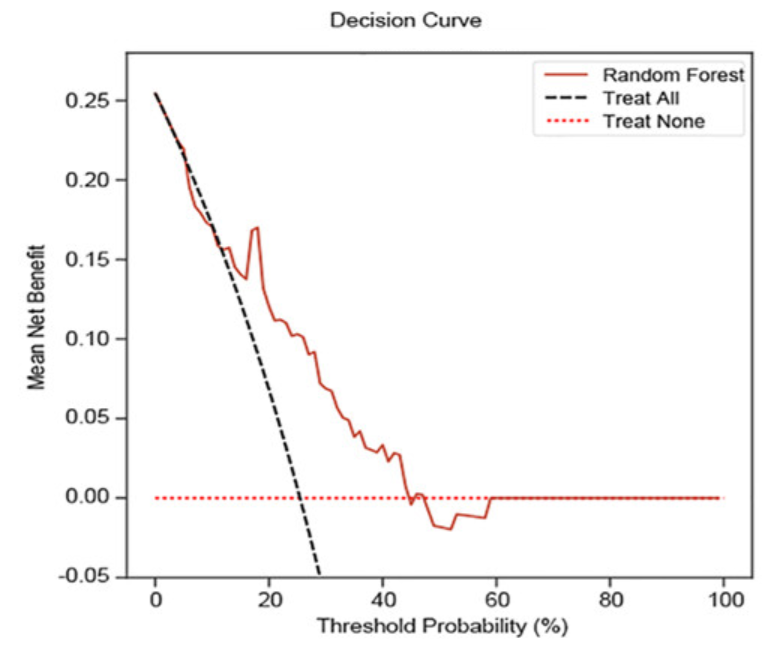
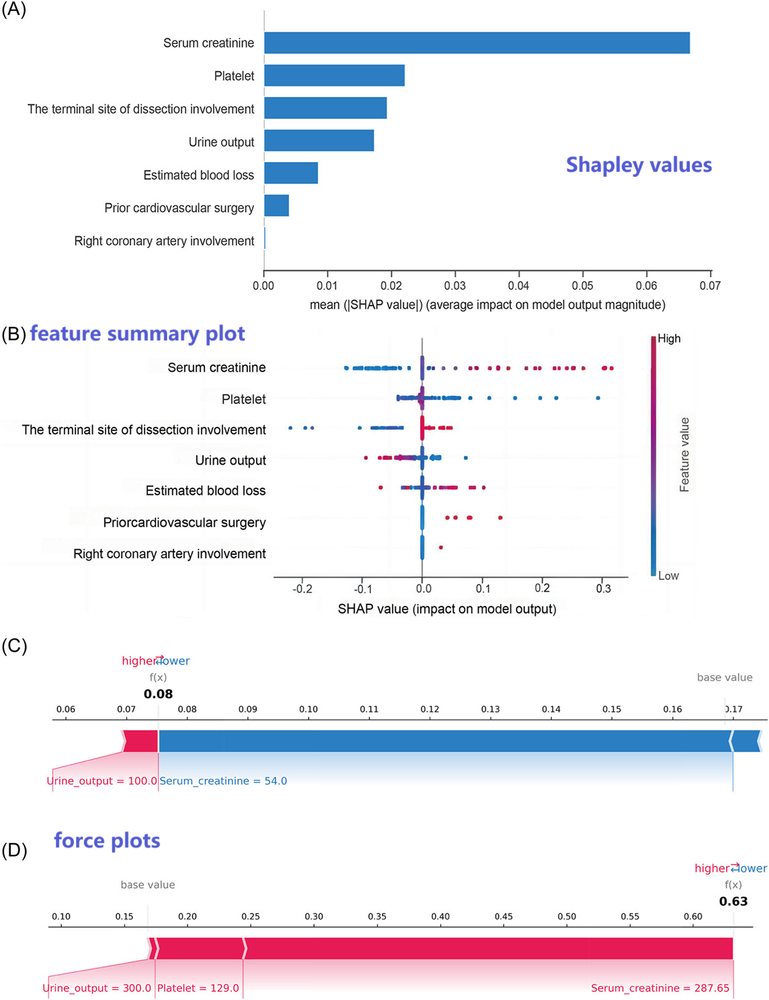

<style>
img{
    width: 49%;
}
</style>

根据视频导读 [链接1](https://space.bilibili.com/471897835/channel/collectiondetail?sid=2241938)/[链接2](https://space.bilibili.com/471897835/channel/collectiondetail?sid=3545578)，列举一些流行病学研究中常见的分析

其流程不外乎：强烈建议[这个R教程](https://ayueme.github.io/R_clinical_model/feature-selection.html)
```bash
1. 筛选变量
2. 建立模型
3. 模型评价/应用，特征的重要程度
```

数据获取：eICU Collaborative Research Database，Pubmed文献整合，队列


## 0.流程图/数据清洗


（[Precise risk-prediction model including arterial stiffness for new-onset atrial fibrillation using machine learning techniques](https://onlinelibrary.wiley.com/doi/10.1111/jch.14848)）在 Supplementary 中清晰说明如何进行Pubmed检索


| Item number | Search term(s) |
| -- | -- |
| 1 | “prevalence” OR “incidence” OR “population” |
| 2 | “atrial fibrillation” OR “atrial flutter” |
| 3 | “ROC Curve” OR “Discrimination” OR “c-statistic” OR “c statistic” OR “Area under the curve” OR “AUC” OR “Calibration” OR “Algorithm” OR “Multivariable” |
| 4 | No.1 AND No.2 AND No.3 |
| 5 | “machine learning” OR “deep learning” OR “artificial intelligence” |
| 6 | “atrial fibrillation” OR “atrial flutter” |
| 7 | “ROC Curve” OR “Discrimination” OR “c-statistic” OR “c statistic” OR “Area under the curve” OR “AUC” OR “Calibration” OR “Algorithm” OR “Multivariable” |
| 8 | No.5 AND No.6 AND No.7 |


正文中，必须清晰交代为何去除样本、有多少样本被去除(或被保留)

[](https://onlinelibrary.wiley.com/doi/10.1002/mef2.77)


**Baseline Table** 中陈列各Feature的数据，并且展示健康组/疾病组之间是否有差异 P-val，可据此**对变量进行初筛(先单后多)**


## 1.筛选变量

过多的模型参数容易造成过拟合的问题，且（线性回归时）变量间的相关性会影响回归系数的准确解释。因此，我们需要先筛选变量，常用：

* 直接给模型加参数限制: LASSO

* 多重共线性检验
    - 辅助回归：用自变量a构建关于其余自变量的线性回归模型，且计算出拟合优度R^2
    - 方差膨胀系数 VIF = 1/(1-R^2)，VIF>15 可认定共线性存在（e.g.假设有ABC变量，用BC回归拟合A，用得到的R计算A的VIF）

* 向前逐步回归


## 2.模型

* 多元线性回归/Log回归

* 非线性回归: [限制性立方样条(RCS)](https://blog.csdn.net/weixin_43645790/article/details/125285467)，高次多项式模型？样条插值=分段？平滑连接？

* 传统ML手段：LightGBM/[RF/XGBoost/SVM](https://www.ncbi.nlm.nih.gov/pmc/articles/PMC10598960/) 

* 深度学习


## 3.模型评价/应用

注意，公共卫生的情形一般是**二分类**

* 区分度--Delong检验+AUC  


* 校准度--Hosmer-Lemeshow，Brier评分+[Calibration curve 校准曲线](https://zhuanlan.zhihu.com/p/671377470): Predicted v.s Observed   


* 临床效用--[Decision analysis curve 决策曲线](https://blog.csdn.net/xzxg001/article/details/137573031): 模型的获益 v.s. 对ALL/None进行干扰情形下的获益   



* 应用--Nomogram: 给每个变量进行打分，总分对应着相应的事件概率   
[](https://pubmed.ncbi.nlm.nih.gov/38250220/)


* 变量解释--SHAP/DALEX[(e.g.)](https://www.ncbi.nlm.nih.gov/pmc/articles/PMC10598960/)  



## 4.其它


* PSM (Propensity Score Matching): 样本不均衡但又不能强行配平，或者考虑到观测数据中存在混杂因素，需要一种方法重新筛选样本，[笔记](../Course/Causal_Inference_I.md#l6-estimation)/[介绍1](https://www.bilibili.com/video/BV1TC4y1N7ge/)/[介绍2](https://dango.rocks/blog/2019/08/18/Causal-Inference-Introduction3-Propensity-Score-Weighting/)/[介绍3](https://blog.csdn.net/weixin_43156294/article/details/139818394)
    1. 以分组T为因变量，其它变量W为协变量，构建Log回归模型
    2. 根据回归模型的系数，对个体估算其属于处理组的概率 e(W)
    3. 根据 e(W) 匹配实验组/对照组个体


* 亚组分析：根据某个Feature分组后再进行统计分析

* 趋势分析(trend analysis)：是否有某种趋势，即结局风险随着某变量的增大而变化，可以[用图表展示](https://www.ncbi.nlm.nih.gov/pmc/articles/PMC10631067/)、也可以计算线性关系是否显著


