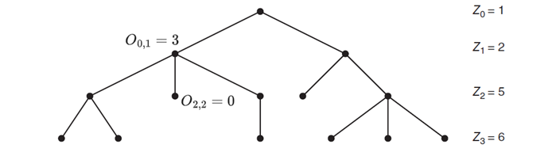
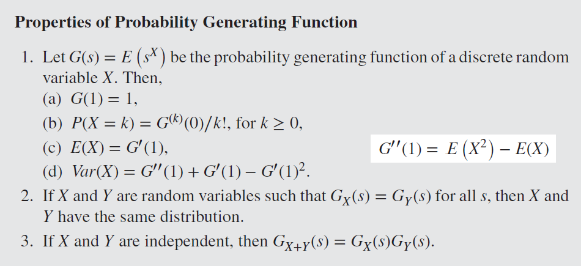

<script>
MathJax = {
  tex: {
    inlineMath: [['$', '$'], ['\\(', '\\)']]
  },
  svg: {
    fontCache:   'global'   // 'local',or 'global' or 'none'
  }
};
</script>
<script type="text/javascript" id="MathJax-script" async
  src="https://cdn.jsdelivr.net/npm/mathjax@3/es5/tex-svg.js">
</script>

<style>
img{
    width: 60%;
}
</style>

## 参考

课本：INTRODUCTION TO STOCHASTIC PROCESSES WITH R

* Branching Processes: [知乎](https://zhuanlan.zhihu.com/p/591192586)，[Stackexchange](https://math.stackexchange.com/questions/4533142/transition-matrix-of-a-single-type-branching-process)，[Lecture2](https://www.stat.berkeley.edu/~aldous/Networks/lec2.pdf)

* [马尔可夫链](https://zhuanlan.zhihu.com/p/151683887)

* [母函数和矩母函数的联系和区别？](https://www.zhihu.com/question/24952770) ，[概率母函数的意义](https://blog.csdn.net/weixin_45183579/article/details/108760536)
 
* Levy 过程

* [泊松过程](https://zhuanlan.zhihu.com/p/537124844)


## Review

* 随机过程（Stochastic Process）是一系列随机动作产生的状态的集合 {$X_t \in S$}，其中 {$t \in I$} 是随机过程的索引，$S$是状态空间（State space）


<details>
  <summary> 数学提示: Conditional Expectation</summary>

$$Var(Y)=E(Y^2)-E(Y)^2    \quad\quad\quad\quad\quad (1)$$
$$Var(Y|X)=E(Y^2|X)-E(Y|X)^2    \quad (2)$$

$$E(Var(Y|X))+Var(E(Y|X))  \quad\quad\quad (3)$$
$$=E(E(Y^2|X)-E(Y|X)^2) + E(E(Y|X)^2)-E(E(Y|X))^2$$
$$=E(Y^2)-E(Y)^2$$
$$=Var(Y)$$

</details>


## Markov Chain

Markov Chain 是随机过程的一种，约定各时刻的状态表示为 {$X_1...X_n$}，下一时刻的状态只由当前时刻决定，即：$P(X_n|X_{n-1},...,X_1)=P(X_n|X_{n-1})$


| -- | [Algoritm](./Stochastic/2-5.png) | -- | $n$ Step 时处于各状态的概率 $=\overrightarrow{\alpha}P^n$ |
| -- | -- | -- | -- |
| n | Timestep | -- | -- |
| $P$ | [Transition Matrix of Graph](./Stochastic/2-1.png) | 为半正定矩阵，其**行和为1** <br> $P^n = \prod\limits^nP$表示$n$次跳转的概率 | $P_{ij}=P(X_n=j\|X_{n-1}=i)$ 表示单次跳转时，从状态 $i$ 跳转到状态 $j$ 的概率 |
| $\overrightarrow{\alpha}$ | 初始状态向量 | -- | -- |


* [Joint Distribution 计算](./Stochastic/2-3.png)：
$$P(X_{t_1}=s_1,X_{t_2}=s_2,...,X_{t_n}=s_n)$$
$$=Prob(1 \rightarrow s_1)Prob(s_1 \rightarrow s_2) ... Prob(s_{n-1} \rightarrow s_n)$$
$$=(\alpha P^{t1})_{s_1} (P^{t_2-t_1})\_{s_1,s_2} ... (P^{t_n-t\_{n-1}})\_{s\_{n-1},s_n}$$


* Limiting Distribution $\rightarrow$ Stationary Distribution
    - **Limiting** Distribution $\lim\limits_{n \rightarrow \infty}P^n_{ij}=\overrightarrow{\lambda_j}$ 即 $\lim\limits_{n \rightarrow \infty}\overrightarrow{\alpha}P^n=\overrightarrow{\lambda}$，此时 $\lim\limits_{n \rightarrow \infty}P^n=\Lambda$ 的每一行都等于$\overrightarrow{\lambda}$
    - **Stationary** Distribution 满足 $\overrightarrow{\pi} = \overrightarrow{\pi}P$
    - Limiting 一定 Stationary：$\overrightarrow{\lambda} = \lim\limits_{n \rightarrow \infty}\overrightarrow{\alpha}P^n = \lim\limits_{n \rightarrow \infty}\overrightarrow{\alpha}P^{n-1}P=\overrightarrow{\lambda}P$
    - Stationary 不一定 Limiting（除非 Ergodic）: $P = \begin{bmatrix} 1 & 0 \\\\ 0 & 1 \end{bmatrix}$ 时，状态向量会在 $(\pi1,\pi2)$ 与 $(\pi2,\pi1)$ 间来回切换，且这两个最终状态取决于状态的初始值（而不是P）


* 如果存在$n \ge 1$ 使 $P^n$ 为正定矩阵（所有元素>0），则 $P^n$ 是 **Regular** Transition Matrix，此时存在对应的 Limiting Distribution 
    - $P = \begin{bmatrix} 0 & 1 & 0 \\\\ 0 & 0 & 1 \\\\ 1 & 0 & 0 \end{bmatrix}$, $P^2 = \begin{bmatrix} 0 & 0 & 1 \\\\ 1 & 0 & 0 \\\\ 0 & 1 & 0 \end{bmatrix}$, $P^3 = \begin{bmatrix} 1 & 0 & 0 \\\\ 0 & 1 & 0 \\\\ 0 & 0 & 1 \end{bmatrix}$ 则会在多种半正定矩阵中循环（不存在正定的$P^n$，且不 Limiting ）
    - [计算 Regular 矩阵的 Stationary Distribution](./Stochastic/3-2.png): $\pi P=\pi$


* 对于一个起始于 State $j$ 的 Markov Chain，
    - **Recurrent** 意味着在有限时间内**必定**再度访问 State $j$：累计访问 $\sum\limits_{n=0}^{\infty}P^n_{jj} = \infty$ 
    - **Transient** 意味着**可能**永**不**再访问 State $j$：累计访问 $\sum\limits_{n=0}^{\infty}P^n_{jj} < \infty$ 
        * 即 "Started in i, the expected number of visits to i is finite"（$\lim\limits_{n \rightarrow \infty}P^n_{jj} = 0$）


* 连通图（同一个communication class，元素相互连通）的 Markov Chain 是 **Irreducible** 的，各 State 全部 Recurrent，或全部 Transient
    - 对于 Infinite Irreducible，可能有 Infinite return time，此时 state 称为 Null Recurrent --- 无限图
    - **Finite Irreducible** 指**有限图**(State)的情况，此时各 State 全部 Recurrent


* 有一组 State $C$，如果所有$C$中元素都不能访问$C$外元素，则称$C$是**Closed**，即 $P_{ij}=0$ for all $i \in C,j \notin C$
    - 连通图：包含全部 Recurrent States $\rightarrow$ Closed
    - 有限连通图：包含全部 Recurrent States $\leftarrow$ Closed


* 对于 Finite Irreducible Markov Chain，存在一个 Stationary 但不一定 Limiting 的 $\pi$, 
    - $\pi_j=\frac{1}{\mu_j}=\lim\limits_{n \rightarrow \infty}\frac{1}{n}\sum\limits_{m=0}^{n-1}P^m_{ij}$ 
    - with probablity 1, 即 $\sum\limits_{j=1}^{k}\pi_j = \sum\limits_{j=1}^{k}\lim\limits_{n \rightarrow \infty}\frac{1}{n}\sum\limits_{m=0}^{n-1}P^m_{ij} = \lim\limits_{n \rightarrow \infty}\frac{1}{n}\sum\limits_{m=0}^{n-1}\sum\limits_{j=1}^{k}P^m_{ij} = \lim\limits_{n \rightarrow \infty}\frac{1}{n}\sum\limits_{m=0}^{n-1}1 = 1$
    - 其中 $\mu_j=E(T_j|X_0=j)$ 指从 $j$ 出发后再次回归 $j$ 所需的时间（步数），[如何估算？First-Step Analysis](./Stochastic/3-4.png)
    - 注：根据 Limiting Distribution 的定义，$\lim\limits_{n \rightarrow \infty}P^n$ 的每一行都一样，所以不需要区别 $i$


* $d(i)=gcd$ {$n >0 : P^n_{ii}>0$} 是 $i \rightarrow i$（状态重现）所有可能步数的最大公约数（greatest common ancestor），即**周期**（period）
    - 若 可能步数集 为空，则 $d(i)=+\infty$
    - 若 $d(i)=1$则 state $i$ 是 **aperiodic** (self-Loop)
    - 若 $d(i)>1$则 state $i$ 是 [**periodic**](./Stochastic/3-7.png)
    - **Irreducible** 时各States周期相同，故而可以谈论 Markov Chain 的 periodic / aperiodic


* **Ergodic** Markov Chain 的条件: Irreducible, aperiodic, finite recurrence time
    - 此时存在一个 Stationary Distribution $\pi$，同时也是 Limiting Distribution ($\pi_j = \lim\limits_{n \rightarrow \infty}P^n_{ij}$)
    - 反例 -- Aperiodic + *Reducible*: ```A <--> B--> C``` 一旦陷入C则不可能再次访问A
    - 反例 -- *Periodic* + Irreducible: gcd=2时，t=2,4,6,... 可以观测到一样的状态


* **Reversible** Markov Chain 的条件： $\pi_iP_{ij}=\pi_jP_{ji}$ for all $i,j$；其中 $\pi$ 是 Stationary Distribution


* **Absorbing State** $i$ 满足：$P_{ii}=1$，如果 Markov Chain 含有多个 Absorbing State，则称其为 **Absorbing Chain**
    - [计算 Absorbing Chain 跳转到 Absorbing State 的长期概率或时间](./Stochastic/3-11.png)
    - [用法1：计算第一次遇见某个节点：将此节点视为Absorbing State](./Stochastic/3-30.png)
    - [用法2：计算第一次遇见某个Pattern：改写包含得到此Pattern路径的$P$，将Pattern视为Absorbing State](./Stochastic/3-33.png)


## Branching Processes

Branching Processes {$Z_n$} 常用于模拟 Population growth；它是一种 Markov Chain，因为子代个数 $Z_{n+1}$ 仅取决于其父代个数 $Z_{n}$ （以及 Offspring 分布）





* 假设 
    - $O_{n,i}$ 表示第 $n$ 代第 $i$ 个个体的后代数
    - $Z_{n+1}=\sum\limits_{r=1}^{Z_{n}}O_{n,r}$ 表示第 $n+1$ 代的个体数目
    - 已知 $P[Z_{n+1}=S_{n+1} | Z_{n}=S_{n} ] = P[\sum\limits_{r=1}^{Z_{n}} O_{n,r}=S_{n+1} | Z_{n}=S_{n} ]= P[\sum\limits_{r=1}^{S_{n}} O_{n,r}=S_{n+1}]$
    - Transition matrix 元素 $P^n_{ij} = P(\sum\limits_{r=1}^{i}O_{n,r}=j)$ 表示第 $n$ 代时 $i$ 个个体累计产生 $j$ 个后代的概率；设定 $P^n_{00}=1$
    - Absorbing state = 0，即当 $Z_n=0$ 时发生灭绝事件，其余 all nonzero states are transient
    - 结局只能是灭绝/无限扩增


* 假设**单个个体的后代数目**遵从某种概率分布 $a = (a0, a1, a2,…)$，其中 $a_k$ 表示 单个个体产生 $k$ 个后代的概率
    - $a_0=0$ 则 Population 永远增加；
    - $a_0=1$ 则 $Z_n = 0$ for $n \ge 1$
    - 因此假设 $0 < a_0 < 1$ 且 $a_0+a_1 <1$ （即，有一定概率产生多个后代）
    - **Offspring 分布** $a$ 可以是各种常见分布，比如 Poisson


* 单个个体后代数目分布的均值 $\mu = \sum\limits_{k=0}^{\infty}ka_k$，则第 $n$ 代个数的均值 $E(Z_n)=\mu^n$ （[推导过程](./Stochastic/4-2.png)）
    - 灭绝事件 $E: Z_n=0$ 最终发生的概率 $P(E)=\lim\limits_{n \rightarrow \infty}P(Z_n=0)=\lim\limits_{n \rightarrow \infty}1-\mu^n$
    - 故而，依据 $\mu$ 的取值，$Z_n$最终可能趋向 $0,1,\infty$ 三种可能


<details>
  <summary> 数学提示: PGF 概率母函数/概率生成函数 Probability generating function $G(s)$</summary>

PGF可用于：确认不同分布是否相互独立，计算期望、方差等

$$G_x(s)=E(s^x)=\sum\limits_{x=0}^{\infty}s^xP(x)$$

$$G^{(j)}(0)=j!P(j)$$

$$G''(0)=2P(2)$$


<!--  -->
</details>


<details>
  <summary> 数学提示: $G(s)$ 的 $n$ 重复合记为 $G^n(s)$ </summary>

$$G^n(s)=G^{n-1}(G(s))=G(...G(G(s))...)$$

</details>


* [计算灭绝结局的概率](./Stochastic/4-7.png): 当 $\mu>1$ 时，方程 $s=G_k(s)$ 的最小解 $s=min(roots)$ 是走向灭绝结局的概率（当 $\mu \leq 1$ 时灭绝结局概率=1）
    - 第 $n$ 代个体数目 $Z_n$ 的 
    $$G_n(s)=\sum\limits_{k=0}^{\infty}s^kP(Z_n=k)$$
    - Offspring 分布 $a$ 的 
    $$G_a(s)=\sum\limits_{k=0}^{\infty}s^ka_k$$
    - $$G_n(s)=E(s^{Z_n})=E(s^{\sum\limits_{k=0}^{Z_{n-1}}O_k})=E([G_a(s)]^{Z_{n-1}})=G_{n-1}(G_a(s))=G_a(G_{n-1}(s))$$
    


## Markov Chain Monte Carlo (MCMC)


* Monte Carlo Simulation 是指重复实验/模拟多次后取结果的均值作为期望值的近拟

* 虽然 Markov Chain 并非完全随机，但步数足够大时它的 Monte Carlo 也满足 [Strong Law](./Stochastic/5-1.png) 

* [Metropolis–Hastings Algorithm](./Stochastic/5-2.png) 从 Stationary Distribution $\pi$ 模拟生成 Markov Chain: 
    1. 假设某一步模拟从 state $i$ 开始
    2. 根据 Transition Matrix 中 $P_{ij}$ 的概率，随机选取一个 $j$
    3. Acceptance Ratio $\alpha = \frac{\pi_jP_{ji}}{\pi_iP_{ij}}$
    4. 生成一个 uniform random number $u \sim U(0,1)$
    5. 若 $u \leq \alpha$ 则下一步是 state $j$，否则下一步依旧停留在 $i$


* Gibbs sampler 从 m-dimensional joint density $\pi(x_1, x_2, ..., x_m)$ 生成样本 $X^{(t)}=(X^{(t)}_1,X^{(t)}_2,...,X^{(t)}_m)$
    - $X^{(t+1)}_i$ depends on $X^{(t+1)}_{[1,i-1]}$ and $X^{(t)}_{[i+1,m]}$


* 希望少量模拟样本也符合期望分布？问问GPT：Perfect sampling of MCMC


## Poisson Process


* **Counting Process** $N(t)$ 是一组随机的正整数，若 $0 \le s \le t$ 意味着 $N(s) \le N(t)$

* **Stationary increments** 指对于任意 $h,t > 0$，$(N_{t+h}-N_t)$的分布与 $t$ 无关
    - $P(N_{t+h}-N_h=k)=P(N_t-N_0=k)$
    - 可将 $N_t - N_0$ 视为 $[0，t]$ 间隔内事件发生的总数

* **Independent increments** 指对于 $0 \le t1 \le t2 \le ... \le tn$，各个 $N_{t_n}-N_{t_{n-1}}$ 相互独立


* 一个增速为 $\lambda$ 的 **Poisson Process** 满足
    - $N_0 = 0$  
    - $N_t  \sim Poisson(\lambda t)$   $$P(N_t=k)=\frac{e^{-\lambda t}(\lambda t)^k}{k!}$$
    - Stationary increments 即 $$P(N_{t_n}-N_{t_{n-1}}=k) \\\\ =P(N_t-0=k) \\\\ =P(N_t=k)$$
    - Independent increments


