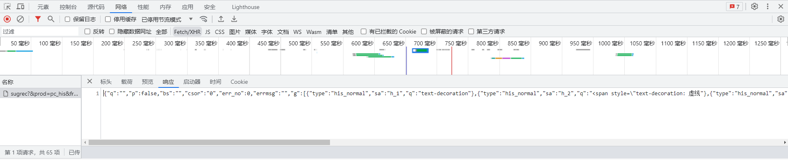
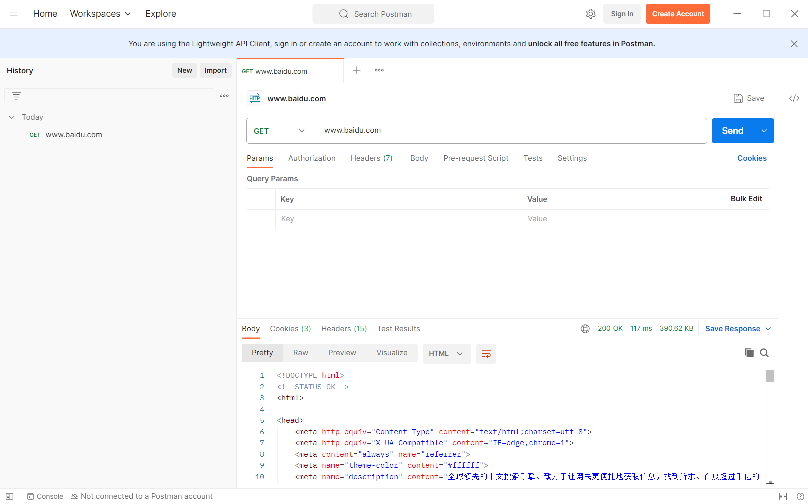

关于前端网络请求的操作    

## Tips
不想花时间处理CORS 可随意启动一个项目，然后在浏览器控制台中运行js代码   

浏览器控制台中引入src：
```js
var myscript = document.createElement('script')
myscript.src='https://cdn.jsdelivr.net/npm/axios/dist/axios.min.js'
document.getElementsByTagName('head')[0].append(myscript)
```


## 背景知识
[MND: send()](https://developer.mozilla.org/zh-CN/docs/Web/API/XMLHttpRequest/send)  

| 方法 | 说明 | 数据传输示例 | HTTP版本 | -- |
| -- | -- | -- | -- | -- |
| GET | 获取报文主体 | ```'http://127.0.0.1:8000/test?valA=aa&valB=22'``` | 1.0，1.1 | -- |
| POST | 传输实体主体（提交数据） |  ```xhr.send('valA=aa&valB=22')```  | 1.0，1.1 | send之前需设置：```xhr.setRequestHeader('Content-Type','application/x-www-form-urlencoded')``` <br> 亦可选择 ```multipart/form-data``` 、 ```application/json``` |
| PUT | 传输文件（提交文件） | -- | 1.0，1.1 | 一般不使用，除非有验证机制或采用REST架构 |
| HEAD | 获取报文Headers | -- | 1.0，1.1 | -- |
| DELETE | 删除文件 | -- | 1.0，1.1 | 一般不使用，除非有验证机制或采用REST架构 |
| OPTIONS | 询问支持的方法 | -- | 1.1 | -- |
| TRACE | 追踪转发路径 | -- | 1.1 | -- |
| CONNECT | 要求使用隧道协议连接代理 | -- | 1.1 | -- |
| LINK | 建立和资源间的联系 | -- | 1.0 | -- |
| UNLINK | 断开联系 | -- | 1.0 | -- |


状态码：  

| status | 类别 | 说明 |
| -- | -- | -- |
| 1xx | Informational 信息状态 | 请求正在处理 |
| 2xx | Success | 请求正常处理完毕 |
| 3xx | Redirection 重定向 | 需要进行附加操作以完成请求 |
| 4xx | Client Error | 服务器无法处理接收的请求 |
| 5xx | Server Error | 服务器处理请求出错 |


## AJAX
[MND: XMLHttpRequest](https://developer.mozilla.org/zh-CN/docs/Web/API/XMLHttpRequest)

```js
const xhr = new XMLHttpRequest();
xhr.open('GET', url);
// xhr.setRequestHeader('Content-Type','application/x-www-form-urlencoded')
xhr.send();
xhr.onreadystatechange = ()=>{
    if (xhr.readyState === XMLHttpRequest.DONE && xhr.status === 200){
        console.log(xhr.responseText);      //html
        console.log(JSON.parse(xhr.responseText));
    }
}

```

```JSON.parse(xhr.responseText)``` 可能会报错：（似乎是资源配置问题：[参考1](https://www.cnblogs.com/smile-fanyin/p/15480419.html)，[参考2](https://blog.csdn.net/u013586483/article/details/110733813)，只需将 vue.config.js 中 publicPath 由"./"设置为"/" ）
```
Uncaught SyntaxError: Unexpected token '<', "
<!doctype "... is not valid JSON
```


## [Axios](https://www.axios-http.cn/docs/intro)
Axios 是一个 promise-based 网络请求库，作用于node.js 和浏览器中，分别使用 http 模块和 XMLHttpRequests 

引入 [axios.min.js](https://cdn.jsdelivr.net/npm/axios/dist/axios.min.js)：
```html
<script src="axios.min.js"></script>
```
推荐把请求包装在异步函数内： 
```js
queryData = {
    ValA:'aa',
    ValB:22
}

(async ()=> {
    const res = await axios.get(url),{params:queryData};
    console.log(res.data);          //html
})()

(async ()=> {
    const res = await axios.post(url),{queryData};
    console.log(res.data);          //html
})()
```
也支持设置baseURL简化地址 、拦截器 interceptors： (也推荐放在async中)
```js
const basepage = axios.create({
    baseURL: 'xxxxx'
})

basepage.interceptors.request.use(config => {console.log('请求发送'); return config})   // 不return则会卡住
basepage.interceptors.response.use(res => {console.log('请求发送'); return res})       // 不return则会卡住

basepage.get(suburlA)  // 此处使用相对地址
basepage.get(suburlB)
```


## Fetch API
[MND: Fetch](https://developer.mozilla.org/zh-CN/docs/Web/API/Fetch_API/Using_Fetch)
```js
method_header_body = {
    methos: 'POST',
    headers: {
        'Content-Type':'application/x-www-form-urlencoded',
    },
    body: {   // body: JSON.stringify{    // for 'application/json'
        ValA: 'aa',
        ValB: 22
    }
}

fetch(url,method_header_body).then(
    res => {
        if (res.ok) {return res.json}
    }
).then(
    data => {console.log(data)}
)
```

## CORS
[MDN_CORS](https://developer.mozilla.org/zh-CN/docs/Web/HTTP/CORS)  ：XMLHttpRequest 和 Fetch API 遵循同源策略；不同域、或无正确CORS响应头 会产生资源访问的跨越问题。

资源持有者可以设置 [```Access-Control-Allow-Origin: https://www.xxx.com```] 来设置允许访问其资源的外域，```*``` 表示所有外域（不推荐）。此外还可以设置```[Access-Control-Allow-Headers], [Access-Control-Allow-Methods]```  

资源持有者在部署时，使用 Nginx 可通过 [```add_header 'Access-Control-Allow-Origin' 'xxx'```] 指令设置自定义header（示例：[link](https://zhuanlan.zhihu.com/p/194397481)）; 使用 node.js 可以使用cors库（示例：[link](https://zhuanlan.zhihu.com/p/437503198)）


## 工具
查看/测试HTTP请求的方法
### F12
浏览器右键打开审查元素，可查看请求的信息：    



### [Postman](https://www.postman.com/downloads/)  
Postman 是一款常用的 HTTP API 测试工具；后端开发也常用    



## 参考
MDN，《图解HTTP》
