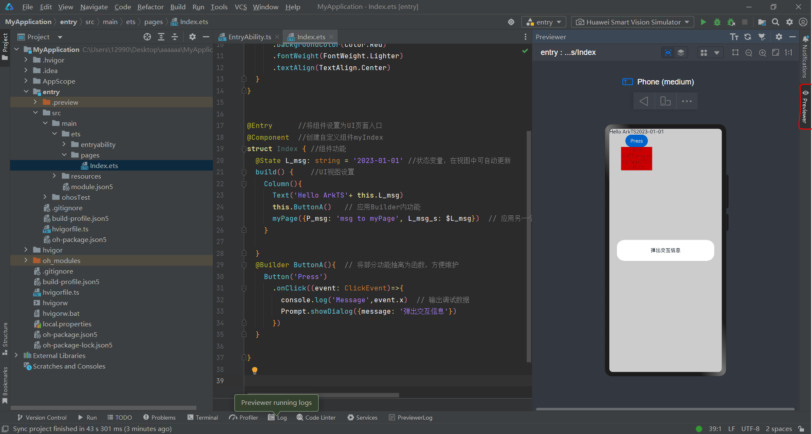
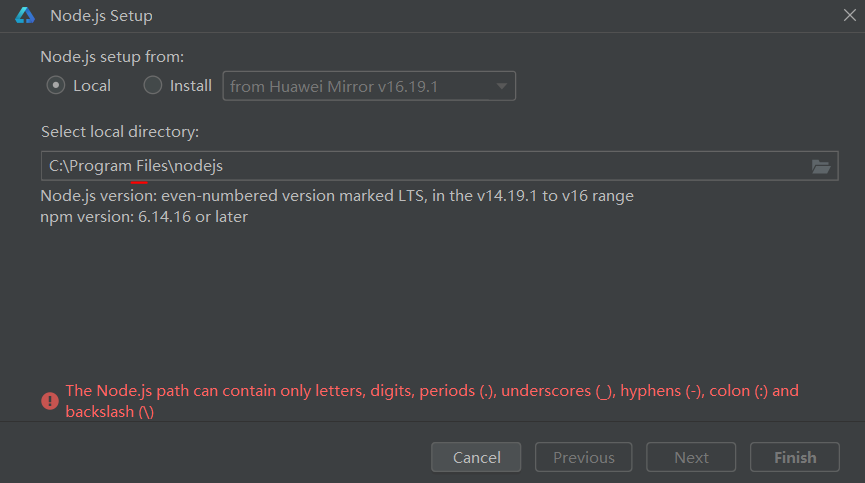

<style>
img{
    width: 60%;
}
</style>

HarmonyOS的开发语言，继承了[TypeScript](./TS.md)的功能，增加了声明式UI和状态管理功能

开发平台：[DevEco Studio](https://developer.harmonyos.com/cn/develop/deveco-studio)，create project开启项目


## 简单示例
Index.ets：（此外，TS、JS的功能都支持，例如List、Foreach）
```ts
import Prompt from '@system.prompt'
@Component  //创建子组件myPage，内含希望复用的功能
struct myPage{
  @Prop P_msg: string   //@Prop接收参数
  @Link L_msg_s: string   //@Link 双向同步
  build() {
    Text('Hello ArkTS:'+ this.P_msg+ this.L_msg_s)
      .width(100)
      .backgroundColor(Color.Red)
      .fontWeight(FontWeight.Lighter)
      .textAlign(TextAlign.Center)
  }
}


@Entry      //将组件设置为UI页面入口
@Component  //创建自定义组件myIndex
struct Index { //组件功能
  @State L_msg: string = '2023-01-01' //状态变量，在视图中可自动更新
  build() {    //UI视图设置
    Column(){
      Text('Hello ArkTS'+ this.L_msg)
      this.ButtonA()   // 应用Builder内功能
      myPage({P_msg: 'msg to myPage', L_msg_s: $L_msg})  // 应用另一个组件，冒号:左侧为myPage组件的参数，右侧为当前组件的参数/值
    }

  }
  @Builder ButtonA(){  // 将部分功能抽离为函数，方便维护
    Button('Press')
      .onClick((event: ClickEvent)=>{
        console.log('Message',event.x)  // 输出调试数据
        Prompt.showDialog({message: '弹出交互信息'})
      })
  }

}
```
项目右侧'Previewer'栏目可以查看当前视图（可能需要等待一会儿才出现）
 


## 模拟器运行应用

记得先至Device Manager设置、下载模拟模拟器SDK：  
 
 


## 参考
Docs: [https://developer.harmonyos.com/](https://developer.harmonyos.com/cn/docs/documentation/doc-guides-V3/start-overview-0000001478061421-V3?catalogVersion=V3)

设置DevECO的时候有个问题。。文件夹名字不支持空格：  
  
