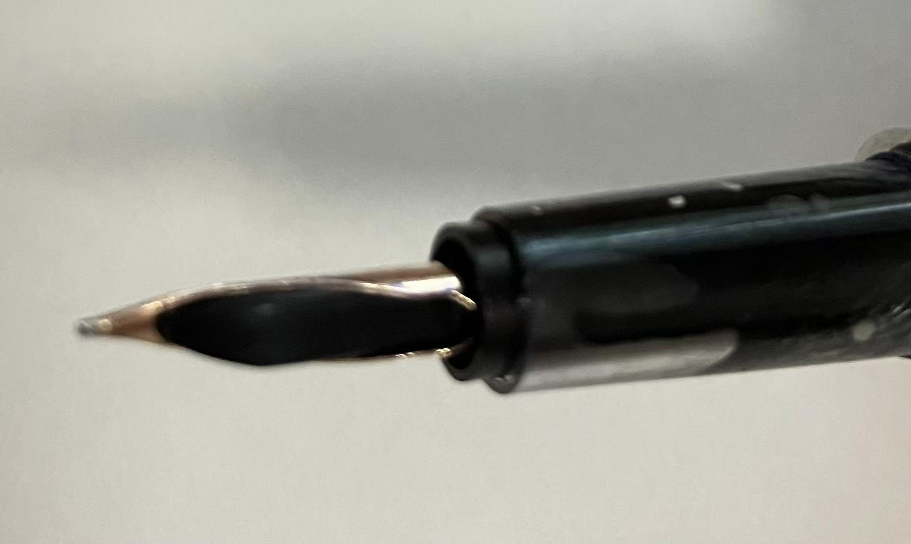

<style>
img{
    width: 30%;
}
</style>

# 钢笔


将英雄110笔尖(12k)挂载到616s笔身

笔身材料：616s 暗夜绿（红/黑 结构不同但外壳通用）


```bash
拧开：  热水化开胶水

       ↑ 
--——————————| |————————————————
  \—————————| |————————————————
             ↓
```

必须卡紧笔舌（“咔”的一声），下图示：未卡紧 v.s. 卡紧

  


笔尖也需用力没入（从侧面捏住怼、否则笔尖会变形/不能卡到位）





若出现断墨/不下墨，可能是由于组装松散。不确定0.38mm/0.5mm的毛细是否有区别。

