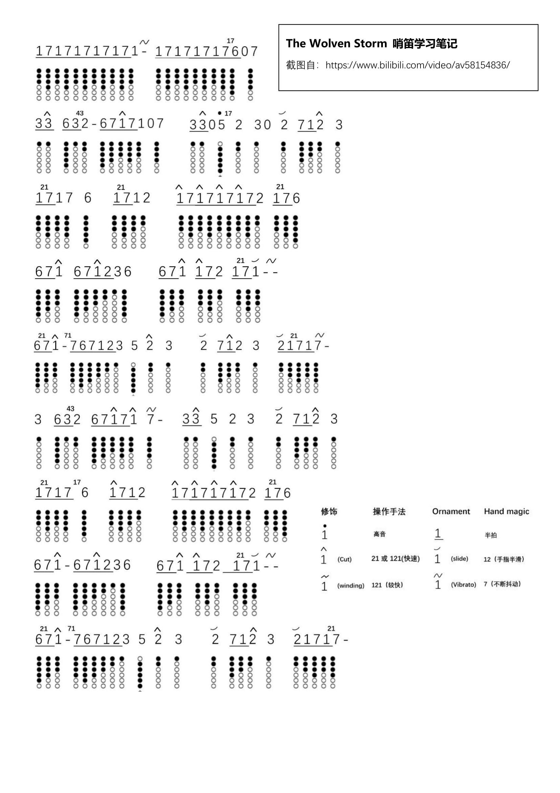
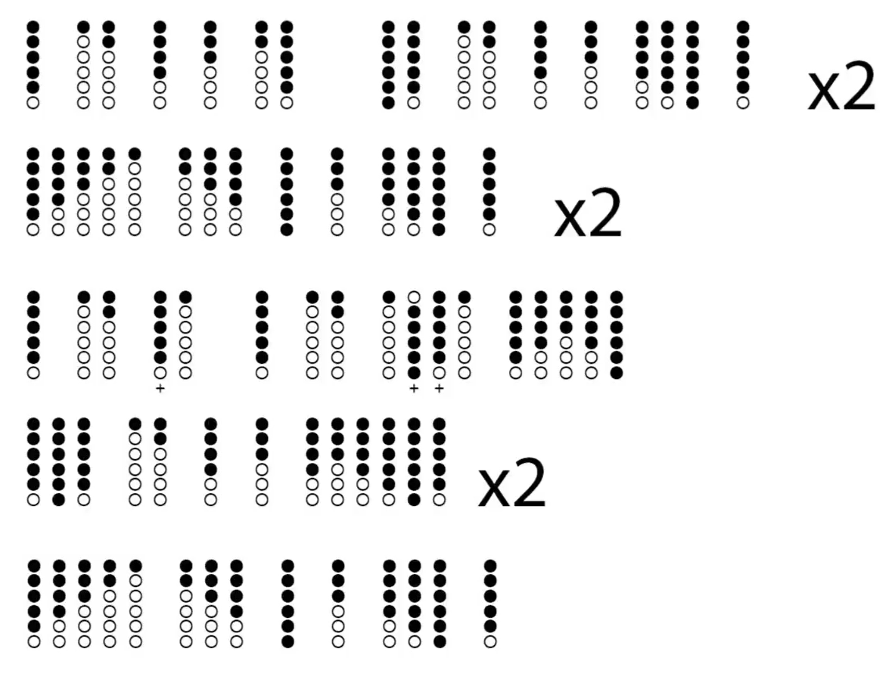
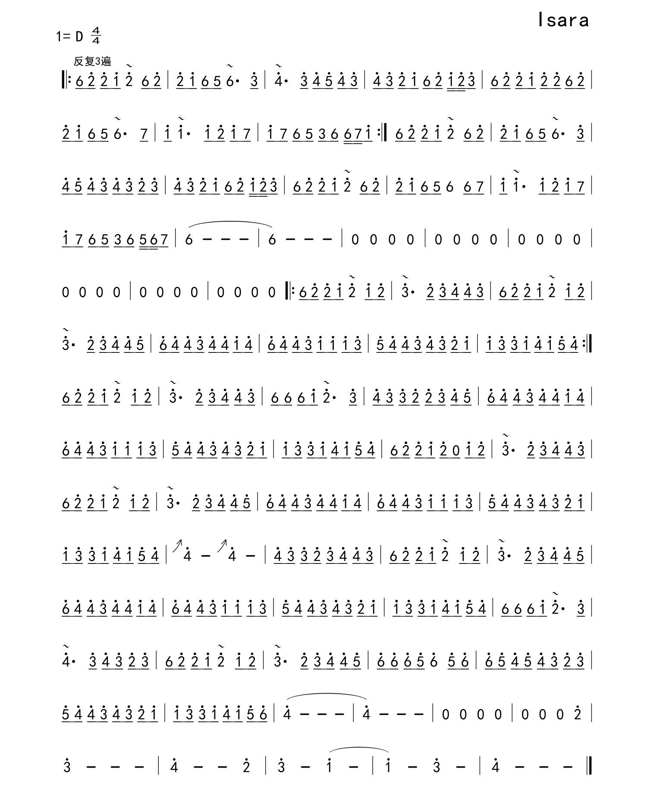
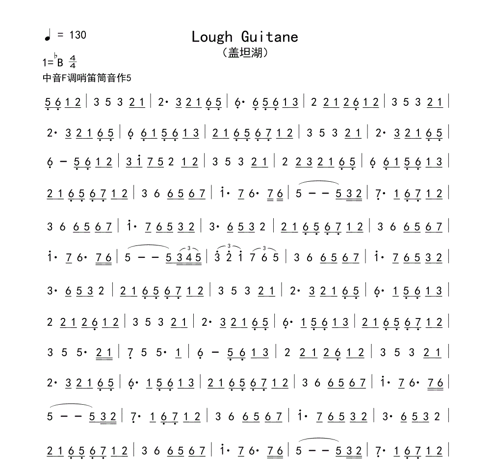
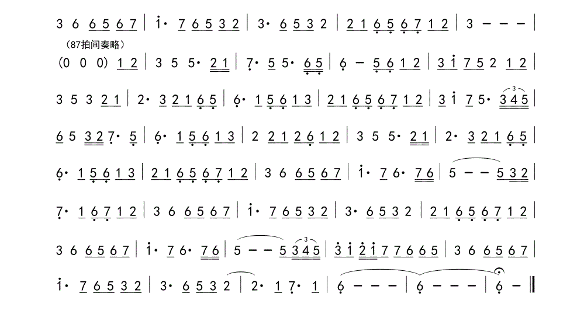

## 犬夜叉: 哀歌

演奏示例 [一](https://www.bilibili.com/video/BV1VN41117bK) / [二](https://www.bilibili.com/video/BV1gE411s7yj) / [三](https://www.bilibili.com/video/BV1jt411W7yA/)


旋律三([C调指法](WebSource/Inuyasha2.png)): 

<br>

6 7 <span style="text-decoration: overline">1 2 3</span>——
<span style="text-decoration: overline">2 3 5</span>——
<span style="text-decoration: overline">4 2 3</span>——
<span style="text-decoration: overline">2 3 5</span>——
<span style="text-decoration: overline">4 2 3 2 1</span> 6——5 6 7 6 5 3 —— 6

<br>


## Titanic Dance

电影泰坦尼克号中一段爱尔兰舞曲，D调   

演奏示例  [全按作1](https://www.bilibili.com/video/BV1np4y1t7tf/?spm_id_from=333.337)


<br>
<span style="text-decoration: overline">11</span> 67<span style="text-decoration: overline">1</span>6 53 53  <br>
<span style="text-decoration: overline">11</span> 67<span style="text-decoration: overline">1</span>6 53 21  <br>
<span style="text-decoration: overline">11</span> 67<span style="text-decoration: overline">1</span>6 53 5  &nbsp; &nbsp; 
<span style="text-decoration: overline">12</span> <span style="text-decoration: overline">31</span> <span style="text-decoration: overline">2</span>7 <span style="text-decoration: overline">11</span>      <br>
<span style="text-decoration: overline">31</span> <span style="text-decoration: overline">1</span> &nbsp;&nbsp; <span style="text-decoration: overline">23</span> <span style="text-decoration: overline">432</span>  &nbsp; &nbsp; <span style="text-decoration: overline">12</span> <span style="text-decoration: overline">31</span> 5<span style="text-decoration: overline">1</span> <span style="text-decoration: overline">35</span> <span style="text-decoration: overline">5</span>     <br>
<span style="text-decoration: overline">31</span> <span style="text-decoration: overline">1</span> &nbsp;&nbsp; <span style="text-decoration: overline">23</span> <span style="text-decoration: overline">432</span>  &nbsp; &nbsp; <span style="text-decoration: overline">12</span> <span style="text-decoration: overline">31</span> <span style="text-decoration: overline">2</span>7 <span style="text-decoration: overline">1 1</span>


## My Heart Will Go On 

演奏示例  [D调](https://www.bilibili.com/list/ml131409035?oid=58241903&bvid=BV1K4411F7Er)

```bash
【前奏】
1(●●●○○○)2(●●○○○○)3(●○○○○○)--2(●●○○○○)1(●●●○○○)2(●●○○○○)5(○●●●●●')
3(●○○○○○)2(●●○○○○)1(●●●○○○)6.(●●●●●○)5.(●●●●●●)
1(●●●○○○)2(●●○○○○)3(●○○○○○)--2(●●○○○○)1(●●●○○○)2(●●○○○○)5(○●●●●●')
3(●○○○○○)5(○●●●●●')6(●●●●●○')5(○●●●●●')3(●○○○○○)2(●●○○○○)


【主歌】
1(●●●○○○)1(●●●○○○)1(●●●○○○)1(●●●○○○)7.(●●●●○○)1(●●●○○○)-1(●●●○○○)7.(●●●●○○)1(●●●○○○)-2(●●○○○○)3(●○○○○○)-2(●●○○○○)
1(●●●○○○)1(●●●○○○)1(●●●○○○)1(●●●○○○)7.(●●●●○○)1(●●●○○○)-1(●●●○○○)5.(●●●●●●)

1(●●●○○○)---2(●●○○○○)--5.(●●●●●●)5(○●●●●●')-4(○●●○○○)3(●○○○○○)2(●●○○○○)-
3(●○○○○○)4(○●●○○○)3(●○○○○○)-2(●●○○○○)1(●●●○○○)7.(●●●●○○)1(●●●○○○)-
{
    7.(●●●●○○)6.(●●●●●○)5.(●●●●●●)
    ----------------------
    7.(●●●●○○)7.(●●●●○○)1(●●●○○○)-2(●●○○○○)3(●○○○○○)-2(●●○○○○)-1(●●●○○○)
}
```


## 巫师三 The Wolven Storm

bilibili视频（https://www.bilibili.com/video/av58154836/）的截图笔记




## 巫师三 Kaer Morhen

演奏教学 [A](https://www.bilibili.com/video/BV1m44y1678f/)




## Isara

演奏示例 [A](https://www.bilibili.com/video/BV1ux411b72Y/)  / [B](https://www.bilibili.com/video/BV13s411W7im/)



```bash
6.(●○○○○○)2(●●●●●○')2(●●●●●○')1(●●●●●●')2(●●●●●○')
6.(●○○○○○)2(●●●●●○')2(●●●●●○')1(●●●●●●')6.(●○○○○○)5.(●●○○○○)6.(●○○○○○)

{
    3(●●●●○○')4(●●●○○○')3(●●●●○○')4(●●●○○○')5(●●○○○○')4(●●●○○○')3(●●●●○○')
    4(●●●○○○')3(●●●●○○')2(●●●●●○')1(●●●●●●')6.(●○○○○○)2(●●●●●○')1(●●●●●●')2(●●●●●○')3(●●●●○○')
    ----------------------
    7.(○●●○○○)1(●●●●●●')1(●●●●●●')1(●●●●●●')2(●●●●●○')1(●●●●●●')7.(○●●○○○)1(●●●●●●')7.(○●●○○○)
    6.(●○○○○○)5.(●●○○○○)3.(●●●●○○)6.(●○○○○○)6.(●○○○○○)7.(○●●○○○)1(●●●●●●')
}
```

## Lough Guitane




